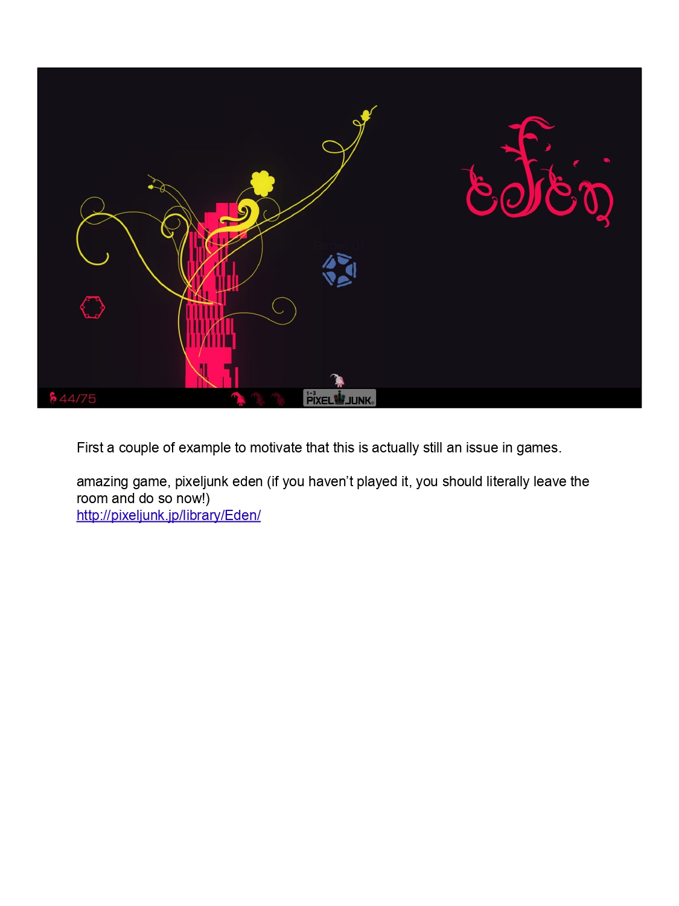
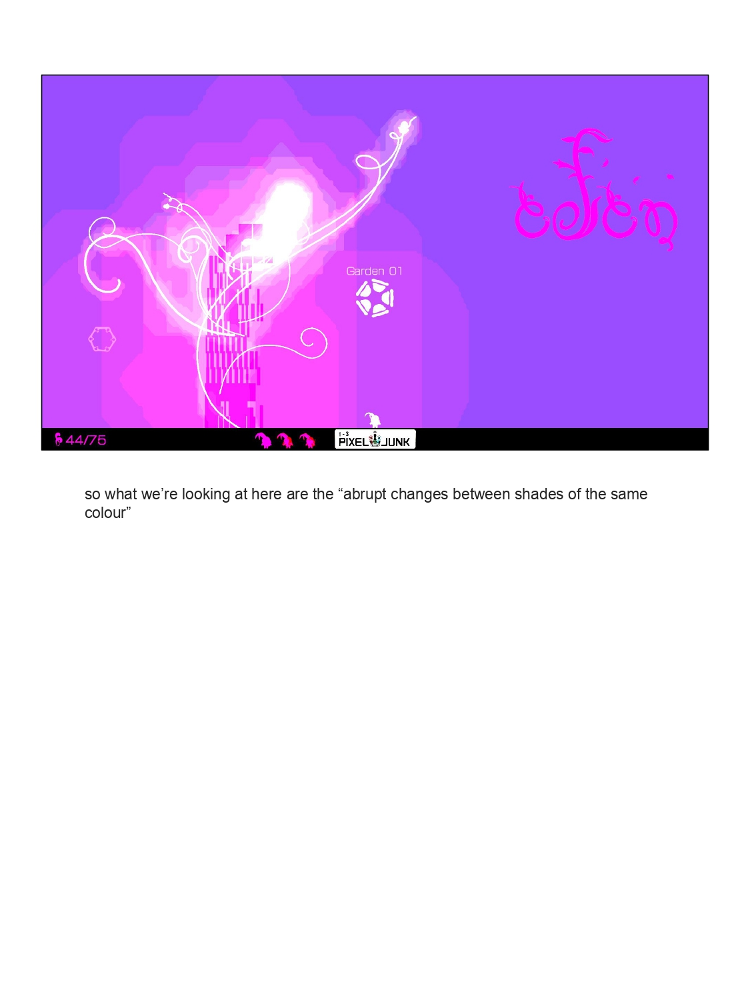
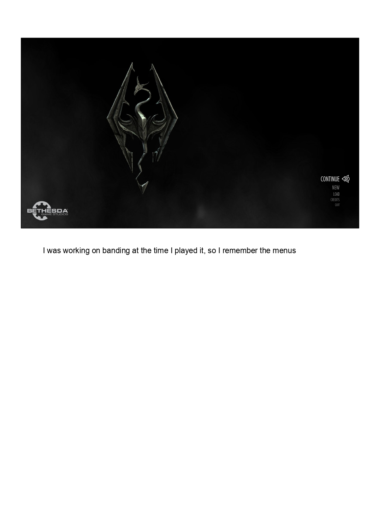
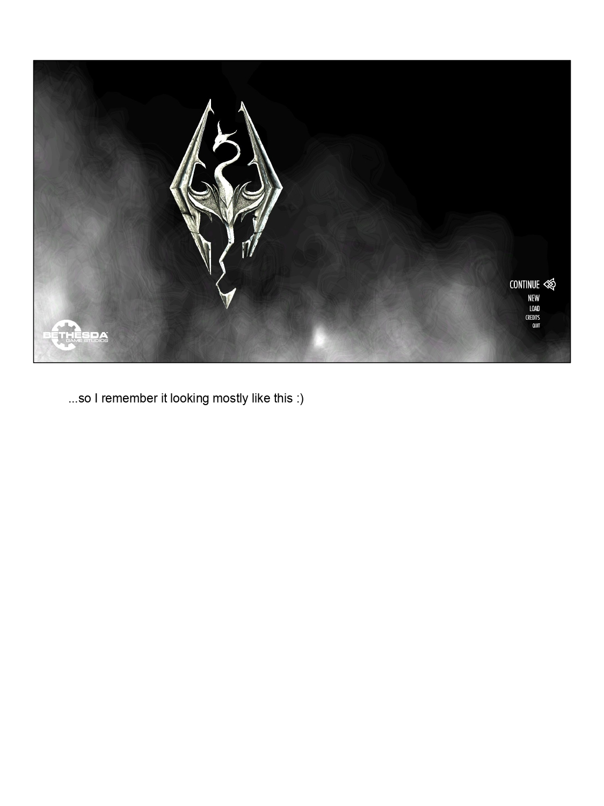
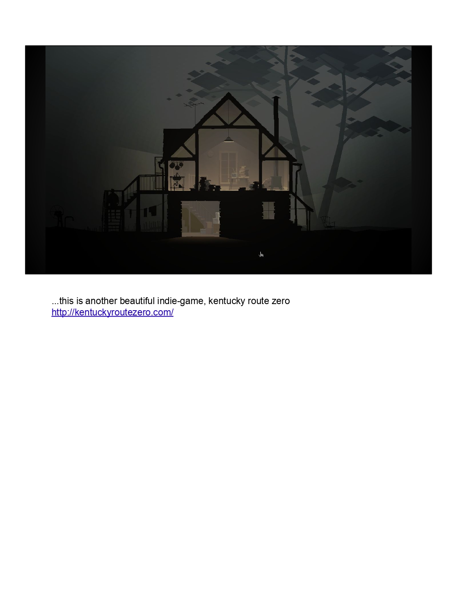
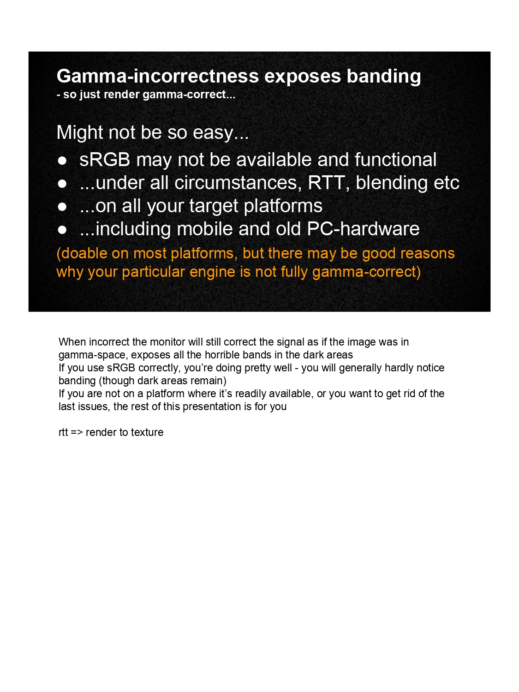
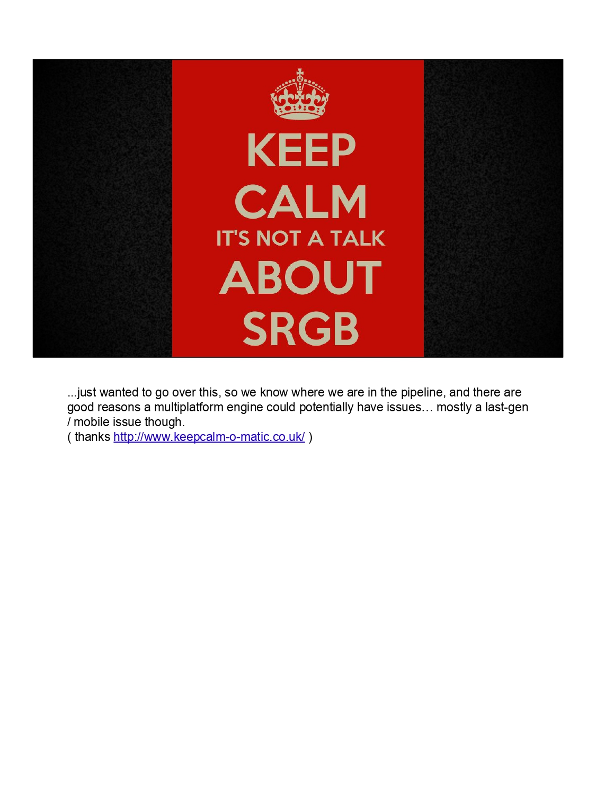
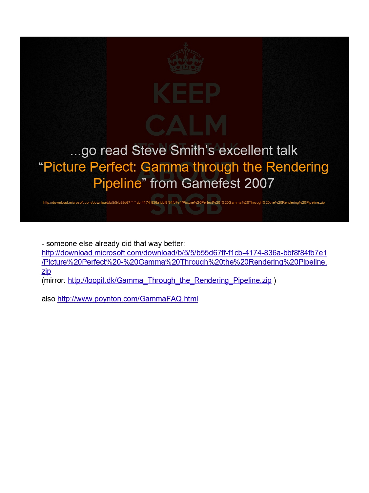

# 游戏中的条带问题 (Banding in Games)

关于游戏中**颜色条带 (color banding)** 伪影的文稿：成因（如伽马处理不当）、平台与管线限制，以及缓解方案。

---

## 第 2 页 · 动机示例：PixelJunk Eden

先用几个例子说明**这仍然是游戏里真实存在的问题**。  
**PixelJunk Eden** 非常出色（没玩过的话强烈推荐去玩一下）。  
http://pixeljunk.jp/library/Eden/

图中为游戏截图：深色背景上的粉/黄发光结构与藤蔓、高对比与渐变，正是容易出现条带的典型场景。

---

## 第 3 页 · 条带是什么

**「我们在这里看到的是『同一颜色不同色阶之间的突变』。」**

即**条带 (banding)** 的定义：渐变不再平滑，而是出现可见的**阶梯/色带**。  
图中同一款游戏（PixelJunk Eden）的紫色背景与发光体上，可以清楚看到这种条带。

---

## 第 5 页 · 示例：《上古卷轴 V：天际》主菜单

作者当时在做条带相关工作时玩了这款游戏，所以对**主菜单**印象很深。  
图中为《天际》主菜单：龙标、深色背景与烟雾/渐变，正是容易出现条带的界面。

---

## 第 6 页 · 天际主菜单（续）

「……所以我记得它大体就是这样 :)」  
主菜单：龙标、Bethesda 标志、CONTINUE / NEW / LOAD / CREDITS / QUIT；背景为深色与体积烟雾/雾效，渐变区域易产生条带。

---

## 第 7 页 · 示例：《肯塔基零号公路》

《肯塔基零号公路》(Kentucky Route Zero) 截图：夜间房屋剖面、室内暖光、室外雾霾与深色渐变。  
这类**低对比、雾效与暗部渐变**正是条带高发区域；体积雾与柔和光照也常受条带影响。

---

## 第 10 页 · 伽马错误会暴露条带 (Gamma-incorrectness exposes banding)

**天真的想法**：「那就按伽马正确来渲染呗……」

**可能没那么容易：**

- sRGB 可能**不可用或未正确生效**
- 且要在**所有情况**下（RTT、混合等）
- 在**所有目标平台**上（包括移动端与老 PC）
- （多数平台可以做到，但你的引擎可能有充分理由仍未完全做伽马校正）

**为何会暴露条带**：当处理错误时，显示器仍会按「图像在伽马空间」来校正信号，从而在**暗部暴露出明显条带**。  
**若正确使用 sRGB**，通常已经好很多，条带会很难察觉（暗部仍可能残留）。  
若你所在平台不易获得 sRGB，或想**彻底解决剩余问题**，本演示后续内容就是为此准备的。

**RTT** = Render to Texture（渲染到纹理）。

---

## 第 11 页 · 保持冷静：这不是一场关于 sRGB 的演讲

**KEEP CALM — IT'S NOT A TALK ABOUT SRGB**

只是先过一遍，让大家知道我们在管线中的位置；多平台引擎完全有可能在这方面出问题，有合理原因……多半是**上代主机/移动端**的问题。  
（图来自 http://www.keepcalm-o-matic.co.uk/）

---

## 第 12 页 · 推荐阅读：Steve Smith 的演讲

**……去读 Steve Smith 的精彩演讲：**  
**「Picture Perfect: Gamma through the Rendering Pipeline」**（Gamefest 2007）

- 有人已经讲得更好：  
  http://download.microsoft.com/download/b/5/5/b55d67ff-f1cb-4174-836a-bbf8f84fb7e1/Picture%20Perfect%20-%20Gamma%20Through%20the%20Rendering%20Pipeline.zip  
  （镜像：http://loopit.dk/Gamma_Through_the_Rendering_Pipeline.zip）
- 另见：http://www.poynton.com/GammaFAQ.html

---

## 其余页面（第 13–72 页）

以下为原稿其余页面，图片位于 `banding_in_games/` 目录，文件名为 `banding_in_games_page-XXXX.jpg`（XXXX 为四位页码，如 0013、0072）。
