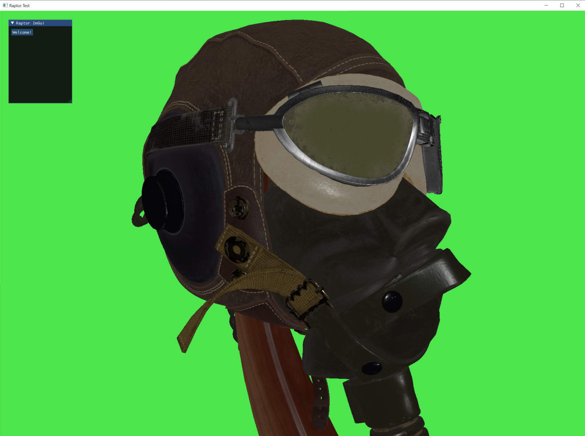
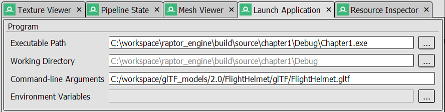
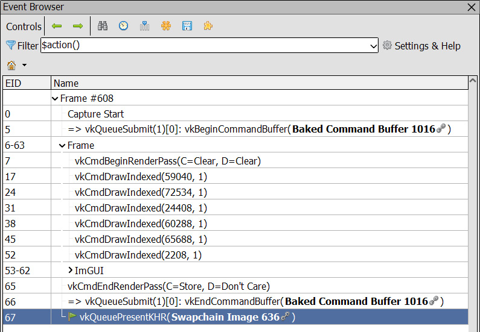
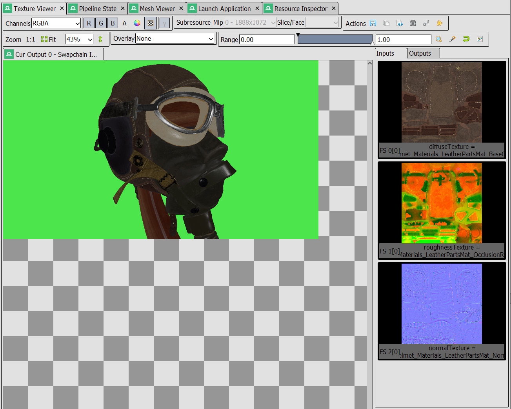

# 第 1 章：介绍 Raptor Engine 与 Hydra

动笔写这本书时，我们就把目标定在：从传统 Vulkan 教程通常结束的地方开始。市面上已有大量书籍和网络资料帮助初学者认识和理解 Vulkan API。

我们仍决定写这本书，是因为感到入门教程与更进阶的内容之间缺少衔接。这些进阶主题虽然会零散出现在文章和博客里，但我们没有找到一本把它们组织成统一、连贯体系的资料。

尽管假定读者对 Vulkan 已有一定了解，本章仍会借机回顾一些基础概念，它们将在全书后续内容中反复用到。我们会介绍全书使用的代码组织方式、类与库。

本章将涵盖以下主题：

- 如何阅读本书
- 理解代码结构
- 理解 glTF 场景格式
- 物理基于渲染（PBR）简述
- 关于 GPU 调试

学完本章后，你将熟悉 Raptor Engine 以及我们为本书开发的渲染框架，并了解 glTF 模型格式的结构和基于物理渲染的基本概念。

## 技术需求

你需要一块至少支持 Vulkan 1.1 的 GPU。本书撰写时 Vulkan 1.3 刚发布，AMD、Nvidia 等厂商已提供首日支持。我们把最低要求设得较低，以便更多人能跟着实践。
后续部分章节会用到一些在较老显卡上可能不可用的硬件特性。在可行的情况下我们会提供软件替代方案；若不可行，则尽量侧重实现的通用思路，而非 API 细节。
本章完整代码可在 GitHub 获取：[Mastering-Graphics-Programming-with-Vulkan/source/chapter1](https://github.com/PacktPublishing/Mastering-Graphics-Programming-with-Vulkan/tree/main/source/chapter1)。

### Windows

代码已在 Windows 上使用 Visual Studio 2019 16.11 和 Vulkan SDK 1.2.198.1 通过测试（成书过程中版本可能变化）。
在 Windows 上安装 Vulkan SDK 需要下载并运行以下安装包：

- [VulkanSDK-1.2.198.1-Installer.exe](https://sdk.lunarg.com/sdk/download/1.2.198.1/windows/VulkanSDK-1.2.198.1-Installer.exe)

安装完成后，请确认能在 **Bin** 目录下运行 **vulkaninfoSDK.exe**，以验证 SDK 安装正确且显卡驱动支持 Vulkan。
如需更详细的安装说明，请参阅[官方文档](https://vulkan.lunarg.com/doc/sdk/latest/windows/getting_started.html)。
我们提供了包含全书代码的 Visual Studio 解决方案，便于按章节分别生成可执行文件。
生成解决方案后，将 **Chapter1** 设为启动项目并运行。你将看到类似下面的画面：



*图 1.1 – 渲染结果*

### Linux

在 Linux 上我们使用 Visual Studio Code、GCC 9 及以上、以及 CMake 3.22.1。Vulkan SDK 版本与 Windows 一致。已在 Debian 11 和 Ubuntu 20.04 上测试。
我们使用 CMake 以支持多种构建系统，但仅使用 Makefile 做过测试。
安装 Vulkan SDK 需要下载：[vulkansdk-linux-x86_64-1.2.198.1.tar.gz](https://sdk.lunarg.com/sdk/download/1.2.198.1/linux/vulkansdk-linux-x86_64-1.2.198.1.tar.gz)。

若已下载到 `~/Downloads`，在终端中执行以下命令解压：

```bash
tar -xvf vulkansdk-linux-x86_64-1.2.198.1.tar.gz
```

解压后会得到顶层目录 `1.2.198.1`。

有两种方式让构建系统找到 SDK：

1. 将以下环境变量写入 `~/.bashrc`（若不用 Bash，则写入你所用 shell 的主配置文件）。若文件不存在需先创建：

```bash
export VULKAN_SDK=~/vulkan/1.2.198.1/x86_64
export PATH=$VULKAN_SDK/bin:$PATH
export LD_LIBRARY_PATH=$VULKAN_SDK/lib:$LD_LIBRARY_PATH
export VK_LAYER_PATH=$VULKAN_SDK/etc/vulkan/explicit_layer.d
```

2. 或者仅在 `~/.bashrc` 中加入：

```bash
source ~/Downloads/1.2.198.1/setup-env.sh
```
编辑并保存 `~/.bashrc` 后重启终端。此时应能运行 `vulkaninfo`。若不能，请按前述步骤再检查一遍。更多安装细节请参阅 [LunarG 官方指南](https://vulkan.lunarg.com/doc/sdk/latest/linux/getting_started.html)。

生成构建文件请执行：

```bash
cmake -B build -DCMAKE_BUILD_TYPE=Debug
```

若要生成 Release 构建，请执行：

```bash
cmake -B build -DCMAKE_BUILD_TYPE=Release
```

构建文件会生成在 `build` 目录下，目录名可自定。

编译本章代码请执行：

```bash
cmake --build build --target chapter1 -- -j 4
```
`-j` 后的数字表示并行编译使用的线程数，建议设为 CPU 核心数。
编译完成后会得到 Chapter1 可执行文件，可直接运行。

> **说明**  
> Windows 与 Linux 构建在成书过程中已由技术审稿与试读读者验证，但仍可能有疏漏。若有疑问或想反馈问题，欢迎在 GitHub 提 issue 或通过 Twitter 联系我们：@marco_castorina 与 @GabrielSassone。

### macOS

macOS 不原生支持 Vulkan，而是通过转译层映射到苹果的图形 API Metal，该转译层由 Vulkan SDK 中的 MoltenVK 提供。
由于这层转译，并非所有特性和扩展都能在 macOS 上使用。本书会用到光线追踪等进阶特性，因此我们未提供在 macOS 上仅部分可用的版本。目前**不支持**该平台。

## 如何阅读本书

本书内容按由浅入深组织，后面的进阶章节会依赖前面已介绍的知识，因此建议按顺序阅读。
与光线追踪相关的部分章节相对独立，可以打乱顺序阅读。若某章内容你已熟悉，仍建议快速浏览，可能会发现有用信息。

## 理解代码结构

本节将深入介绍全书使用的基础代码，并说明我们做出部分设计决策的理由。
在挑选要使用的代码时，目标很明确：需要一套轻量、简单、够基础，便于在其上继续构建的框架。功能大而全的库对我们来说过于臃肿。
同时，我们希望使用我们熟悉的代码，以便开发更顺畅、心里更有底。
市面上有不少优秀库，例如 [Sokol](https://github.com/floooh/sokol)、[BGFX](https://github.com/bkaradzic/bgfx) 等，但都各有不足。
例如 Sokol 虽好，却不支持 Vulkan，接口仍基于较旧的图形 API（如 OpenGL、D3D11）。
BGFX 更完整，但偏通用、功能过多，不利于我们在此基础上做定制扩展。
经过调研，我们选择了 Hydra Engine——这是 Gabriel 近年来为做渲染实验和写文章而开发的库。
从 [Hydra Engine](https://github.com/JorenJoestar/DataDrivenRendering) 出发并演进为 Raptor Engine 有如下好处：

- 代码熟悉
- 体量小、结构简单
- 基于 Vulkan 的 API
- 没有复杂高级特性，但基础构件扎实
Hydra Engine 体量小、可用且我们熟悉，正合需求。
从 API 设计角度看，相比两位作者过去用过的其他库，这也是明显优势。
由于由 Gabriel 从零设计，在本书中演进代码时，我们对底层架构有完整把握。
我们在 Hydra Engine 基础上对部分代码做了更偏 Vulkan 的改造，Raptor Engine 由此诞生。下面几节会简要介绍代码架构，让你熟悉全书会用到的构建块。
我们还会介绍用于将网格、纹理和材质导入 Raptor Engine 的 glTF 数据格式。
### 代码分层

Raptor Engine 采用分层设计：每一层只能与下层交互。
这样做的目的是简化层间通信、简化 API 设计，并让最终行为更可预期。
Raptor 分为三层：

- 基础层（Foundation）
- 图形层（Graphics）
- 应用层（Application）

基础层和应用层的代码在各章共用，位于 `source/raptor`。
图形层则每章有各自实现，便于在每章引入新特性，而无需在所有章节维护多套分支。例如本章的图形层代码位于 `source/chapter1/graphics`。
在开发 Raptor Engine 时，我们严格按所在层规定通信方向：一层只能与同层代码及更底层交互。
因此，基础层只能与层内其他代码交互，图形层可以与基础层交互，应用层则可以与所有层交互。
有时需要从底层“反哺”到上层，做法是在上层编写代码，由它来驱动下层之间的协作。
例如，Camera 类定义在基础层，包含驱动渲染相机所需的全部数学逻辑。
若要通过鼠标或手柄等用户输入移动相机呢？
据此我们在应用层实现了 GameCamera，其中包含输入处理逻辑，接收用户输入并按需更新相机。
这种由上层桥接的模式会在代码其他处沿用，用到时再说明。
下面几节概览各主要层及其核心代码，帮助你熟悉全书会用到的构建块。

### 基础层

基础层由多组类组成，充当框架所需的基础砖块。
这些类分工明确、覆盖各类需求，是本书中渲染代码所依赖的基石，涵盖数据结构、文件操作、日志和字符串处理等。
C++ 标准库也提供类似数据结构，但我们选择自实现，因为多数场景只需其中一部分功能，并能更精细地控制和追踪内存分配。
我们牺牲了一些便利（例如析构时自动释放内存），换来了对内存生命周期和编译时间的更好把控。这些数据结构用途各异，在图形层中会大量使用。
下面简要过一遍各基础模块，便于你熟悉它们。
#### 内存管理

先从内存管理（`source/raptor/foundation/memory.hpp`）说起。
这里的一个核心 API 决策是采用显式分配模型：任何动态分配的内存都需要通过分配器进行。
这一点在代码库中所有类里都有体现。
该基础模块定义了多种分配器共用的主分配器 API。
其中包括基于 tlsf 的 HeapAllocator、固定大小线性分配器、基于 malloc 的分配器、固定大小栈分配器以及固定大小双栈分配器。
本书不展开内存管理技术，但你可以在代码中一窥更工程化的内存管理思路。
#### 数组

接下来是数组（`source/raptor/foundation/array.hpp`）。数组大概是软件工程里最基础的数据结构，用于表示连续、动态分配的数据，接口与常见的 [std::vector](https://en.cppreference.com/w/cpp/container/vector) 类似。
实现比标准库更简洁，且需要显式传入分配器进行初始化。
与 std::vector 的明显区别主要体现在方法上：例如 push_use() 会扩容并返回新元素供填充，delete_swap() 会删除元素并与最后一个元素交换。
#### 哈希表

哈希表（`source/raptor/foundation/hash_map.hpp`）是另一种基础数据结构，用于加速查找，在代码库中广泛使用：凡是需要按简单条件快速查找对象（例如按名称查纹理）时，哈希表都是事实上的标准选择。
哈希表相关文献浩如烟海，超出本书范围；近年来 Google 在 Abseil 库中文档化并开源了一套较全面的实现（[abseil-cpp](https://github.com/abseil/abseil-cpp)）。
Abseil 哈希表由 SwissTable 演进而来，每条目存少量元数据以快速排除不匹配项，用线性探测插入，并用 SIMD 指令批量检测多个槽位。
> **重要说明**  
> 若想了解 Abseil 哈希表背后的思路，可阅读：[Hash brown TL;DR](https://gankra.github.io/blah/hashbrown-tldr/)（概览）与 [Deep dive into hashbrown](https://blog.waffles.space/2018/12/07/deep-dive-into-hashbrown/)（更深入的实现）。

### 文件操作

接下来是文件操作（`source/raptor/foundation/file.hpp`）。
引擎中另一类常见操作是文件读写，例如从磁盘读取纹理、着色器或文本文件。
接口风格与 C 文件 API 类似，例如 `file_open` 对应 [fopen](https://www.cplusplus.com/reference/cstdio/fopen/)。
此外还有创建/删除目录、从路径中提取文件名或扩展名等工具函数。
例如创建纹理时，需要先把纹理文件读入内存，再交给图形层创建 Vulkan 资源供 GPU 使用。
#### 序列化

序列化（`source/raptor/foundation/blob_serialization.hpp`）指将人可读文件转为二进制，这里也有用到。
该主题很广且资料相对不多，可参考 [How Media Molecule does serialization](https://yave.handmade.network/blog/p/2723-how_media_molecule_does_serialization) 或 [Serialization for games](https://jorenjoestar.github.io/post/serialization_for_games)。
我们会用序列化把部分人可读文件（多为 JSON）在需要时转成自定义二进制格式。
目的是加快加载：人可读格式便于表达和修改，而二进制可按应用需求定制，这也是游戏技术里常说的资源烘焙（asset baking）。
本书代码中只做最少量的序列化，但和内存管理一样，在设计高性能代码时值得心里有数。
#### 日志

日志（`source/raptor/foundation/log.hpp`）用于输出用户自定义文本，便于理解执行流程和调试。
可记录系统初始化步骤，或在出错时附带额外信息供用户排查。
代码中提供了一套简单日志服务，支持自定义回调和拦截任意消息。
例如 Vulkan 调试层会把警告和错误输出到该日志服务，方便你即时了解应用行为。
#### 字符串

接下来是字符串（`source/raptor/foundation/string.hpp`）。
字符串即字符数组，用于存文本。在 Raptor Engine 中，出于对内存和接口简洁的掌控，我们实现了自用字符串代码。
主要提供 StringBuffer，在预分配的一块固定最大内存内做拼接、格式化、取子串等操作。
StringArray 用于在连续内存中高效存储和管理多段字符串。
例如获取文件/文件夹列表时会用到。此外还有只读访问用的 StringView。
#### 时间

接下来是时间（`source/raptor/foundation/time.hpp`）。
自研引擎中计时很重要，时间模块提供各种与时间相关的计算。
例如应用普遍需要“时间差”（常称 delta time）来推进时间和各类计算。
这部分会在应用层里手动算，但会调用时间函数；也可用于测 CPU 性能、定位慢代码或统计某操作的耗时。
时间接口支持按秒、毫秒等不同单位计算时长。
#### 进程执行

最后一块工具是进程执行（`source/raptor/foundation/process.hpp`），即从我们自己的程序中启动外部可执行文件。
在 Raptor Engine 中，最典型的用法是调用 Vulkan 的着色器编译器，把 GLSL 编译为 SPIR-V（参见 [SPIR-V 规范](https://www.khronos.org/registry/SPIR-V/specs/1.0/SPIRV.html)），Vulkan 使用的着色器需符合该 Khronos 规范。
上面这些工具模块（很多看似与图形无关）构成了现代渲染引擎的基础设施。
它们本身不涉及图形，却是构建让用户完全可控的图形应用所必需的，也体现了现代游戏引擎在幕后所做工作的简化版。
接下来介绍图形层——基础砖块会在其中被实际使用，也是本书代码库中最重要的部分。

### 图形层

最重要的架构层是图形层，也是本书的重点。图形层包含所有与 Vulkan 相关的代码和抽象，用于在 GPU 上在屏幕上绘制内容。
代码组织上有一点需要说明：本书按章划分且共用一个 GitHub 仓库，因此每章都保留了一份图形层代码的快照，图形代码会在各章中复制并逐步演进。
随着章节推进，该目录下的代码会不断增长，我们还会编写着色器和使用其他资源，但清楚“当前从哪一版起步”或“某章对应哪一版”很重要。
API 设计再次沿袭 Hydra：

- 图形资源通过包含全部参数的创建结构体创建
- 资源在外部以句柄传递，便于复制和安全传递

该层的核心类是 **GpuDevice**，负责：

- Vulkan API 的封装与使用
- 图形资源的创建、销毁与更新
- 交换链的创建、销毁、调整大小与更新
- 命令缓冲的申请与提交
- GPU 时间戳管理
- GPU-CPU 同步

我们将“图形资源”定义为一切驻留在 GPU 上的对象，包括：

- **纹理（Textures）**：可读写的图像
- **缓冲（Buffers）**：同构或异构数据数组
- **采样器（Samplers）**：将原始 GPU 内存转换为着色器所需形式
- **着色器（Shaders）**：SPIR-V 编译后的 GPU 可执行代码
- **管线（Pipeline）**：GPU 状态的近乎完整快照
图形资源的使用是各类渲染算法的核心。
因此 **GpuDevice**（`source/chapter1/graphics/gpu_device.hpp`）是创建渲染算法的入口。
下面是 GpuDevice 资源相关接口的片段：

```cpp
struct GpuDevice {
    BufferHandle create_buffer( const BufferCreation& bc );
    TextureHandle create_texture( const TextureCreation& tc );
    ...
    void destroy_buffer( BufferHandle& handle );
    void destroy_texture( TextureHandle& handle );
};
```

Here is an example of the creation and destruction to create VertexBuffer, taken from the Raptor ImGUI (`source/chapter1/graphics/raptor_imgui.hpp`) backend:

```cpp
GpuDevice gpu;
// Create the main ImGUI vertex buffer
BufferCreation bc;
bc.set( VK_BUFFER_USAGE_VERTEX_BUFFER_BIT, ResourceUsageType::Dynamic, 65536 ).set_name( "VB_ImGui" );
BufferHandle imgui_vb = gpu.create(bc);
// Destroy the main ImGUI vertex buffer
gpu.destroy(imgui_vb);
```
在 Raptor Engine 中，图形资源（`source/chapter1/graphics/gpu_resources.hpp`）与 Vulkan 的粒度一致，但做了增强，便于写出更简单、更安全的代码。
下面看 Buffer 类：

```cpp
struct Buffer {
    VkBuffer vk_buffer;
    VmaAllocation vma_allocation;
    VkDeviceMemory vk_device_memory;
    VkDeviceSize vk_device_size;
    VkBufferUsageFlags type_flags = 0;
    u32 size = 0;
    u32 global_offset = 0;
    BufferHandle handle;
    BufferHandle parent_buffer;
    const char* name = nullptr;
}; // struct Buffer
```
可以看到，Buffer 结构体里包含不少额外信息。
其中 VkBuffer 是 Vulkan API 使用的主结构体；此外还有与 GPU 内存分配相关的成员，如设备内存和大小。
Raptor Engine 使用了名为 Virtual Memory Allocator (VMA) 的工具库（[VulkanMemoryAllocator](https://github.com/GPUOpen-LibrariesAndSDKs/VulkanMemoryAllocator)），它是编写 Vulkan 代码时事实上的标准工具。
在结构体中对应为成员 vma_allocation。
还有用途标志、大小与偏移、全局偏移、当前缓冲句柄与父句柄（书中后续会用到），以及便于调试的可读名称。可以把这个 Buffer 看作 Raptor Engine 中其他抽象如何创建、如何帮助写出更简单安全代码的蓝本。
它们在遵循 Vulkan 设计与哲学的同时，隐藏了一些在专注渲染算法时相对次要的实现细节。
图形层是本书代码中最重要的部分，这里只做了简要概览。我们会在各章中逐步演进其实现，并在全书范围内深入设计选择与实现细节。
接下来是应用层，它处于用户与应用程序之间。

### 应用层

应用层负责引擎中与“应用本身”相关的部分——从基于操作系统的窗口创建与更新，到鼠标、键盘等用户输入的采集。
该层还集成了 [ImGui](https://github.com/ocornut/imgui) 的后端，便于用 UI 增强交互、控制应用行为。
书中会有一个应用类作为所有示例程序的模板，方便你把精力集中在图形一侧。
基础层与应用层的代码位于 `source/raptor`，在全书各章中基本不变；由于本书主要写图形系统，这部分放在各章共享的目录中。
本节介绍了代码结构及 Raptor Engine 的三层：基础层、图形层、应用层，并简要说明了各层的主要类、用法和设计动机。
下一节将介绍我们选用的 3D 数据文件格式及其在引擎中的集成方式。

## 理解 glTF 场景格式

多年来出现了多种 3D 文件格式，本书我们选用 glTF。近年来它越来越流行，拥有开放规范，并默认支持基于物理的渲染（PBR）模型。
我们选择它是因为规范开放、结构易于理解，并可使用 Khronos 在 GitHub 上提供的多种模型来测试实现并与其他框架对比。
glTF 基于 JSON，本书中我们实现了一个自定义解析器，将 JSON 反序列化为 C++ 类并用于驱动渲染。
下面概览 glTF 格式的主要部分。根级有场景列表，每个场景可包含多个节点。例如：

```json
"scene": 0,
"scenes": [
  {
    "nodes": [ 0, 1, 2, 3, 4, 5 ]
  }
],
```

每个节点包含指向网格数组的索引：

```json
"nodes": [
  {
    "mesh": 0,
    "name": "Hose_low"
  }
]
```

场景数据存放在一个或多个 buffer 中，每段数据由 bufferView 描述：

```json
"buffers": [
  {
    "uri": "FlightHelmet.bin",
    "byteLength": 3227148
  }
],
"bufferViews": [
  {
    "buffer": 0,
    "byteLength": 568332,
    "name": "bufferViewScalar"
  }
]
```

每个 bufferView 引用实际存放数据的 buffer 及其长度。accessor 通过类型、偏移和长度指向 bufferView 中的一段数据：

```json
"accessors": [
  {
    "bufferView": 1,
    "byteOffset": 125664,
    "componentType": 5126,
    "count": 10472,
    "type": "VEC3",
    "name": "accessorNormals"
  }
]
```
meshes 数组的每一项由一个或多个 mesh primitive 组成。每个 primitive 包含指向 accessors 的属性列表、索引 accessor 的索引以及材质索引：

```json
"meshes": [
  {
    "primitives": [
      {
        "attributes": {
          "POSITION": 1,
          "TANGENT": 2,
          "NORMAL": 3,
          "TEXCOORD_0": 4
        },
        "indices": 0,
        "material": 0
      }
    ],
    "name": "Hose_low"
  }
]
```

materials 定义使用的纹理（漫反射、法线、粗糙度等）以及控制材质渲染的其他参数：

```json
"materials": [
  {
    "pbrMetallicRoughness": {
      "baseColorTexture": { "index": 2 },
      "metallicRoughnessTexture": { "index": 1 }
    },
    "normalTexture": { "index": 0 },
    "occlusionTexture": { "index": 1 },
    "doubleSided": true,
    "name": "HoseMat"
  }
]
```

每个纹理由 image 与 sampler 组合指定：

```json
"textures": [
  { "sampler": 0, "source": 0, "name": "FlightHelmet_Materials_RubberWoodMat_Normal.png" }
],
"images": [
  { "uri": "FlightHelmet_Materials_RubberWoodMat_Normal.png" }
],
"samplers": [
  { "magFilter": 9729, "minFilter": 9987 }
]
```
glTF 还可以描述动画、相机等更多内容。本书用到的模型大多未使用这些特性，若涉及会在文中说明。
JSON 被反序列化为 C++ 类后用于渲染。我们未在结果对象中保留 glTF 扩展，因为本书未使用。下面通过示例演示如何用我们的解析器读取 glTF 文件。第一步是将文件加载为 glTF 对象：

```cpp
char gltf_file[512]{ };
memcpy( gltf_file, argv[ 1 ], strlen( argv[ 1] ) );
file_name_from_path( gltf_file );
glTF::glTF scene = gltf_load_file( gltf_file );
```

此时场景已加载到 scene 变量中。接下来把模型中的 buffer、纹理和采样器上传到 GPU 以供渲染。我们先处理纹理和采样器：

```cpp
Array<TextureResource> images;
images.init( allocator, scene.images_count );
for ( u32 image_index = 0; image_index < scene.images_count; ++image_index ) {
    glTF::Image& image = scene.images[ image_index ];
    TextureResource* tr = renderer.create_texture( image.uri.data, image.uri.data );
    images.push( *tr );
}
Array<SamplerResource> samplers;
samplers.init( allocator, scene.samplers_count );
for ( u32 sampler_index = 0; sampler_index < scene.samplers_count; ++sampler_index ) {
    glTF::Sampler& sampler = scene.samplers[ sampler_index ];
    SamplerCreation creation;
    creation.min_filter = sampler.min_filter == glTF::Sampler::Filter::LINEAR ? VK_FILTER_LINEAR : VK_FILTER_NEAREST;
    creation.mag_filter = sampler.mag_filter == glTF::Sampler::Filter::LINEAR ? VK_FILTER_LINEAR : VK_FILTER_NEAREST;
    SamplerResource* sr = renderer.create_sampler( creation );
    samplers.push( *sr );
}
```
每种资源都存于数组中。我们遍历数组项、创建对应的 GPU 资源，并放入单独数组供渲染循环使用。
下面看如何处理 buffer 和 bufferView：

```cpp
Array<void*> buffers_data;
buffers_data.init( allocator, scene.buffers_count );
for ( u32 buffer_index = 0; buffer_index < scene.buffers_count; ++buffer_index ) {
    glTF::Buffer& buffer = scene.buffers[ buffer_index ];
    FileReadResult buffer_data = file_read_binary( buffer.uri.data, allocator );
    buffers_data.push( buffer_data.data );
}
Array<BufferResource> buffers;
buffers.init( allocator, scene.buffer_views_count );
for ( u32 buffer_index = 0; buffer_index < scene.buffer_views_count; ++buffer_index ) {
    glTF::BufferView& buffer = scene.buffer_views[ buffer_index ];
    u8* data = ( u8* )buffers_data[ buffer.buffer ] + buffer.byte_offset;
    VkBufferUsageFlags flags = VK_BUFFER_USAGE_VERTEX_BUFFER_BIT | VK_BUFFER_USAGE_INDEX_BUFFER_BIT;
    BufferResource* br = renderer.create_buffer( flags, ResourceUsageType::Immutable, buffer.byte_length, data, buffer.name.data );
    buffers.push( *br );
}
```

先将完整 buffer 数据读入 CPU 内存，再遍历每个 bufferView 创建对应 GPU 资源，并存入供渲染循环使用的数组。
最后根据网格定义生成绘制数据。下面示例只演示如何读取位置缓冲，完整实现见 `chapter1/main.cpp`：

```cpp
for ( u32 mesh_index = 0; mesh_index < scene.meshes_count; ++mesh_index ) {
    glTF::Mesh& mesh = scene.meshes[ mesh_index ];
    glTF::MeshPrimitive& mesh_primitive = mesh.primitives[ 0 ];
    glTF::Accessor& position_accessor = scene.accessors[ gltf_get_attribute_accessor_index( mesh_primitive.attributes, mesh_primitive.attribute_count, "POSITION" ) ];
    glTF::BufferView& position_buffer_view = scene.buffer_views[ position_accessor.buffer_view ];
    BufferResource& position_buffer_gpu = buffers[ position_accessor.buffer_view ];
    MeshDraw mesh_draw{ };
    mesh_draw.position_buffer = position_buffer_gpu.handle;
    mesh_draw.position_offset = position_accessor.byte_offset;
}
```

渲染一个网格所需的 GPU 资源已集中到 MeshDraw 结构中。我们按 Accessor 的定义取回缓冲和纹理，存入 MeshDraw，供渲染循环使用。
本章在应用启动时加载模型且不再修改，因此可以在开始渲染前一次性创建所有描述符集：

```cpp
DescriptorSetCreation rl_creation{};
rl_creation.set_layout( cube_rll ).buffer( cube_cb, 0 );
rl_creation.texture_sampler( diffuse_texture_gpu.handle, diffuse_sampler_gpu.handle, 1 );
rl_creation.texture_sampler( roughness_texture_gpu.handle, roughness_sampler_gpu.handle, 2 );
rl_creation.texture_sampler( normal_texture_gpu.handle, normal_sampler_gpu.handle, 3 );
rl_creation.texture_sampler( occlusion_texture_gpu.handle, occlusion_sampler_gpu.handle, 4 );
mesh_draw.descriptor_set = gpu.create_descriptor_set( rl_creation );
```

按资源类型调用 DescriptorSetCreation 的对应方法，该对象保存了通过 Vulkan API 创建描述符集所需的数据。
至此渲染所需对象都已就绪。在渲染循环中只需遍历所有网格，绑定各自的缓冲与描述符集并发起绘制：

```cpp
for ( u32 mesh_index = 0; mesh_index < mesh_draws.size; ++mesh_index ) {
    MeshDraw mesh_draw = mesh_draws[ mesh_index ];
    gpu_commands->bind_vertex_buffer( sort_key++, mesh_draw.position_buffer, 0, mesh_draw.position_offset );
    gpu_commands->bind_vertex_buffer( sort_key++, mesh_draw.tangent_buffer, 1, mesh_draw.tangent_offset );
    gpu_commands->bind_vertex_buffer( sort_key++, mesh_draw.normal_buffer, 2, mesh_draw.normal_offset );
    gpu_commands->bind_vertex_buffer( sort_key++, mesh_draw.texcoord_buffer, 3, mesh_draw.texcoord_offset );
    gpu_commands->bind_index_buffer( sort_key++, mesh_draw.index_buffer, mesh_draw.index_offset );
    gpu_commands->bind_descriptor_set( sort_key++, &mesh_draw.descriptor_set, 1, nullptr, 0 );
    gpu_commands->draw_indexed( sort_key++, TopologyType::Triangle, mesh_draw.count, 1, 0, 0, 0 );
}
```

本书后续会逐步演进这段代码，但它已经足够作为起点，供你尝试加载其他模型或修改着色器（下一节会进一步说明）。
网上有不少 glTF 教程，部分链接见“延伸阅读”。glTF 规范本身也是很好的参考，建议若对格式有疑问可查阅规范或代码。
本节分析了 glTF 格式，并给出了与我们的渲染器最相关的 JSON 示例；演示了如何用我们加入框架的 glTF 解析器，将几何与纹理数据上传到 GPU，并最终用这些数据绘制组成模型的网格。
下一节说明如何用基于物理的渲染（PBR）实现，将刚刚解析并上传到 GPU 的数据绘制成画面。

## PBR 简述

PBR 是很多渲染引擎的核心。它最初用于离线渲染，随着硬件能力和图形学界研究的进步，现已广泛用于实时渲染。
顾名思义，该技术旨在模拟光与物质的物理相互作用，部分实现还会保证能量守恒。
关于 PBR 的深入资料很多，这里只简要介绍我们的实现以供对照，实现遵循 glTF 规范中的描述。
要得到表面最终颜色，需要分别计算漫反射与高光。现实中高光强弱由表面粗糙度决定：表面越光滑，反射越多；镜面几乎反射全部光线。
粗糙度通过纹理表示。在 glTF 中，该值与金属度、环境遮蔽等打包在一张纹理里以节省资源。我们把材质区分为导体（金属）与电介质（非金属）。
金属材质只有高光项，非金属同时有漫反射和高光。若材质同时包含金属与非金属成分，用金属度在两者之间插值。
例如木材金属度接近 0，塑料会混合金属度与粗糙度，车身则主要由金属成分主导。
既然在模拟材质的真实光学响应，就需要一个函数，给定视角与光线方向，返回反射光量。该函数即双向反射分布函数（BRDF）。
我们使用 Trowbridge-Reitz/GGX 分布作为高光 BRDF，实现如下：

```glsl
float NdotH = dot(N, H);
float alpha_squared = alpha * alpha;
float d_denom = ( NdotH * NdotH ) * ( alpha_squared - 1.0 ) + 1.0;
float distribution = ( alpha_squared * heaviside( NdotH ) ) / ( PI * d_denom * d_denom );
float NdotL = dot(N, L);
float NdotV = dot(N, V);
float HdotL = dot(H, L);
float HdotV = dot(H, V);
float visibility = ( heaviside( HdotL ) / ( abs( NdotL ) + sqrt( alpha_squared + ( 1.0 - alpha_squared ) * ( NdotL * NdotL ) ) ) ) * ( heaviside( HdotV ) / ( abs( NdotV ) + sqrt( alpha_squared + ( 1.0 - alpha_squared ) * ( NdotV * NdotV ) ) ) );
float specular_brdf = visibility * distribution;
```

先按 glTF 规范中的公式计算分布项与可见性项，再相乘得到高光 BRDF。
也可以采用其他近似，欢迎尝试替换成不同实现。
漫反射 BRDF 计算如下：

```glsl
vec3 diffuse_brdf = (1 / PI) * base_colour.rgb;
```

接着引入菲涅尔项，它根据视角和材质折射率决定反射颜色。下面是金属与电介质共用的 Schlick 近似实现：

```glsl
// f0 in the formula notation refers to the base colour here
vec3 conductor_fresnel = specular_brdf * ( base_colour.rgb + ( 1.0 - base_colour.rgb ) * pow( 1.0 - abs( HdotV ), 5 ) );
// f0 in the formula notation refers to the value derived from ior = 1.5
float f0 = 0.04; // pow( ( 1 - ior ) / ( 1 + ior ), 2 )
float fr = f0 + ( 1 - f0 ) * pow(1 - abs( HdotV ), 5 );
vec3 fresnel_mix = mix( diffuse_brdf, vec3( specular_brdf ), fr );
```

这里按 glTF 规范分别计算导体与电介质的菲涅尔项。
在得到所有分量后，按材质金属度在它们之间插值：

```glsl
vec3 material_colour = mix( fresnel_mix, conductor_fresnel, metalness );
```

环境遮蔽项目前未使用，因为它只影响间接光，而我们尚未实现间接光。
以上只是非常简略的介绍，略过了大量支撑这些近似的理论，但足以作为进一步学习的起点。
若想在我们基础上实验或修改，可参考“延伸阅读”中的资料。
下一节介绍我们在遇到棘手渲染问题时都会用到的调试工具，写书过程中它多次帮上大忙。

## 关于 GPU 调试

无论你在图形编程上经验多少，总会有需要调试的时候。要准确知道 GPU 在执行你的程序时在做什么，不像在 CPU 上那么直观。好在 GPU 调试工具已经相当成熟，能在程序表现异常时提供很大帮助。
各家 GPU 厂商都提供了出色的着色器调试与性能分析工具：Nvidia 有 Nsight Graphics，AMD 有 Radeon GPU Analyzer、Radeon GPU Profiler 等套件。
本书主要使用 [RenderDoc](https://renderdoc.org/)。它是图形编程社区里的常用工具，可以抓取一帧并记录该帧内发出的全部 Vulkan API 调用。
使用 RenderDoc 很简单。先填入你的可执行程序路径，例如：



*图 1.2 – 在 RenderDoc 中设置应用程序路径*

然后点击 Launch 启动应用，你会看到叠加显示的帧时间和已渲染帧数。
按 F12 即可录制当前帧。关闭应用后，录制的帧会自动加载。
左侧是按渲染通道分组的 API 调用列表，还会显示 RenderDoc 分配的事件 ID（EID），便于在多帧之间对比：



*图 1.3 – 所捕获帧的 Vulkan API 调用列表*

窗口右侧有多个标签页，可查看某次绘制时绑定的纹理、缓冲内容以及管线状态。
下图是纹理查看器标签页，显示某次绘制后的输出以及绑定的输入纹理：



*图 1.4 – RenderDoc 纹理查看器*

在纹理查看器中右键某像素，可以查看该像素的历史，了解哪些绘制影响了它。
还有调试功能可以单步执行着色器并查看中间结果。使用该功能时需注意，我们发现数值有时并不完全准确。
以上是 RenderDoc 及其功能的简要介绍：你已了解如何在运行图形应用时抓取一帧，以及主要面板的用途和用法，以便理解最终图像是如何渲染出来的。
建议在本章代码上亲自用 RenderDoc 抓一帧，加深对帧构建过程的理解。

## 小结

本章为全书打下了基础。至此你应该已经熟悉代码的结构与用法；我们介绍了 Raptor Engine，并概览了全书将用到的主要类与库。
我们介绍了 3D 模型的 glTF 格式，以及如何将其解析为用于渲染的对象；简述了 PBR 模型与我们的实现；最后介绍了 RenderDoc 及其在调试渲染问题、理解帧构建方式上的用法。
下一章将讨论如何改进资源管理。

## 延伸阅读

本章只触及了所涉主题的表面。下面列出可进一步查阅的资料，对理解本章概念和全书后续内容都会有用。
除了我们自研的标准库替代实现，若你从零开始自己的项目，也可以考虑其他选择，例如 EA 开发的 [EASTL](https://github.com/electronicarts/EASTL)。

- **Vulkan 规范**：[Vulkan 1.3 规范](https://www.khronos.org/registry/vulkan/specs/1.3-extensions/html/vkspec.html)
- **glTF 格式**：
  - [glTF 2.0 规范](https://www.khronos.org/registry/glTF/specs/2.0/glTF-2.0.html)
  - [glTF 示例查看器](https://github.com/KhronosGroup/glTF-Sample-Viewer)
- **glTF 库**：本书为教学目的自写了解析器。若你自建项目，可考虑评估这些库：
  - [cgltf](https://github.com/jkuhlmann/cgltf)
  - [libgltf](https://github.com/code4game/libgltf)
  - [tinygltfloader](https://github.com/syoyo/tinygltfloader)
- **PBR 相关**：
  - [Filament](https://google.github.io/filament/Filament.html)
  - [S2012 着色课程](https://blog.selfshadow.com/publications/s2012-shading-course/)
  - [PBR Book](https://pbr-book.org/)