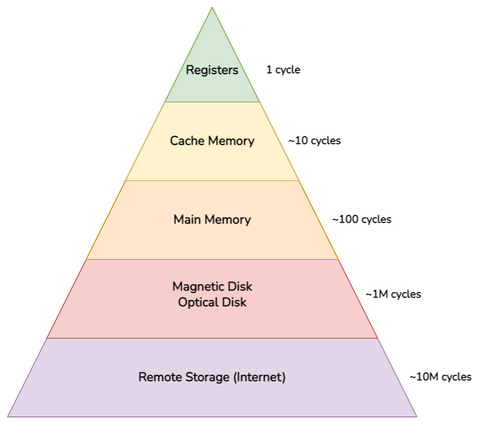

# 第 3 章：解锁多线程

本章介绍如何为 Raptor Engine 加入多线程。这既需要底层架构的较大调整，也需要一些 Vulkan 特有的改动与同步，以便 CPU 与 GPU 的多核以正确且高效的方式协作。

多线程渲染是多年来反复出现的主题，自多核架构普及以来，多数游戏引擎都离不开它。PlayStation 2、世嘉土星等主机早已提供多线程支持，后续世代则通过更多核心延续这一趋势。

游戏引擎中多线程渲染的早期实践可追溯到 2008 年 Christer Ericson 的博客文章（[链接](https://realtimecollisiondetection.net/blog/?p=86)），文中说明了将用于在屏幕上绘制物体的命令生成进行并行化与优化的可行性。

OpenGL 以及 DirectX 11 及更早版本缺乏真正的多线程支持，尤其是它们采用全局上下文跟踪每次命令后状态变化的大状态机。即便如此，不同对象的命令生成本身可能耗时数毫秒，多线程在当时已是可观的性能收益。

好在 Vulkan 从 API 设计上就原生支持多线程命令缓冲，尤其是 VkCommandBuffer 的创建与使用。Raptor Engine 此前是单线程应用，要完整支持多线程需要一定的架构改动。本章将介绍这些改动、如何使用基于任务的多线程库 enkiTS，并实现异步资源加载与多线程命令录制。

本章将涵盖：

- 如何使用基于任务的多线程库
- 如何异步加载资源
- 如何在多线程中并行绘制

学完本章后，你将掌握如何并发执行资源加载与屏幕绘制的任务；理解基于任务的多线程模型后，也便于在后续章节中完成其他并行工作。

## 技术需求

本章代码可在以下地址获取：[Mastering-Graphics-Programming-with-Vulkan/source/chapter3](https://github.com/PacktPublishing/Mastering-Graphics-Programming-with-Vulkan/tree/main/source/chapter3)。

## 使用 enkiTS 的基于任务的多线程
要实现并行，需要先理解本章架构所依赖的一些基本概念与选择。首先，在软件工程里“并行”指的是让多段代码同时执行。现代硬件有可独立运作的单元，操作系统则提供称为线程的执行单元。

一种常见做法是以**任务（task）**为单位：小的、可被任意线程执行的独立工作单元。

### 为何采用基于任务的并行？

多线程并非新话题，自其被引入各类游戏引擎以来就有多种实现方式。游戏引擎要尽可能高效地利用硬件，因此也推动了更优的软件架构。

早期做法是为每种工作开专用线程——例如单独渲染线程、异步 I/O 线程等。这在双核时代能增加可并行粒度，但很快成为瓶颈。于是需要更“与核心无关”地使用 CPU，让几乎任意核心都能执行任意类型工作，从而催生了**基于任务**与**基于纤程（fiber）**两种架构。

基于任务的并行通过向多个线程分发任务、并用依赖关系编排它们来实现。任务与平台无关且不可被抢占，调度与组织代码更直观。纤程则类似任务，但 heavily 依赖调度器在适当时机中断与恢复，编写正确的纤程系统较难，容易产生隐蔽错误。

鉴于任务比纤程更易用、且实现基于任务并行的库更多，我们选用 **enkiTS** 处理多线程。若想深入理解这两种架构，可参考相关演讲：基于任务的例子如《命运》系列引擎（[Destiny's Multithreaded Rendering](https://www.gdcvault.com/play/1021926/Destiny-s-Multithreaded-Rendering)），基于纤程的如顽皮狗引擎（[Parallelizing the Naughty Dog Engine](https://www.gdcvault.com/play/1022186/Parallelizing-the-Naughty-Dog-Engine)）。

### 使用 enkiTS（Task-Scheduler）库

基于任务的多线程以“任务”为核心：任务是在 CPU 任意核心上可执行的独立工作单元。需要**调度器**协调任务并处理依赖。任务可有一个或多个依赖，从而只在某些任务完成后才被调度执行。这样我们可以在任意时刻提交任务，通过依赖形成图式执行；若设计得当，各核心可被充分利用。

调度器负责检查依赖与优先级、按需调度或移除任务，是加入 Raptor Engine 的新系统。初始化时库会创建若干线程，每个等待执行任务。任务加入后被放入队列；当调度器执行待处理任务时，各线程按依赖与优先级从队列取下一个可用任务并执行。注意：正在运行的任务可以再派发新任务，新任务会进入该线程的本地队列，但若其他线程空闲可被“偷走”——即 **work-stealing** 队列。

初始化调度器只需创建配置并调用 Initialize：
```cpp
enki::TaskSchedulerConfig config;
config.numTaskThreadsToCreate = 4;
enki::TaskScheduler task_scheduler;
task_scheduler.Initialize( config );
```

这样会创建 4 个工作线程。enkiTS 以 **TaskSet** 为工作单位，可用继承或 lambda 驱动执行：

```cpp
struct ParallelTaskSet : enki::ITaskSet {
    void ExecuteRange( enki::TaskSetPartition range_, uint32_t threadnum_ ) override {
        // 在此执行逻辑，也可通过 task_scheduler 派发新任务
    }
};
// main 中：AddTaskSetToPipe( &task ); task_scheduler.WaitforTask( &task );
```

TaskSet 定义“任务如何执行”，具体用多少任务、在哪个线程由调度器决定。更简洁的写法是用 lambda：

```cpp
enki::TaskSet task( 1, []( enki::TaskSetPartition range_, uint32_t threadnum_ ) {
    // 在此执行
} );
task_scheduler.AddTaskSetToPipe( &task );
```

enkiTS 还支持 **pinned task**：绑定到某一线程、始终在该线程执行的任务。下一节将用 pinned task 做异步 I/O。

本节简要介绍了多线程的几种思路及我们选择基于任务的原因，并给出了 enkiTS 的简单用法。下一节将看到引擎中的实际应用：异步资源加载。

## 异步加载
资源加载往往是框架中最慢的操作之一：文件大、来源多样（光盘、硬盘甚至网络）。理解内存访问速度层级很重要：



*图 3.1 – 内存层级*

最快的是寄存器，其次是多级缓存；它们都在处理单元内（CPU 与 GPU 各有寄存器和缓存）。主存（RAM）是应用常用数据的所在，比缓存慢，但是代码能直接访问、因此是加载操作的目标。再往下是硬盘与光驱——更慢但容量大，通常存放要载入主存的资源。远程存储（如服务器）最慢，本章不涉及，但可用于带在线服务的应用（如多人游戏）。

为优化读取，我们要把所需数据都迁入主存（无法直接操控缓存和寄存器）。要掩盖磁盘与光驱的慢速，关键手段之一就是**并行化**来自各种介质的资源加载，避免拖慢应用流畅度。常见做法是专设一个线程只负责加载并与引擎其他系统交互以更新在用资源——这也是前面提到的“线程专门化”的一种。

下面几节将说明如何配置 enkiTS、为 Raptor Engine 创建并行任务，以及 Vulkan 队列（并行提交命令所必需），最后给出异步加载的实际代码。

### 创建 I/O 线程与任务
enkiTS 的 **pinned-task** 把任务绑定到指定线程，使其在该线程上持续运行，除非用户停止或该线程被更高优先级任务占用。为简化，我们增加一个专用于 I/O 的线程（`config.numTaskThreadsToCreate = 4` 等），不让主逻辑占用它，从而减少上下文切换。

创建 pinned task 并绑定到线程 ID：

```cpp
RunPinnedTaskLoopTask run_pinned_task;
run_pinned_task.threadNum = task_scheduler.GetNumTaskThreads() - 1;
task_scheduler.AddPinnedTask( &run_pinned_task );
```

再创建负责异步加载的 pinned task，绑定到同一线程：

```cpp
AsynchronousLoadTask async_load_task;
async_load_task.threadNum = run_pinned_task.threadNum;
task_scheduler.AddPinnedTask( &async_load_task );
```

下面是这两个任务的具体实现。先看第一个 pinned task：
（RunPinnedTaskLoopTask：在循环中 `WaitForNewPinnedTasks` 后 `RunPinnedTasks`，用 `execute` 标志在退出或最小化时停止。AsynchronousLoadTask：循环调用 `async_loader->update()`，使该线程专用于 I/O、不被其他任务占用。）

在进入 AsynchronousLoader 之前，需要理解 Vulkan 的**队列（queue）**概念及其对异步加载的意义。

## Vulkan 队列与首次并行命令生成
**队列**可理解为：把记录在 VkCommandBuffer 中的命令提交给 GPU 的入口。相对 OpenGL 这是 Vulkan 新增的概念。一次队列提交本身是单线程、相对昂贵的操作，也会成为 CPU-GPU 之间的同步点。通常引擎在 present 前向**主队列**提交命令缓冲，由 GPU 执行并得到最终画面。

除了主队列还可以创建更多队列，在不同线程中使用，以增强并行。队列的详细说明见 [Vulkan-Guide/queues](https://github.com/KhronosGroup/Vulkan-Guide/blob/master/chapters/queues.adoc)。每个队列能提交的命令类型由其 flag 表示：

- **VK_QUEUE_GRAPHICS_BIT**：可提交所有 vkCmdDraw 等绘制命令
- **VK_QUEUE_COMPUTE_BIT**：可提交 vkCmdDispatch、vkCmdTraceRays（光线追踪）等
- **VK_QUEUE_TRANSFER_BIT**：可提交复制命令，如 vkCmdCopyBuffer、vkCmdCopyBufferToImage、vkCmdCopyImageToBuffer

每种可用队列通过**队列族（queue family）**暴露；一个队列族可具备多种能力并包含多个队列。例如：
（示例：第一个队列族具备 graphics/compute/transfer，queueCount=1；第二个具备 compute/transfer，queueCount=2；第三个仅 transfer，queueCount=2。GPU 保证至少有一个能提交所有类型命令的队列，即主队列。部分 GPU 还有仅带 VK_QUEUE_TRANSFER 的专用队列，可用 DMA 加速 CPU-GPU 数据传输。逻辑设备负责创建与销毁队列，一般在应用启动/关闭时进行。）

查询不同队列支持的代码大致如下：
```cpp
u32 queue_family_count = 0;
vkGetPhysicalDeviceQueueFamilyProperties( vulkan_physical_device, &queue_family_count, nullptr );
VkQueueFamilyProperties* queue_families = ...;
vkGetPhysicalDeviceQueueFamilyProperties( vulkan_physical_device, &queue_family_count, queue_families );
// 遍历查找同时具备 graphics|compute|transfer 的主队列、以及仅 transfer 的传输队列，记录 main_queue_index 与 transfer_queue_index
```

得到物理设备的所有队列族后，根据 queueFlags 选出主队列与传输队列（若存在），并保存索引以便创建设备后通过 `vkGetDeviceQueue` 获取 VkQueue。若没有独立传输队列，则用主队列做传输，并需正确同步上传与图形提交。

创建队列时在 VkDeviceCreateInfo 中填入 pQueueCreateInfos；设备创建后获取队列：
（在 VkDeviceCreateInfo 中设置 queueCreateInfoCount 与 pQueueCreateInfos，调用 vkCreateDevice；再用 vkGetDeviceQueue 按 family 与索引取主队列与传输队列。）

至此主队列与传输队列就绪，可并行提交工作。我们通过专用类 **AsynchronousLoader** 在传输队列上提交复制命令而不阻塞 CPU/GPU，下一节看其实现。

### AsynchronousLoader 类

AsynchronousLoader 的职责包括：处理“从文件加载”请求、处理上传到 GPU 的传输、管理 staging buffer、在命令缓冲中填入复制命令、通知渲染器某纹理已完成传输。在具体上传代码之前，需要理解与命令池、传输队列和 staging buffer 相关的 Vulkan 用法。

#### 为传输队列创建命令池
向传输队列提交命令需要先创建与该队列关联的命令池：`queueFamilyIndex` 设为传输队列族，并设置 `VK_COMMAND_POOL_CREATE_RESET_COMMAND_BUFFER_BIT`。从该池分配的指令缓冲才能正确提交到传输队列。然后从这些池中分配命令缓冲：
（按帧为每个 command_pools[i] 分配 PRIMARY 级别、数量为 1 的命令缓冲。）这样即可用这些命令缓冲向传输队列提交命令。接下来使用 **staging buffer**，以便从 CPU 尽可能高效地向 GPU 传输数据。

#### 创建 staging buffer

在 CPU 与 GPU 之间做最优传输需要一块可作为“复制源”的内存。我们创建一块持久的 **staging buffer** 专用于此。下面分配一块 64 MB、持久映射的缓冲：
```cpp
BufferCreation bc;
bc.reset().set( VK_BUFFER_USAGE_TRANSFER_SRC_BIT, ResourceUsageType::Stream, rmega( 64 ) ).set_name( "staging_buffer" ).set_persistent( true );
BufferHandle staging_buffer_handle = gpu->create_buffer( bc );
```

对应 Vulkan 侧：VkBufferCreateInfo 使用 VK_BUFFER_USAGE_TRANSFER_SRC_BIT、size 为 64MB；VmaAllocationCreateInfo 使用 VMA_ALLOCATION_CREATE_MAPPED_BIT 使缓冲始终映射。vmaCreateBuffer 填写的 allocation_info.pMappedData 可赋给 buffer->mapped_data 供 CPU 写入。需要更大时可重新创建更大的 staging buffer。

接着需要创建用于提交与同步的信号量与栅栏。

#### 创建用于 GPU 同步的信号量与栅栏

创建 semaphore 与 fence；**重要**：fence 需以已 signaled 状态创建（VK_FENCE_CREATE_SIGNALED_BIT），这样第一帧才能开始处理上传：
（vkCreateSemaphore、vkCreateFence，fence 带 VK_FENCE_CREATE_SIGNALED_BIT。）

下面进入请求处理逻辑。

#### 处理文件请求

文件请求本身与 Vulkan 无关。我们使用 [STB 图像库](https://github.com/nothings/stb) 将纹理读入内存，再把数据与对应纹理加入上传请求，由传输队列负责从内存复制到 GPU：
（stbi_load 读图，将 texture_data 与 load_request.texture 填入 upload_requests。）

#### 处理上传请求

上传请求真正把数据传到 GPU。先等待 fence 为 signaled（因此创建时设为已 signaled）；若已 signaled 则 vkResetFences，以便提交完成后由 API 再次 signal：
（vkGetFenceStatus 若非 VK_SUCCESS 则 return；否则 vkResetFences。）然后取一个上传请求、在 staging 中占位、用命令缓冲录制上传到 GPU 的命令：
（取 upload_requests.back()，按对齐计算 aligned_image_size 与 current_offset，从 command_buffers[current_frame] 取 cb，begin 后调用 cb->upload_texture_data，free request.data，end。upload_texture_data 内部负责写 staging 并插入所需 barrier。）首先把数据拷入 staging：
（memcpy 到 staging_buffer->mapped_data + offset。设置 VkBufferImageCopy 的 bufferOffset 等。插入 pre-copy 内存屏障：oldLayout UNDEFINED → newLayout VK_IMAGE_LAYOUT_TRANSFER_DST_OPTIMAL，dstAccessMask VK_ACCESS_TRANSFER_WRITE_BIT。参考 [Khronos 同步示例](https://github.com/KhronosGroup/Vulkan-Docs/wiki/Synchronization-Examples)。然后 vkCmdCopyBufferToImage。此时数据已在 GPU 上，但主队列还不能用，需要再做一次带队列族所有权转移的 post-copy 屏障。）
（post-copy 屏障：srcQueueFamilyIndex=传输队列族，dstQueueFamilyIndex=图形队列族，oldLayout=TRANSFER_DST_OPTIMAL，newLayout=SHADER_READ_ONLY_OPTIMAL。所有权转移后，渲染器在主队列上再执行一次屏障，使新图像对着色器可读。通知渲染器“传输完成”的做法是：把纹理加入一个带互斥锁的“待更新纹理”列表。我们选择在所有渲染结束后、present 前为每个已传输纹理执行最终屏障；也可在帧开始时做。缓冲上传路径类似，书中略，代码中有。）

本节通过传输队列与独立命令缓冲实现了资源到 GPU 的异步加载，并说明了队列间所有权转移与任务调度器的初步用法。下一节将用这些知识实现多线程并行录制绘制命令。

## 在多线程上录制命令
多线程录制命令需要每个线程至少使用不同的命令缓冲，录制后再提交到主队列。在 Vulkan 中，各类 pool 都需由用户做外部同步，因此最佳做法是**线程与 pool 一一对应**。命令缓冲从对应池分配并在其中录制；CommandPool、DescriptorSetPool、QueryPool 等一旦与线程绑定，即可在该线程内自由使用。提交到主队列的缓冲数组顺序即执行顺序，因此可在命令缓冲级别做排序。

下面说明命令缓冲的**分配策略**及其对并行录制的重要性，以及 Vulkan 特有的**主/次级命令缓冲**区别。

### 分配策略

并行录制成功的关键是同时考虑**线程**与**帧**：每个线程要有专属的 pool，且该 pool 当前不能正在被 GPU 使用。一种简单策略是：设最大录制线程数为 T、最大在途帧数为 F，则分配 F×T 个命令池；用 (frame, thread) 二元组唯一对应一个池，保证同一池既不会在飞也不会被多线程同时写。这种做法偏保守、可能导致各线程工作量不均，但作为起点足以支持 Raptor Engine 的并行渲染。此外我们为每 (frame, thread) 预分配最多 5 个空命令缓冲（2 个 primary、3 个 secondary）。负责这些的是 **CommandBufferManager**，通过设备的 `get_command_buffer` 获取命令缓冲。

### 命令缓冲回收

与分配策略配套的是回收：缓冲执行完后可复用而不是每次重新分配。我们按帧固定关联若干 CommandPool，回收时对对应池调用 **vkResetCommandPool** 而不是逐个释放缓冲，CPU 侧更高效。注意这不是释放缓冲占用的内存，而是让池重用已分配内存并把其下所有命令缓冲重置为初始状态。每帧开始时调用重置方法：
（CommandBufferManager::reset_pools(frame_index) 内按 frame 与线程索引调用 vkResetCommandPool。池重置后即可复用其中的命令缓冲进行录制。）

### 主命令缓冲与次级命令缓冲

Vulkan 中命令缓冲分为 **primary** 与 **secondary**。主命令缓冲最常用，可录制绘制、计算、复制等各类命令，但粒度较粗：至少包含一个 render pass，且单个 pass 内部无法再并行。次级命令缓冲限制更大——只能在某个 render pass 内录制绘制命令——但可用于在多个线程中并行录制同一 pass 内的多段绘制（例如 G-Buffer pass）。因此需要根据任务粒度决定用主缓冲还是次级缓冲。第 4 章《实现帧图》将说明如何用帧图决定缓冲类型与每任务的对象/ pass 数量。

### 使用主命令缓冲绘制
主命令缓冲是最常用、也最简单的用法：可录制任意命令，且只有主缓冲能直接提交到队列。分配时在 VkCommandBufferAllocateInfo 中使用 VK_COMMAND_BUFFER_LEVEL_PRIMARY。录制时 vkBeginCommandBuffer，绑定 pass 与管线，发 draw/copy/compute 命令，最后 vkEndCommandBuffer。提交时填充 VkSubmitInfo（commandBufferCount、pCommandBuffers），调用 vkQueueSubmit( vulkan_main_queue, 1, &submit_info, fence )。

并行录制时只需满足两点：**禁止多线程同时录制同一 CommandPool**；**与同一 RenderPass 相关的命令只能在一个线程中录制**。若某个 pass（如 Forward 或 G-Buffer）内 draw call 很多、需要并行录制，就要用到次级命令缓冲。

### 使用次级命令缓冲绘制
次级命令缓冲只能针对**一个** render pass 录制，因此若多个 pass 都需要“pass 内并行”，就需要多个次级缓冲。次级缓冲不能直接提交到队列，必须通过 **vkCmdExecuteCommands** 被主缓冲“执行”；它们只继承开始录制时主缓冲已绑定的 RenderPass 与 Framebuffer，viewport、scissor 等需在次级缓冲里重新设置。

步骤概述：先由主命令缓冲开始 render pass 并设置 framebuffer（vkCmdBeginRenderPass 时使用 VK_SUBPASS_CONTENTS_SECONDARY_COMMAND_BUFFERS）。然后每个次级缓冲用 VkCommandBufferInheritanceInfo 指定 renderPass 与 framebuffer，VkCommandBufferBeginInfo 使用 VK_COMMAND_BUFFER_USAGE_RENDER_PASS_CONTINUE_BIT 与 pInheritanceInfo，再 vkBeginCommandBuffer。次级缓冲内需先 vkCmdSetViewport、vkCmdSetScissor，再绑定管线并 vkCmdDraw*。录制结束后 vkEndCommandBuffer，主缓冲中调用 vkCmdExecuteCommands( primary, count, secondaryBuffers ) 按顺序执行。为保证多线程录制后的顺序正确，可为每个次级缓冲赋执行索引，排序后再传给 vkCmdExecuteCommands。
主缓冲侧：开始 render pass 时若将用次级缓冲填充，需传入 `VK_SUBPASS_CONTENTS_SECONDARY_COMMAND_BUFFERS`；次级缓冲侧：用 `VkCommandBufferInheritanceInfo` 传入 renderPass 与 framebuffer，再以 `VK_COMMAND_BUFFER_USAGE_RENDER_PASS_CONTINUE_BIT` 与 pInheritanceInfo 开始录制，然后设置 viewport、scissor、绑定管线并发出 draw 命令。示例：

```cpp
VkClearValue clearValues[2];
VkRenderPassBeginInfo renderPassBeginInfo {};
renderPassBeginInfo.renderPass = renderPass;
renderPassBeginInfo.framebuffer = frameBuffer;
vkBeginCommandBuffer(primaryCommandBuffer, &cmdBufInfo);
vkCmdBeginRenderPass(primaryCommandBuffer, &renderPassBeginInfo, VK_SUBPASS_CONTENTS_SECONDARY_COMMAND_BUFFERS);

VkCommandBufferInheritanceInfo inheritanceInfo {};
inheritanceInfo.renderPass = renderPass;
inheritanceInfo.framebuffer = frameBuffer;
VkCommandBufferBeginInfo commandBufferBeginInfo {};
commandBufferBeginInfo.flags = VK_COMMAND_BUFFER_USAGE_RENDER_PASS_CONTINUE_BIT;
commandBufferBeginInfo.pInheritanceInfo = &inheritanceInfo;
vkBeginCommandBuffer(secondaryCommandBuffer, &commandBufferBeginInfo);
vkCmdSetViewport(secondaryCommandBuffers.background, 0, 1, &viewport);
vkCmdSetScissor(secondaryCommandBuffers.background, 0, 1, &scissor);
vkCmdBindPipeline(secondaryCommandBuffers.background, VK_PIPELINE_BIND_POINT_GRAPHICS, pipelines.starsphere);
vkCmdDrawIndexed(…);
```

注意：除继承的 render pass 与 framebuffer 外，scissor 与 viewport 等状态不会继承，必须在次级缓冲开头重新设置。录制结束后调用 vkEndCommandBuffer，再在主缓冲中通过 **vkCmdExecuteCommands** 把次级缓冲按顺序“拷贝”进主缓冲执行。多线程完成顺序不定，可通过为每个次级缓冲赋予执行索引、排序后再传入 vkCmdExecuteCommands 保证绘制顺序。此后主缓冲可继续录制或提交到队列。

### 并行录制：生成多个任务

最后一步是创建多个任务并行录制命令缓冲。示例中我们按“每组若干 mesh 一个命令缓冲”划分，实际更常见的是按每个 render pass 一个命令缓冲。

```cpp
SecondaryDrawTask secondary_tasks[ parallel_recordings ]{ };
u32 start = 0;
for ( u32 secondary_index = 0; secondary_index < parallel_recordings; ++secondary_index ) {
  SecondaryDrawTask& task = secondary_tasks[ secondary_index ];
  task.init( scene, renderer, gpu_commands, start, start + draws_per_secondary );
  start += draws_per_secondary;
  task_scheduler->AddTaskSetToPipe( &task );
}
```

每个 mesh 组对应一个任务，任务内为一段 mesh 范围录制一个次级命令缓冲。添加完所有任务后，需等待它们完成，再把次级缓冲依次交给主缓冲执行：

```cpp
for ( u32 secondary_index = 0; secondary_index < parallel_recordings; ++secondary_index ) {
  SecondaryDrawTask& task = secondary_tasks[ secondary_index ];
  task_scheduler->WaitforTask( &task );
  vkCmdExecuteCommands( gpu_commands->vk_command_buffer, 1, &task.cb->vk_command_buffer );
}
```

更多实现细节可参考本章源码。

本节说明了如何并行录制多个命令缓冲以优化 CPU 侧、分配策略与跨帧复用、主/次级缓冲的区别与在渲染器中的用法，并演示了并行录制的完整流程。下一章将介绍**帧图（Frame Graph）**，用于定义多个 render pass，并可结合本章的任务系统为每个 pass 并行录制命令缓冲。

## 本章小结

本章介绍了**基于任务的并行**概念，以及如何用 enkiTS 等库为 Raptor Engine 快速加入多线程能力；随后讲解了通过**异步加载器**从文件加载数据到 GPU，并围绕 Vulkan 实现了与绘制队列并行的**第二执行队列**；区分了**主命令缓冲**与**次级命令缓冲**的用法；强调了在并行录制时**缓冲分配策略**的重要性，以及跨帧复用时的安全与效率；最后按步骤演示了两种命令缓冲的用法，足以为采用 Vulkan 的应用带来所需的并行度。下一章将实现**帧图**数据结构，用于自动化部分录制流程（含 barrier），并简化并行渲染任务的粒度决策。

## 延伸阅读

- 基于任务的系统已使用多年，[Task-based Multithreading - How to](https://www.gdcvault.com/play/1012321/Task-based-Multithreading-How-to) 提供了很好的概览。
- 关于无锁 work-stealing 队列可参考 [Job system 2.0: lock-free work-stealing](https://blog.molecular-matters.com/2015/09/08/job-system-2-0-lock-free-work-stealing-part-2-a-specialized-allocator/) 等文章。
- PlayStation 3 与 Xbox 360 使用 IBM Cell 处理器，通过多核为开发者提供更高性能；PS3 的协同处理单元（SPU）常用于从主处理器卸载工作。可参阅 [The PlayStation 3's SPU](https://www.gdcvault.com/play/1331/The-PlayStation-3-s-SPU)、[Practical Occlusion Culling on the SPU](https://gdcvault.com/play/1014356/Practical-Occlusion-Culling-on) 等演讲与文章。