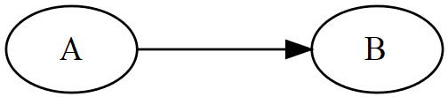
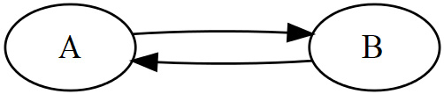
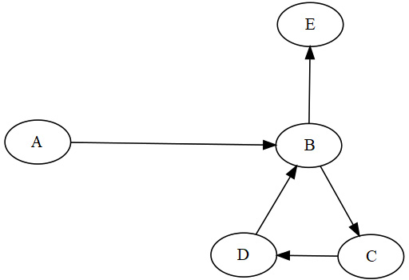
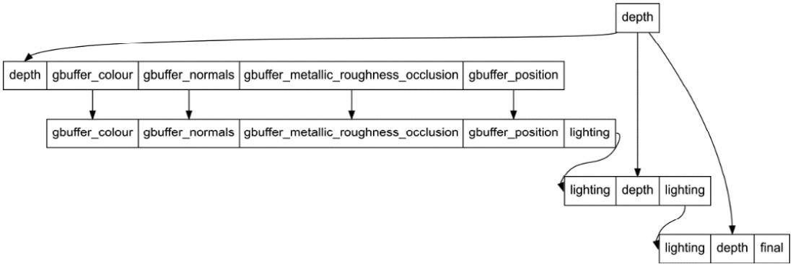
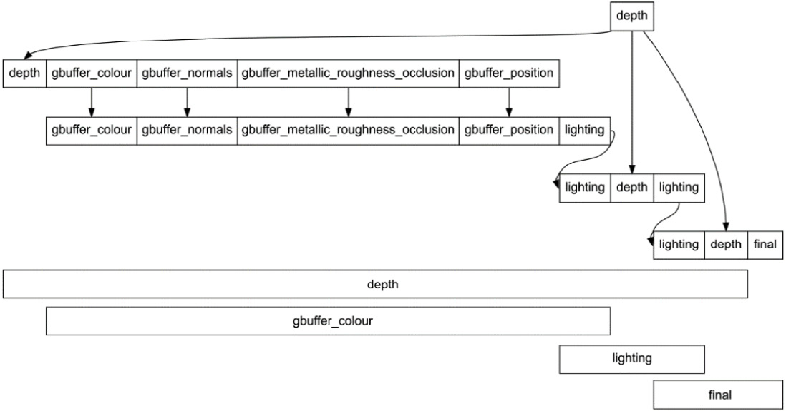

# 第 4 章：实现帧图（Frame Graph）

本章介绍**帧图（frame graph）**——一种用于控制单帧渲染步骤的新系统。 顾名思义，我们将把渲染一帧所需的各个**步骤（pass）**组织成一张**有向无环图（DAG）**，从而确定各 pass 的执行顺序以及哪些 pass 可以并行执行。
使用图结构还能带来：自动化 render pass 与 framebuffer 的创建与管理；通过**内存别名（memory aliasing）**减少帧所需内存；由帧图统一管理内存屏障与布局转换。本章将涵盖：理解帧图结构与实现细节；实现拓扑排序以保证 pass 按正确顺序执行；用图驱动渲染并自动化资源管理与布局转换。
## 技术需求

本章代码见：https://github.com/PacktPublishing/Mastering-Graphics-Programming-with-Vulkan/tree/main/source/chapter4

## 理解帧图

目前 Raptor Engine 的渲染仍只包含单个 pass。这对前面章节足够，但无法支撑后续更复杂的管线；现代渲染引擎通常包含大量 pass，手写管理既繁琐又易出错。因此我们在此引入帧图。本节介绍图的结构及在代码中的主要接口。

### 图的构成

图由**节点（node/vertex）**与**边（edge）**定义；节点之间通过边连接。



Figure 4.1 – 从节点 A 到 B 的一条边。

帧图是 **DAG**，需满足：**有向**——边有方向，A→B 与 B→A 需不同边；**无环**——不能沿后继路径回到自身，否则会无限循环。



Figure 4.2 – 有向图中 A→B 与 B→A；



Figure 4.3 – 含环示例。

在帧图中每个节点对应一个渲染 pass（depth prepass、G-Buffer、光照等）；边不显式定义，由节点的输入/输出隐含——某 pass 的输出被另一 pass 用作输入即产生一条边。



Figure 4.4 – 完整帧图示例。

下面说明我们如何用数据结构表示图。

### 数据驱动方式
有的引擎只提供代码接口构建帧图，有的则允许用可读格式（如 JSON）描述图，这样修改图不必改代码。我们选择用 **JSON 定义图**并实现解析器实例化所需类，原因包括：修改图时无需重新编译；可重组图、删除节点而不用动代码；图的流程更易阅读；非技术人员也更容易参与，甚至可用可视化工具编辑再导出 JSON。下面是一个帧图节点的 JSON 示例：
```
{
"inputs":
[
{
"type": "attachment",
"name": "depth"
}
],
 "name": "gbuffer_pass",
"outputs":
[
{
"type": "attachment",
"name": "gbuffer_colour",
"format": "VK_FORMAT_B8G8R8A8_UNORM",
"resolution": [ 1280, 800 ],
"op": "VK_ATTACHMENT_LOAD_OP_CLEAR"
},
{
"type": "attachment",
"name": "gbuffer_normals",
"format": "VK_FORMAT_R16G16B16A16_SFLOAT",
"resolution": [ 1280, 800 ],
"op": "VK_ATTACHMENT_LOAD_OP_CLEAR"
},
...
]
}
```
节点由三个字段定义：**name**（执行时标识节点，并为 render pass 等提供名称）；**inputs**（本节点使用的、由其他节点产生的资源，未在图中产生的输入会报错，仅外部资源例外，需在运行时提供给图）；**outputs**（本节点产生的资源）。我们按用途定义了四类资源：**attachment**——用于确定节点的 render pass 与 framebuffer 组成，输入/输出都可声明，以便多节点复用同一资源（如 depth prepass 后 G-Buffer pass 加载 depth 做遮挡）；**texture**——与 attachment 区分，attachment 参与 pass/framebuffer 定义，texture 在 pass 内被读取、属于 shader 数据，该区分也用于决定哪些图像需布局转换与 barrier，后文详述；texture 的尺寸与格式在首次作为 output 定义时已指定，此处无需重复；**buffer**——storage buffer，读写均需在跨 pass 时插入内存屏障；**reference**——仅用于建立节点间边而不创建新资源。下面用 reference 类型举例：
```
{
"inputs":
[
{
"type": "attachment",
"name": "lighting"
},
{
"type": "attachment",
"name": "depth"
}
],
 "name": "transparent_pass",
"outputs":
[
{
"type": "reference",
"name": "lighting"
}
]
}
```
此处 lighting 是 attachment 类型的输入。处理图时会正确把产生 lighting 的节点连到本节点；但还要让**后续**使用 lighting 的节点与本节点建立连接，否则节点顺序会错。因此在 transparent pass 的 output 里对 lighting 加一个 **reference**；不能再用 attachment，否则会在创建 render pass 与 framebuffer 时重复计入 lighting。下面进入实现部分。

## 实现帧图

本节定义全章使用的数据结构（资源与节点），并解析 JSON 生成资源与节点。先看数据结构。

### 资源（Resources）

资源表示节点的输入或输出，决定其在某节点中的用途，并用于定义帧图节点之间的边。结构如下：
```
struct FrameGraphResource {
FrameGraphResourceType type;
FrameGraphResourceInfo resource_info;
FrameGraphNodeHandle producer;
FrameGraphResourceHandle output_handle;
i32 ref_count = 0;
const char* name = nullptr;
};
```
资源既可作输入也可作输出。字段含义：**type**——图像或 buffer；**resource_info**——尺寸、格式等；**producer**——产生该资源的节点，用于建边；**output_handle**——父资源句柄，后文说明；**ref_count**——计算别名（aliasing）时用，即多资源共享同一块内存；**name**——JSON 中的名称，便于调试与按名查找。接下来看图节点：
```
struct FrameGraphNode {
RenderPassHandle render_pass;
FramebufferHandle framebuffer;
FrameGraphRenderPass* graph_render_pass;
Array<FrameGraphResourceHandle> inputs;
Array<FrameGraphResourceHandle> outputs;
Array<FrameGraphNodeHandle> edges;
const char* name = nullptr;
};
```
节点保存执行时使用的输入列表与产生的输出列表；每个输入/输出都是独立的 FrameGraphResource，通过 output_handle 把输入链到其输出资源。同一图像可能先作为 output attachment 再作为 input texture，类型不同故需分开资源实例，这一区分用于自动插入内存屏障。节点还保存所连节点列表、名称、根据输入/输出定义创建的 framebuffer 与 render pass，以及指向渲染实现的指针（与 render pass 的绑定后文说明）。FrameGraphBuilder 负责创建节点与资源。解析与使用流程如下。

### 解析图（Parsing the graph）

定义好数据结构后，解析 JSON 填充这些结构并生成帧图。步骤：

1. 初始化 FrameGraphBuilder 与 FrameGraph：
```
FrameGraphBuilder frame_graph_builder;
frame_graph_builder.init( &gpu );
FrameGraph frame_graph;
frame_graph.init( &frame_graph_builder );
```
2. 调用 parse 读取 JSON 并创建资源与节点：
`frame_graph.parse( frame_graph_path, &scratch_allocator );`
3. 编译：`frame_graph.compile();` —— 在此步计算节点间边、为每个节点创建 framebuffer 与 render pass、确定可别名的资源，下一节详述。
4. 注册各渲染 pass：
```
frame_graph->builder->register_render_pass(
"depth_pre_pass", &depth_pre_pass );
frame_graph->builder->register_render_pass(
"gbuffer_pass", &gbuffer_pass );
frame_graph->builder->register_render_pass(
"lighting_pass", &light_pass );
frame_graph->builder->register_render_pass(
"transparent_pass", &transparent_pass );
frame_graph->builder->register_render_pass(
"depth_of_field_pass", &dof_pass );
```
这样可方便地替换每个 pass 的实现类，甚至运行时切换。
5. 渲染：`frame_graph->render( gpu_commands, scene );`。

下面详述 compile 与 render。

## 实现拓扑排序

帧图实现的核心在 compile 内：计算边、创建 framebuffer/render pass、资源别名。以下为算法要点，完整实现见本章 GitHub。

**计算节点间边**：遍历每个节点的每个输入，按名称找到对应的 output 资源，把 output 的信息写入 input（producer、resource_info、output_handle），并在产生该输入的父节点与本节点之间建立边。第一步代码如下：
for ( u32 r = 0; r < node->inputs.size; ++r ) {
 FrameGraphResource* resource = frame_graph->
get_resource( node->inputs[ r ].index );
u32 output_index = frame_graph->find_resource(
hash_calculate( resource->name ) );
FrameGraphResource* output_resource = frame_graph
->get_resource( output_index );
（图中 output 按名称存于 map。）第二步：把 output 的 producer、resource_info、output_handle 写入 input。第三步：在 producer 节点与当前节点间建边（parent_node->edges.push( 当前节点 )）。循环结束后每个节点都有其连接的节点列表；此阶段也可选择移除无边的节点。然后对节点做**拓扑排序**，得到“生产者先于消费者”的执行顺序。排序算法要点：sorted_nodes 存的是逆序结果；
Array<FrameGraphNodeHandle> sorted_nodes;
sorted_nodes.init( &local_allocator, nodes.size );
visited 标记已处理节点以防环；stack 替代递归做迭代 DFS。外层：对每个节点 push 进 stack；内层：若 visited==2 表示已加入排序列表，pop 并继续；若 visited==1 表示其子节点已处理完，标记为 2、加入 sorted_nodes、pop；首次到达时置 visited=1。因一节点可有多个 output 连到多节点，需避免同一节点被多次加入排序列表，故用 1/2 两阶段。代码片段：
if ( visited[ node_handle.index ] == 1) {
 visited[ node_handle.index ] = 2; // added
sorted_nodes.push( node_handle );
stack.pop();
continue;
}
（叶节点 edges.size==0 时 continue；否则把未访问的子节点 push 进 stack。最后把 sorted_nodes 逆序写回 nodes 即得到拓扑序。）排序完成后即可分析哪些资源可做**内存别名**。

## 计算资源别名（Computing resource aliasing）
大型帧图有大量节点与资源，许多资源的生命周期并不覆盖整帧，因此可在不再需要时复用其内存（**内存别名**：多资源指向同一块分配）。



Figure 4.5 – 帧内资源生命周期示例；

例如 gbuffer_colour 不必保留整帧，其内存可复用于最终结果等。做法：先确定每个资源的首次与末次使用节点，再在分配时优先复用已释放的内存。实现中先分配辅助数组：
```
sizet resource_count = builder->resource_cache.resources.
used_indices;
Array<FrameGraphNodeHandle> allocations;
allocations.init( &local_allocator, resource_count,
resource_count );
for ( u32 i = 0; i < resource_count; ++i) {
} allocations[ i ].index = k_invalid_index;
Array<FrameGraphNodeHandle> deallocations;
deallocations.init( &local_allocator, resource_count,
resource_count );
for ( u32 i = 0; i < resource_count; ++i) {
} deallocations[ i ].index = k_invalid_index;
Array<TextureHandle> free_list;
free_list.init( &local_allocator, resource_count );
```
allocations 记录某资源在哪个节点分配，deallocations 记录在哪个节点可释放，free_list 存已释放可复用的纹理。算法：先遍历所有节点的输入，对每次作为输入使用的资源增加 ref_count；再遍历节点与输出，对非外部且尚未分配的 attachment 进行分配——若 free_list 非空则用其最后一个纹理做别名（传给 TextureCreation），否则新建；最后遍历该节点输入，对对应 output 资源 ref_count--，若变为 0 则记入 deallocations 并把纹理放入 free_list。核心代码见下（省略部分已在上文说明）：
```
for ( u32 i = 0; i < nodes.size; ++i ) {
FrameGraphNode* node = ( FrameGraphNode* )builder->
node_cache.nodes.access
 _resource( nodes[ i ].index );
for ( u32 j = 0; j < node->inputs.size; ++j ) {
FrameGraphResource* input_resource =
builder->resource_cache.resources.get(
node->inputs[ j ].index );
FrameGraphResource* resource =
builder->resource_cache.resources.get(
input_resource->output_handle.index );
resource->ref_count++;
}
}
```
（第一段循环：对所有输入增加对应 output 的 ref_count；第二段：对每个节点的输出，若非外部且未分配则在本节点分配——attachment/texture 从 free_list 取或新建；第三段：对该节点输入对应的 output 做 ref_count--，若为 0 则加入 free_list。）
```
for ( u32 i = 0; i < nodes.size; ++i ) {
FrameGraphNode* node = builder->get_node(
nodes[ i ].index );
for ( u32 j = 0; j < node->outputs.size; ++j ) {
u32 resource_index = node->outputs[ j ].index;
FrameGraphResource* resource =
builder->resource_cache.resources.get(
resource_index );
if ( !resource->resource_info.external &&
allocations[ resource_index ].index ==
k_invalid_index ) {
allocations[ resource_index ] = nodes[ i ];
if ( resource->type ==
FrameGraphResourceType_Attachment ) {
FrameGraphResourceInfo& info =
resource->resource_info;
if ( free_list.size > 0 ) {
TextureHandle alias_texture =
 free_list.back();
free_list.pop();
TextureCreation texture_creation{ };
TextureHandle handle =
builder->device->create_texture(
texture_creation );
info.texture.texture = handle;
} else {
TextureCreation texture_creation{ };
TextureHandle handle =
builder->device->create_texture(
texture_creation );
info.texture.texture = handle;
}
}
}
}
for ( u32 j = 0; j < node->inputs.size; ++j ) {
FrameGraphResource* input_resource =
builder->resource_cache.resources.get(
node->inputs[ j ].index );
u32 resource_index = input_resource->
output_handle.index;
FrameGraphResource* resource =
builder->resource_cache.resources.get(
resource_index );
resource->ref_count--;
if ( !resource->resource_info.external &&
resource->ref_count == 0 ) {
 deallocations[ resource_index ] = nodes[ i ];
if ( resource->type ==
FrameGraphResourceType_Attachment ||
resource->type ==
FrameGraphResourceType_Texture ) {
free_list.push( resource->resource_info.
texture.texture );
}
}
}
}
```
图分析完成后，用生成的资源创建 framebuffer，即可进入渲染。下一节说明如何用帧图驱动渲染。

## 用帧图驱动渲染（Driving rendering with the frame graph）

图分析完成后即可按拓扑序执行各节点，并为每个节点把资源置于正确状态。主循环对每个节点：
```
for ( u32 n = 0; n < nodes.size; ++n ) {
FrameGraphNode*node = builder->get_node( nodes
[ n ].index );
gpu_commands->clear( 0.3, 0.3, 0.3, 1 );
gpu_commands->clear_depth_stencil( 1.0f, 0 );
for ( u32 i = 0; i < node->inputs.size; ++i ) {
FrameGraphResource* resource =
builder->get_resource( node->inputs[ i ].index
 );
if ( resource->type ==
FrameGraphResourceType_Texture ) {
Texture* texture =
gpu_commands->device->access_texture(
resource->resource_info.texture.texture
);
util_add_image_barrier( gpu_commands->
vk_command_buffer, texture->vk_image,
RESOURCE_STATE_RENDER_TARGET,
RESOURCE_STATE_PIXEL_SHADER_RESOURCE,
0, 1, resource->resource_info.
texture.format ==
VK_FORMAT_D32_SFLOAT );
} else if ( resource->type ==
FrameGraphResourceType_Attachment ) {
Texture*texture = gpu_commands->device->
access_texture( resource->
resource_info.texture.texture
); }
}
```
先遍历节点输入：若为 texture，插入 barrier 将其从 attachment 布局转为 fragment shader 可读布局；若为 attachment 则取得纹理指针（后续用于输出时设置尺寸）。确保此前写入完成再读取。
```
for ( u32 o = 0; o < node->outputs.size; ++o ) {
FrameGraphResource* resource =
builder->resource_cache.resources.get(
node->outputs[ o ].index );
if ( resource->type ==
FrameGraphResourceType_Attachment ) {
Texture* texture =
gpu_commands->device->access_texture(
resource->resource_info.texture.texture
 );
width = texture->width;
height = texture->height;
if ( texture->vk_format == VK_FORMAT_D32_SFLOAT ) {
util_add_image_barrier(
gpu_commands->vk_command_buffer,
texture->vk_image, RESOURCE_STATE_UNDEFINED,
RESOURCE_STATE_DEPTH_WRITE, 0, 1, resource->
resource_info.texture.format ==
VK_FORMAT_D32_SFLOAT );
} else {
util_add_image_barrier( gpu_commands->
vk_command_buffer, texture->vk_image,
RESOURCE_STATE_UNDEFINED,
RESOURCE_STATE_RENDER_TARGET, 0, 1,
resource->resource_info.texture.format ==
VK_FORMAT_D32_SFLOAT );
}
}
}
```
再遍历输出：对 attachment 类型插入 barrier（UNDEFINED→DEPTH_WRITE 或 RENDER_TARGET），并记录 width/height。各节点分辨率可能不同，随后根据 width/height 设置 scissor 与 viewport：
```
Rect2DInt scissor{ 0, 0,( u16 )width, ( u16 )height };
gpu_commands->set_scissor( &scissor );
Viewport viewport{ };
viewport.rect = { 0, 0, ( u16 )width, ( u16 )height };
viewport.min_depth = 0.0f;
viewport.max_depth = 1.0f;
gpu_commands->set_viewport( &viewport );
然后调用 `node->graph_render_pass->pre_render()`，供节点在 render pass 外执行操作（如景深 pass 为输入纹理生成 MIP）。最后绑定本节点的 render pass 与 framebuffer，调用注册的 render，再结束 render pass：
gpu_commands->bind_pass( node->render_pass, node->
framebuffer, false );
node->graph_render_pass->render( gpu_commands,
render_scene );
gpu_commands->end_current_render_pass();
}
```
本章从帧图所用主要数据结构出发，说明了如何解析图并依输入/输出计算边、做拓扑排序、用内存别名优化分配，以及按节点执行渲染并保证资源状态正确。尚未实现但可增强帧图的功能包括：检测图中环、禁止同一节点既生产又消费同一输入；当前别名采用贪心策略（取第一个可容纳的已释放资源），可能产生碎片与次优内存使用。欢迎在代码基础上继续改进。

## 本章小结

本章实现了帧图以改进 render pass 管理，便于后续扩展渲染管线。我们介绍了图的基本概念（节点与边）、帧图在 JSON 中的结构及采用数据驱动的原因；然后详述了图的处理流程：主要数据结构、解析生成节点与资源与边的计算、拓扑排序保证执行顺序、基于生命周期的内存别名策略，以及渲染循环中如何保证资源状态。下一章将结合前两章的多线程与帧图，演示如何并行使用计算与图形管线进行布料模拟。

## 延伸阅读

- 本实现深受 Frostbite 引擎帧图的启发，推荐观看：[FrameGraph - Extensible Rendering Architecture in Frostbite](https://www.gdcvault.com/play/1024045/FrameGraph-Extensible-Rendering-Architecture-in)。
- 许多引擎都使用帧图来组织与优化渲染管线，建议多参考其他实现并选择最适合需求的方案。