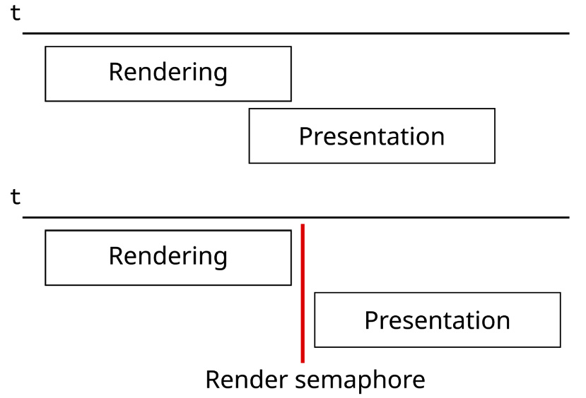
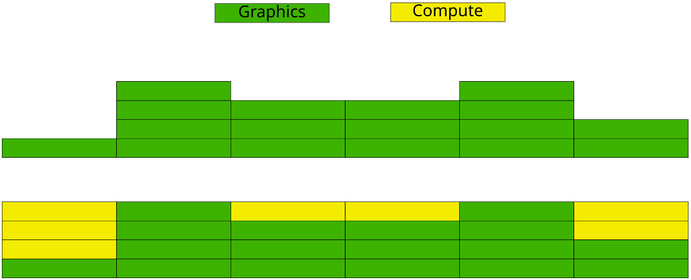

# 第 5 章：解锁异步计算（Async Compute）

本章通过让**计算任务与图形任务并行执行**来改进渲染器。目前我们仍把全部工作录制并提交到单一队列；计算任务也可以提交到同一队列与图形一起执行——例如本章已用 compute shader 做全屏光照 pass，此时不需要单独队列以减少队列间同步。但若把部分计算放到**独立计算队列**上，可更好利用 GPU 的计算单元。本章将实现一个在独立计算队列上运行的**简单布料模拟**，并为此对引擎做相应改动。

本章主要涉及：用**单一时间线信号量（timeline semaphore）**替代多个 fence；为异步计算增加**独立队列**；用异步计算实现**布料模拟**。

## 技术需求

本章代码见：https://github.com/PacktPublishing/Mastering-Graphics-Programming-with-Vulkan/tree/main/source/chapter5

## 用单一时间线信号量替代多个 fence
本节说明当前渲染器中 fence 与 semaphore 的用法，以及如何用**时间线信号量**减少同步对象数量。引擎已用 fence 支持多帧并行：CPU 在提交新命令前等待 fence，确保 GPU 已用完该帧资源。



Figure 5.1 – CPU 处理当前帧、GPU 渲染上一帧。代价是每帧在飞都要一个 fence，双缓冲至少两个、三缓冲要三个；此外还需多个 semaphore，例如渲染完成后 signal 一个 semaphore 并传给 present，保证 present 前渲染完成。Figure 5.2 – 无 semaphore 时可能把未渲染完的图像 present 出去；有 semaphore 后先 wait 再 present 才能正确。引入多队列后更复杂：单独计算队列需要更多 fence 与 semaphore 来同步计算与图形队列。即便不用计算队列，把渲染拆成多次提交时，每次提交也要各自的 signal/wait semaphore，大场景数十上百次提交会难以管理。**时间线信号量**可解决：它与 fence/semaphore 一样表示“某次提交完成”，但可在 CPU 与 GPU 两侧共用同一对象。时间线信号量持有一个**单调递增的值**，可指定“在何值上 signal、等待何值”；CPU 与 GPU 都可等待它，从而大幅减少同步对象。下面说明在 Vulkan 中的用法。

### 启用时间线信号量扩展
时间线信号量在 Vulkan 1.2 中已纳入核心，但非强制，使用前需查询支持。通过枚举设备扩展并查找扩展名：
```
vkEnumerateDeviceExtensionProperties(
vulkan_physical_device, nullptr,
&device_extension_count, extensions );
for ( size_t i = 0; i < device_extension_count; i++ ) {
if ( !strcmp( extensions[ i ].extensionName,
VK_KHR_TIMELINE_SEMAPHORE_EXTENSION_NAME ) ) {
timeline_semaphore_extension_present = true;
continue;
}
}
```
若存在该扩展，在创建设备时需填充额外结构（`VkPhysicalDeviceFeatures2` + `VkPhysicalDeviceTimelineSemaphoreFeatures`），并把扩展名加入 enabled 列表；创建设备时 pNext 指向 physical_features2。示例：
```
VkPhysicalDeviceFeatures2 physical_features2 {
VK_STRUCTURE_TYPE_PHYSICAL_DEVICE_FEATURES_2 };
void* current_pnext = nullptr;
VkPhysicalDeviceTimelineSemaphoreFeatures timeline_sempahore_features{ VK_STRUCTURE_TYPE_PHYSICAL_DEVICE_TIMELINE_SEMAPHORE_FEATURES };
if ( timeline_semaphore_extension_present ) {
timeline_sempahore_features.pNext = current_pnext;
} current_pnext = &timeline_sempahore_features;
physical_features2.pNext = current_pnext;
vkGetPhysicalDeviceFeatures2( vulkan_physical_device,
&physical_features2 );
（将 VK_KHR_TIMELINE_SEMAPHORE_EXTENSION_NAME 加入 device_extensions。）创建设备时：
VkDeviceCreateInfo device_create_info {
VK_STRUCTURE_TYPE_DEVICE_CREATE_INFO };
device_create_info.enabledExtensionCount =
device_extensions.size;
device_create_info.ppEnabledExtensionNames =
device_extensions.data;
device_create_info.pNext = &physical_features2;
vkCreateDevice( vulkan_physical_device,
&device_create_info, vulkan_allocation_callbacks,
&vulkan_device );
```
启用后即可在代码中使用时间线信号量。下一节说明如何创建。

### 创建时间线信号量

先填写标准创建结构，再通过 pNext 挂上 VkSemaphoreTypeCreateInfo（semaphoreType = VK_SEMAPHORE_TYPE_TIMELINE），最后调用 vkCreateSemaphore：
```
VkSemaphoreCreateInfo semaphore_info{
VK_STRUCTURE_TYPE_SEMAPHORE_CREATE_INFO };
```
（见上：pNext 指向 semaphore_type_info。）创建完成后即可在渲染器中使用。下面说明在 CPU 与 GPU 上的用法。

### 在 CPU 上等待时间线信号量

使用 VkSemaphoreWaitInfo（semaphoreCount、pSemaphores、pValues）调用 vkWaitSemaphores，可一次等待多个信号量并分别指定要等待的值；flags 可用 VK_SEMAPHORE_WAIT_ANY_BIT 表示“任一达到即返回”，否则需全部达到。timeout 单位为纳秒，超时未满足则返回 VK_TIMEOUT；通常设为无穷大，也可设为较大值（如 1 秒）以便检测死锁。示例：
```
u64 timeline_value = …;
VkSemaphoreWaitInfo semaphore_wait_info{
VK_STRUCTURE_TYPE_SEMAPHORE_WAIT_INFO };
semaphore_wait_info.semaphoreCount = 1;
semaphore_wait_info.pSemaphores =
&vulkan_timeline_semaphore;
semaphore_wait_info.pValues = &timeline_value;
vkWaitSemaphores( vulkan_device, &semaphore_wait_info,
timeout );
```
（说明已并入上文。）下一节说明在 GPU 提交中的用法。

### 在 GPU 上使用时间线信号量

**说明**：本节使用 VK_KHR_synchronization2 扩展简化 barrier 与 semaphore 的编写；旧 API 实现见完整代码。在提交时定义要等待的 semaphore 列表（VkSemaphoreSubmitInfoKHR）：可混用标准 semaphore 与时间线 semaphore，标准 semaphore 的 value 被忽略。再定义要 signal 的列表；时间线 signal 值必须单调递增，且不能在**同一提交**内 wait 自己将 signal 的值，否则会死锁。最后把两个列表填入 VkSubmitInfo2KHR，用 queue_submit2 提交；这样就不再需要 fence。示例（wait：image_acquired + 时间线上一帧；signal：render_complete + 时间线当前帧+1）：
```
VkSemaphoreSubmitInfoKHR wait_semaphores[]{
{ VK_STRUCTURE_TYPE_SEMAPHORE_SUBMIT_INFO_KHR, nullptr,
vulkan_image_acquired_semaphore, 0,
VK_PIPELINE_STAGE_2_COLOR_ATTACHMENT_OUTPUT_BIT_KHR,
0 },
{ VK_STRUCTURE_TYPE_SEMAPHORE_SUBMIT_INFO_KHR, nullptr,
vulkan_timeline_semaphore, absolute_frame - (
k_max_frames - 1 ),
VK_PIPELINE_STAGE_2_TOP_OF_PIPE_BIT_KHR , 0 }
};
（wait 列表可包含标准与时间线 semaphore；signal 列表同理。）
VkSemaphoreSubmitInfoKHR signal_semaphores[]{
{ VK_STRUCTURE_TYPE_SEMAPHORE_SUBMIT_INFO_KHR, nullptr,
*render_complete_semaphore, 0,
VK_PIPELINE_STAGE_2_COLOR_ATTACHMENT_OUTPUT_BIT_KHR,
0 },
{ VK_STRUCTURE_TYPE_SEMAPHORE_SUBMIT_INFO_KHR, nullptr,
vulkan_timeline_semaphore, absolute_frame + 1,
VK_PIPELINE_STAGE_2_COLOR_ATTACHMENT_OUTPUT_BIT_KHR
, 0 }
};
```
（时间线 signal 值必须递增；wait 的值必须来自先前提交，否则会死锁。）将 wait/signal 列表填入 submit_info 并 queue_submit2：
```
VkSubmitInfo2KHR submit_info{
VK_STRUCTURE_TYPE_SUBMIT_INFO_2_KHR };
submit_info.waitSemaphoreInfoCount = 2;
submit_info.pWaitSemaphoreInfos = wait_semaphores;
submit_info.commandBufferInfoCount =
num_queued_command_buffers;
submit_info.pCommandBufferInfos = command_buffer_info;
submit_info.signalSemaphoreInfoCount = 2;
submit_info.pSignalSemaphoreInfos = signal_semaphores;
queue_submit2( vulkan_main_queue, 1, &submit_info,
VK_NULL_HANDLE );
```
同一提交内可同时 wait 与 signal 同一时间线信号量，且不再需要 fence。下一节用时间线信号量为**异步计算**增加独立队列。

## 为异步计算增加独立队列

现代 GPU 有大量通用计算单元，可同时用于图形与计算。单帧负载（着色器复杂度、分辨率、pass 依赖等）可能导致 GPU 未满载。把部分计算用 compute shader 移到 GPU 可提高利用率：调度器会把空闲计算单元分配给计算任务，与图形任务重叠。



Figure 5.3 – 上：图形未满载；下：计算利用空闲资源。下面用上一节的时间线信号量同步两个队列对数据的访问。

### 在独立队列上提交工作
第 3 章已配置多队列。两队列访问同一数据时需正确同步，否则可能读到过期或未初始化数据。第一步：为计算工作使用**独立命令缓冲**（同一命令缓冲不能提交到不同队列），通过 `gpu.get_command_buffer( 0, gpu.current_frame, true )` 获取。第二步：为计算队列单独创建一个时间线信号量（创建方式同前）。每次计算提交时递增该信号量的值；第一次提交时**不要** wait 该信号量（否则永远等不到 signal 会死锁，validation layer 会提示）。wait 阶段使用 VK_PIPELINE_STAGE_2_COMPUTE_SHADER_BIT_KHR。示例：
```
bool has_wait_semaphore = last_compute_semaphore_value > 0;
VkSemaphoreSubmitInfoKHR wait_semaphores[]{
{ VK_STRUCTURE_TYPE_SEMAPHORE_SUBMIT_INFO_KHR, nullptr,
vulkan_compute_semaphore,
last_compute_semaphore_value,
VK_PIPELINE_STAGE_2_COMPUTE_SHADER_BIT_KHR, 0 }
};
last_compute_semaphore_value++;
VkSemaphoreSubmitInfoKHR signal_semaphores[]{
{ VK_STRUCTURE_TYPE_SEMAPHORE_SUBMIT_INFO_KHR, nullptr,
vulkan_compute_semaphore,
last_compute_semaphore_value,
VK_PIPELINE_STAGE_2_COMPUTE_SHADER_BIT_KHR, 0 },
};
```
（wait/signal 列表准备好后填入 VkSubmitInfo2KHR，用 queue_submit2 提交到 vulkan_compute_queue，无 fence。）
```
VkCommandBufferSubmitInfoKHR command_buffer_info{
VK_STRUCTURE_TYPE_COMMAND_BUFFER_SUBMIT_INFO_KHR };
command_buffer_info.commandBuffer =
command_buffer->vk_command_buffer;
VkSubmitInfo2KHR submit_info{
VK_STRUCTURE_TYPE_SUBMIT_INFO_2_KHR };
submit_info.waitSemaphoreInfoCount =
has_wait_semaphore ? 1 : 0;
submit_info.pWaitSemaphoreInfos = wait_semaphores;
submit_info.commandBufferInfoCount = 1;
submit_info.signalSemaphoreInfoCount = 1;
submit_info.pSignalSemaphoreInfos = signal_semaphores;
queue_submit2( vulkan_compute_queue, 1, &submit_info,
VK_NULL_HANDLE );
```
（首次提交不要 wait 计算信号量。）提交计算后，图形队列在提交时需**等待计算信号量**，确保计算产出的数据就绪。在图形队列的 wait 列表中加入计算时间线信号量（仅当 last_compute_semaphore_value > 0 且本帧有异步工作时才 wait；wait 阶段按用途设置，例如我们修改的是顶点数据则用 VK_PIPELINE_STAGE_2_VERTEX_ATTRIBUTE_INPUT_BIT_KHR，若计算产出的是纹理且要到 fragment 才用则设对应阶段，正确设置有助于性能）。新增代码要点：
```
bool wait_for_compute_semaphore = (
last_compute_semaphore_value > 0 ) && has_async_work;
VkSemaphoreSubmitInfoKHR wait_semaphores[]{
{ VK_STRUCTURE_TYPE_SEMAPHORE_SUBMIT_INFO_KHR, nullptr,
vulkan_image_acquired_semaphore, 0,
VK_PIPELINE_STAGE_2_COLOR_ATTACHMENT_OUTPUT_BIT_KHR,
0 },
{ VK_STRUCTURE_TYPE_SEMAPHORE_SUBMIT_INFO_KHR, nullptr,
vulkan_compute_semaphore,
last_compute_semaphore_value,
VK_PIPELINE_STAGE_2_VERTEX_ATTRIBUTE_INPUT_BIT_KHR,
0 },
 { VK_STRUCTURE_TYPE_SEMAPHORE_SUBMIT_INFO_KHR, nullptr,
vulkan_graphics_semaphore,
absolute_frame - ( k_max_frames - 1 ),
VK_PIPELINE_STAGE_2_TOP_OF_PIPE_BIT_KHR , 0 },
};
```
（说明已并入上文。）下一节以**布料模拟**为例，用 compute shader 在异步计算队列上实现。

## 用异步计算实现布料模拟
本节以 GPU 上的**简单布料模拟**为例说明计算负载的用法：先说明在 GPU 上跑部分任务的好处，再概述 compute shader 的执行模型，最后说明从 CPU 移植到 GPU 时要注意的差异。

### 使用 compute shader 的好处

以往物理模拟多在 CPU 上；GPU 管线多为专用硬件、算力主要给图形用。随着管线阶段泛化为通用计算块，引擎得以把部分工作移到 GPU。除算力外，在 GPU 上计算可**避免 CPU→GPU 的昂贵拷贝**；内存带宽提升慢于处理器，减少跨设备数据传输对性能很重要。布料模拟需更新所有顶点并把结果拷回 GPU，网格规模大时可能占去相当比例帧时间；在 GPU 上还可并行更新更多 mesh，扩展性更好。

### Compute shader 概述
GPU 执行模型为 **SIMT（Single Instruction, Multiple Threads）**，与 CPU 的 SIMD 类似但单指令作用的数据更多、每线程更灵活。不同厂商对“线程组”有不同叫法（warp、wave 等），本书统称 **thread group**。一次 compute 调用可包含多个线程，数量由 **local_size** 指定。在 shader 内：`layout (local_size_x = 8, local_size_y = 8, local_size_z = 1) in;` 表示本地 8×8×1=64 线程；各 GPU 有较优的 thread group 大小，建议查厂商文档。**全局组大小**在 dispatch 时指定：
gpu_commands->dispatch( ceilu32( renderer->
gpu->swapchain_width * 1.f / 8 ),
ceilu32( renderer->gpu->swapchain_height * 1.f / 8 ),
1 );
（示例来自光照 pass：处理整张 render target，宽高各除以 8 得到 global_group_size，保证总线程数×64 覆盖所有像素。shader 内用 `gl_GlobalInvocationID` 得到当前线程的全局位置，每个线程对应唯一像素。）更深入内容见延伸阅读。下面说明如何把 CPU 代码改写为 compute shader。

### 编写 compute shader
compute shader 的写法与 vertex/fragment 类似，但可更自由地决定访问哪些数据；相应地需更注意**访问模式与线程间同步**。多线程写同一内存时需 MemoryBarrier 保证写完成且所有线程看到一致结果；跨 invocation 访问同一位置可用 GLSL 原子操作。布料模拟的 CPU 版伪代码：
```cpp
for each physics mesh in the scene:
for each vertex in the mesh:
compute the force applied to the vertex
// We need two loops because each vertex references
other vertices position
// First we need to compute the force applied to each
vertex,
// and only after update each vertex position
for each vertex in the mesh:
update the vertex position and store its velocity
update the mesh normals and tangents
 copy the vertices to the GPU
```
（使用常见弹簧模型，实现细节见代码与延伸阅读中的论文。）循环末尾需把更新后的顶点、法线、切线拷到 GPU，mesh 多或复杂时开销很大；若布料还依赖其他在 GPU 上运行的系统（如动画），还会增加拷贝与同步。因此把布料模拟移到 GPU 有利。下面看顶点缓冲与 descriptor 的配置。原先在 CPU 更新时只能用 host coherent 的 buffer；改在 GPU 更新后可用 **device_only** buffer，只在初始化时拷一次，之后可释放 CPU 端缓冲。创建示例：
```cpp
BufferCreation creation{ };
sizet buffer_size = positions.size * sizeof( vec3s );
creation.set( flags, ResourceUsageType::Immutable,
buffer_size ).set_data( positions.data )
.set_name( nullptr ).set_persistent( true );
BufferResource* cpu_buffer = renderer->
create_buffer( creation );
cpu_buffers.push( *cpu_buffer );
```
（position 用 device_only 创建，通过 async_loader->request_buffer_copy 一次性从 CPU 拷到 GPU，法线、切线、纹理坐标、索引同理。）接着为 compute shader 创建 descriptor set（从 cloth_technique 的 pipeline 取 layout，binding：0 物理常量、1 PhysicsMesh、2 position、3 normal、4 index）：
```cpp
DescriptorSetLayoutHandle physics_layout = renderer->
gpu->get_descriptor_set_layout
( cloth_technique->passes[ 0 ].pipeline,
k_material_descriptor_set_index );
ds_creation.reset().buffer( physics_cb, 0 )
.buffer( mesh.physics_mesh->gpu_buffer, 1 )
.buffer( mesh.position_buffer, 2 )
.buffer( mesh.normal_buffer, 3 )
.buffer( mesh.index_buffer, 4 )
.set_layout( physics_layout );
mesh.physics_mesh->descriptor_set = renderer->
gpu->create_descriptor_set( ds_creation );
与 shader 中的 binding 对应（set = MATERIAL_SET）：
layout ( std140, set = MATERIAL_SET, binding = 0 ) uniform
PhysicsData {
...
};
layout ( set = MATERIAL_SET, binding = 1 ) buffer
PhysicsMesh {
uint index_count;
uint vertex_count;
PhysicsVertex physics_vertices[];
};
layout ( set = MATERIAL_SET, binding = 2 ) buffer
PositionData {
float positions[];
};
layout ( set = MATERIAL_SET, binding = 3 ) buffer
NormalData {
float normals[];
};
layout ( set = MATERIAL_SET, binding = 4 ) readonly buffer
IndexData {
uint indices[];
};
```
注意：运行时大小未知时每个 buffer 单独一个 storage block，且每个 block 只能有一个 runtime array 且必须在最后；position/normal 用 float 数组而非 vec3，避免 GPU 上 16 字节对齐导致与 CPU 布局不一致（用 vec4 会多浪费 4 字节/顶点）；只读的 IndexData 标为 readonly 便于编译器优化。也可用 AoS（如 MeshVertex 结构体数组）减少 block 数，但 depth pass 等只需 position 时无法单独绑定，故我们采用 **SoA**。dispatch 与队列同步已前述，下面只给出 shader 中**计算每个顶点受力**的要点：
```glsl
vec3 spring_force = vec3( 0, 0, 0 );
for ( uint j = 0; j < physics_vertices[ v ]
.joint_count; ++j ) {
pull_direction = ...;
} spring_force += pull_direction;
vec3 viscous_damping = physics_vertices[ v ]
.velocity * -spring_damping;
vec3 viscous_velocity = ...;
vec3 force = g * m;
force -= spring_force;
force += viscous_damping;
force += viscous_velocity;
physics_vertices[ v ].force = force;
```
（GLSL 无引用，每次都要从 physics_vertices 读/写，注意不要误写到局部变量。）算完力后按 CPU 逻辑更新位置：
```glsl
vec3 previous_position = physics_vertices[ v ]
.previous_position;
vec3 current_position = physics_vertices[ v ].position;
vec3 new_position = ...;
physics_vertices[ v ].position = new_position;
physics_vertices[ v ].previous_position = current_position;
physics_vertices[ v ].velocity = new_position - current_position;
```
（同样每次从 buffer 读写。）最后把 physics_vertices 的 position 写回 positions 数组（v*3+0/1/2）。全部在 GPU 上完成，可与动画等系统共用数据而无需昂贵拷贝。**设计选择**：我们采用**每个 mesh 一次 invocation**，同一 dispatch 内更新多个布料以提升性能；若改为每顶点一线程则需大量线程组内与跨 invocation 同步；也可拆成两个 shader（先算力再更新位置），但每次 dispatch 之间仍需 pipeline barrier，且 GPU 只保证录制顺序不保证完成顺序，故采用“每 mesh 一线程”。本节概述了 compute 执行模型、在 GPU 上跑部分计算的好处，以及从 CPU 移植时需注意的布局与同步。更多细节见代码；可尝试改布料算法或加入自己的 compute shader。

## 本章小结
本章为渲染器打下了支持 compute shader 的基础：介绍了**时间线信号量**及其如何替代多个 semaphore 与 fence；说明了在 CPU 上等待时间线信号量、在队列提交中 wait/signal 时间线信号量的用法；演示了用时间线信号量同步图形队列与计算队列。最后以**布料模拟**为例说明如何把 CPU 代码移植到 GPU：在 GPU 上计算的好处、compute shader 的执行模型与 local/global 工作组配置、以及 SoA 布局、只读标记、每 mesh 一线程等实现要点。下一章将为管线加入 **mesh shader**，并对不支持的设备提供 compute shader 替代方案。

## 延伸阅读

- **Vulkan 同步**（较复杂，建议深入阅读）：  
  [Vulkan 规范 - Synchronization](https://www.khronos.org/registry/vulkan/specs/1.3-extensions/html/vkspec.html#synchronization)、[Understanding Vulkan Synchronization](https://www.khronos.org/blog/understanding-vulkan-synchronization)、[Synchronization-Examples](https://github.com/KhronosGroup/Vulkan-Docs/wiki/Synchronization-Examples)
- **Compute shader 与执行模型**：  
  [OpenGL Compute Shader](https://www.khronos.org/opengl/wiki/Compute_Shader)、[CUDA C Programming Guide - programming model](https://docs.nvidia.com/cuda/cuda-c-programming-guide/index.html#programming-model)、[OpenCL Programming Model](https://github.com/KhronosGroup/OpenCL-Guide/blob/main/chapters/opencl_programming_model.md)
- **布料模拟**：实现参考 [Rigidcloth.pdf](http://graphics.stanford.edu/courses/cs468-02-winter/Papers/Rigidcloth.pdf)；另一常用方法 [sig98.pdf](http://www.cs.cmu.edu/~baraff/papers/sig98.pdf)；[Ubisoft Cloth Simulation Performance Postmortem](https://www.gdcvault.com/play/1022350/Ubisoft-Cloth-Simulation-Performance-Postmortem) 启发了用布料演示 compute shader 的思路。