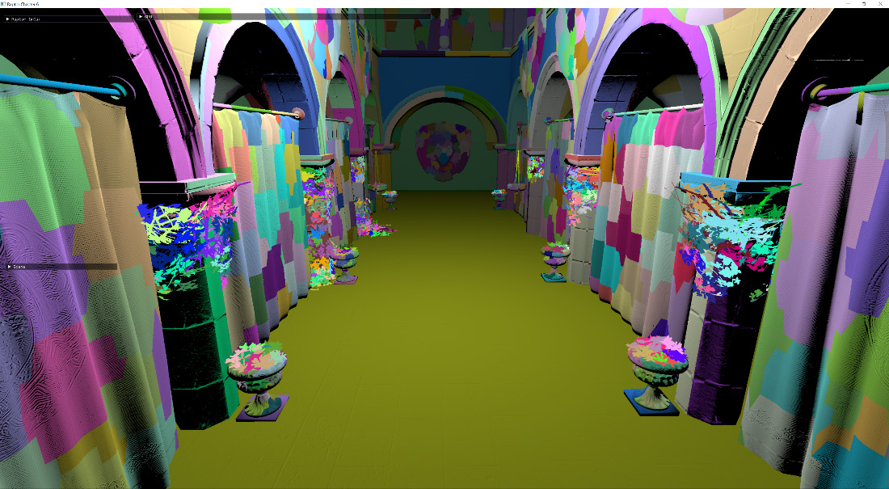
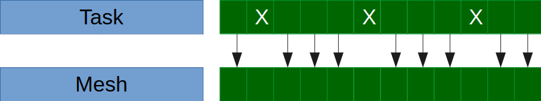

# 第 6 章：GPU 驱动渲染（GPU-Driven Rendering）

本章将几何管线升级为使用**mesh shader**与**meshlet**：把网格渲染的流程从 CPU 移到 GPU，由不同 shader 负责剔除与绘制命令的生成。我们先在 CPU 侧把网格拆成**meshlet**（每组最多约 64 个三角形，各自带包围球）；再用 compute shader 做剔除并写出各 pass 的绘制命令列表；最后用 mesh shader 渲染 meshlet。目前 mesh shader 仅 Nvidia GPU 支持，书中也会提供基于 compute 的替代实现。传统上几何剔除在 CPU 上做，场景中的 mesh 常用 **AABB** 表示、与视锥做剔除；场景变复杂后剔除会占用大量帧时间，且通常是管线第一步，难以与其他工作并行；在 CPU 上做视锥剔除也难以判断遮挡。每帧按相机重排所有物体在数十万物体时不可行；地形等大块 mesh 即使用户只看到一小部分也常整块绘制。把部分计算移到 GPU 可充分利用其并行能力。本章将实现**视锥剔除**与**遮挡剔除**，并在 GPU 上**直接生成绘制命令**。

本章主要涉及：将大 mesh **拆分为 meshlet**；用 **task shader 与 mesh shader** 对 meshlet 做背面与视锥剔除；用 **compute shader** 做高效遮挡剔除；在 GPU 上**生成绘制命令**并使用**间接绘制**。

## 技术需求

本章代码见：https://github.com/PacktPublishing/Mastering-Graphics-Programming-with-Vulkan/tree/main/source/chapter6

## 将大 mesh 拆分为 meshlet
本章主要关注管线的**几何阶段**（着色之前）；在几何阶段增加一些复杂度可减少后续需要着色的像素。
**说明**：此处“几何阶段”指 IA、顶点处理、图元装配等，不是特指 geometry shader；顶点处理可运行 vertex/geometry/tessellation/task/mesh 等 shader。
内容几何体形态与复杂度各异，引擎需处理从小物体到大地形。大地形或建筑通常由美术拆块以便按距离选 LOD；
拆成小块有助于剔除不可见几何，但有些 mesh 仍然很大，即使只看到一小部分也要整块处理。**Meshlet** 即为此设计：将 mesh 再细分为顶点组（通常 64 个顶点），便于在 GPU 上处理。



Figure 6.1 – meshlet 细分示例。每组顶点可组成任意数量三角形，一般按硬件调优；Vulkan 推荐 126（见 [Nvidia Turing mesh shaders 介绍](https://developer.nvidia.com/blog/introduction-turing-mesh-shaders/)，需为每个 meshlet 的图元数量预留空间）。**说明**：撰写时 mesh/task shader 仅通过 Nvidia 扩展提供；本章部分 API 针对该扩展，概念可用通用 compute shader 实现；Khronos 正在制定更通用的扩展。三角形数变少后，可对不可见或被遮挡的 meshlet 做更细粒度剔除。除顶点与三角形列表外，还为每个 meshlet 生成**包围球**与**锥体（cone）**等数据，用于背面、视锥与遮挡剔除；将来也可按 LOD 启发式选择 meshlet 子集。Figure 6.2 – meshlet 包围球示例。为何用球而非 AABB？AABB 至少需两个 vec3（中心+半尺寸或 min/max）；球只需一个 vec4（中心+半径），处理数百万 meshlet 时每字节都重要，且球在视锥与遮挡测试中更简便。Figure 6.3 – meshlet 锥体示例。锥体表示 meshlet 朝向，用于背面剔除。下面看如何在代码中生成 meshlet。

### 生成 meshlet（Generating meshlets）
使用开源库 **MeshOptimizer**（https://github.com/zeux/meshoptimizer）生成 meshlet；也可选用 [meshlete](https://github.com/JarkkoPFC/meshlete)。加载 mesh 的顶点与索引后，先估算最大 meshlet 数量并分配顶点/索引数组（meshlet_vertex_indices、meshlet_triangles；不修改原始 buffer，只生成指向原始缓冲的索引列表；三角形索引用 1 字节存储以节省内存）：
```
const sizet max_meshlets = meshopt_buildMeshletsBound(
indices_accessor.count, max_vertices, max_triangles );
Array<meshopt_Meshlet> local_meshlets;
local_meshlets.init( temp_allocator, max_meshlets,
max_meshlets );
Array<u32> meshlet_vertex_indices;
meshlet_vertex_indices.init( temp_allocator, max_meshlets *
max_vertices, max_meshlets* max_vertices );
Array<u8> meshlet_triangles;
meshlet_triangles.init( temp_allocator, max_meshlets *
max_triangles * 3, max_meshlets* max_triangles * 3 );
```
然后调用 meshopt_buildMeshlets 生成 meshlet（传入 max_vertices=64、max_triangles=124、cone_weight 等；Vulkan 推荐值见前文）：
```
const sizet max_vertices = 64;
const sizet max_triangles = 124;
 const f32 cone_weight = 0.0f;
sizet meshlet_count = meshopt_buildMeshlets(
local_meshlets.data,
meshlet_vertex_indices.data,
meshlet_triangles.data, indices,
indices_accessor.count,
vertices,
position_buffer_accessor.count,
sizeof( vec3s ),
max_vertices,
max_triangles,
cone_weight );
```
每个 meshlet 由 meshopt_Meshlet 描述（vertex_offset、triangle_offset、vertex_count、triangle_count；偏移指向 meshlet_vertex_indices 与 meshlet_triangles，非原始 mesh 的 buffer）。结构体如下：
```
{struct meshopt_Meshlet
unsigned int vertex_offset;
unsigned int triangle_offset;
unsigned int vertex_count;
unsigned int triangle_count;
};
```
上传到 GPU 前压缩数据：position 保持全精度，法线每维 1 字节、UV 每维 half。伪代码：`normal = (normal+1)*127`，`uv = quantize_half(uv)`。再对每个 meshlet 调用 meshopt_computeMeshletBounds 得到包围球与锥体：
```
for ( u32 m = 0; m < meshlet_count; ++m ) {
meshopt_Meshlet& local_meshlet = local_meshlets[ m ];
meshopt_Bounds meshlet_bounds =
meshopt_computeMeshletBounds(
meshlet_vertex_indices.data +
local_meshlet.vertex_offset,
meshlet_triangles.data +
local_meshlet.triangle_offset,
local_meshlet.triangle_count,
vertices,
position_buffer_accessor
.count,
sizeof( vec3s ) );
...
}
```
meshopt_Bounds 包含：center[3]、radius（包围球）；cone_apex、cone_axis、cone_cutoff（锥体方向与角度）；以及量化版 cone_axis_s8、cone_cutoff_s8。我们未使用 cone_apex（会提高背面剔除计算成本，但可得到更好结果）。量化值用于减小每 meshlet 数据量。最后将 meshlet 数据拷入 GPU buffer 供 task/mesh shader 使用；对每个 mesh 还保存其 meshlet 的 offset 与 count，用于基于父 mesh 的粗粒度剔除（mesh 可见则加入其 meshlet）。下一节介绍 task 与 mesh shader。

## 理解 task shader 与 mesh shader
（meshopt_Bounds 结构见上。）Figure 6.4 – 传统几何管线与 mesh 管线对比。mesh shader 可单独使用（无 task 时可在 CPU 做剔除等）；task 与 mesh shader **替代** 顶点 shader，mesh 输出直接进 fragment。二者执行模型与 compute 类似，可指定 thread group 大小；task 输出直接给 mesh。**Task shader**（又称 amplification shader）相当于过滤器：提交所有 meshlet 给 task shader，通过过滤的才进入 mesh shader。



Figure 6.5 – task 剔除的 meshlet 不再由 mesh 处理。

**Mesh shader** 对通过的 meshlet 做类似顶点 shader 的最终处理。下面说明在 Vulkan 中的实现。

### 实现 task shader
task/mesh shader 通过 Vulkan 扩展提供；扩展还引入 VK_PIPELINE_STAGE_TASK_SHADER_BIT_NV 与 MESH_SHADER_BIT_NV，用于 barrier 同步。管线包含（可选）task 模块、mesh shader、fragment shader。调用：`vkCmdDrawMeshTasksNV( cmd, task_count, first_task )`；间接版本 `vkCmdDrawMeshTasksIndirectCountNV` 从 buffer 读绘制参数与数量，我们使用该版本以实现每场景一次 draw、由 GPU 决定绘制哪些 meshlet；命令写入见后文“用 compute 做 GPU 剔除”。Shader 中需启用 `#extension GL_NV_mesh_shader : require` 与 `GL_ARB_shader_draw_parameters`（后者在 platform.h 启用）以使用 gl_DrawIDARB。task 与 compute 类似，先设定 `layout(local_size_x = 32) in;`（y/z 被忽略）。主逻辑先确定当前处理的 mesh 与 meshlet 索引：
（gl_DrawIDARB 来自间接 buffer 中的绘制命令。）加载当前 meshlet 的世界空间包围球中心与半径：
```
vec4 center = model * vec4(meshlets[mi].center, 1);
float scale = length( model[0] );
float radius = meshlets[mi].radius * scale;
还原锥体轴与 cutoff（存为单字节）：
vec3 cone_axis = mat3( model ) *
vec3(int(meshlets[mi].cone_axis[0]) / 127.0,
int(meshlets[mi].cone_axis[1]) / 127.0,
int(meshlets[mi].cone_axis[2]) / 127.0);
float cone_cutoff = int(meshlets[mi].cone_cutoff) / 127.0;
```
coneCull：计算锥轴与“球心到相机”向量的夹角余弦，与 cone_cutoff（半角余弦）× 距离 + 半径比较，判断锥是否背向相机。背面剔除：`accept = !coneCull(...)`。视锥剔除：将球心变换到相机空间，对六个视锥平面做 `dot(plane, center) > -radius`；`accept = accept && frustum_visible`。最后用 **subgroup** 写出可见 meshlet 的索引与数量：启用 `GL_KHR_shader_subgroup_ballot`；`subgroupBallot(accept)` 得到位掩码；`subgroupBallotExclusiveBitCount` 得到写入位置，若 accept 则 `meshletIndices[index]=meshlet_index`；`subgroupBallotBitCount` 得到总数，由线程 0 写入 `gl_TaskCountNV`（GPU 据此决定 mesh 调用次数）。每个 work group 只写一次 TaskCount。

### 实现 mesh shader
task 剔除后由 mesh shader 处理通过的 meshlet，类似顶点 shader 但有关键区别。同样先 `layout(local_size_x = 32) in;`，再读 task 输出的 `in taskNV { uint meshletIndices[32]; };`。输出：`layout(triangles, max_vertices=64, max_primitives=124) out;` 及与顶点 shader 类似的 varying 数组（因每次可输出最多 64 个顶点）。主逻辑：确定 mesh/meshlet 索引与顶点/索引偏移与数量，并行处理顶点（写 gl_MeshVerticesNV、gl_Position 等），再写图元索引（writePackedPrimitiveIndices4x8NV，一次写 4 个 8 位索引），最后由线程 0 写 `gl_PrimitiveCountNV`。索引存于 meshletData，每 meshlet 内顶点数≤64 故 1 字节足够。实现要点：
```
uint ti = gl_LocalInvocationID.x;
uint mi = meshletIndices[gl_WorkGroupID.x];
MeshDraw mesh_draw = mesh_draws[ meshlets[mi].mesh_index ];
uint mesh_instance_index = draw_commands[gl_DrawIDARB +
total_count].drawId;
Next, we determine the vertex and index offset and count for the active
meshlet:
uint vertexCount = uint(meshlets[mi].vertexCount);
uint triangleCount = uint(meshlets[mi].triangleCount);
uint indexCount = triangleCount * 3;
uint vertexOffset = meshlets[mi].dataOffset;
uint indexOffset = vertexOffset + vertexCount;
We then process the vertices for the active meshlet:
{for (uint i = ti; i < vertexCount; i += 32)
uint vi = meshletData[vertexOffset + i];
vec3 position = vec3(vertex_positions[vi].v.x,
vertex_positions[vi].v.y,
 vertex_positions[vi].v.z);
// normals, tangents, etc.
gl_MeshVerticesNV[ i ].gl_Position = view_projection *
(model * vec4(position, 1));
mesh_draw_index[ i ] = meshlets[mi].mesh_index;
}
```
（gl_MeshVerticesNV 供光栅化使用；writePackedPrimitiveIndices4x8NV 一次写 4 个 8 位索引；格式不同时需逐个写 gl_PrimitiveIndicesNV；线程 0 写 gl_PrimitiveCountNV。）下一节用 compute 做遮挡剔除。

## 用 compute 做 GPU 剔除（GPU culling using compute）
上节在 task shader 中做了背面与视锥剔除；本节用 **compute shader** 做视锥与**遮挡剔除**。常见做法是 depth pre-pass 只写深度，再在 G-Buffer pass 中跳过已知被挡的 fragment，但需要画两遍场景且通常要等 pre-pass 完成。本节算法来自 [Siggraph 2015 论文](https://advances.realtimerendering.com/s2015/aaltonenhaar_siggraph2015_combined_final_footer_220dpi.pdf)。流程简述：(1) 用上一帧深度做 mesh/meshlet 的视锥与遮挡剔除并生成绘制命令列表（可能漏掉本帧新可见的，即 false negative）；(2) 该列表在 compute 中生成，用于间接绘制可见物体；(3) 得到新深度缓冲后更新 **depth pyramid**；(4) 对第一轮被剔除的物体用更新后的 pyramid 再测一遍，生成新列表以消除 false positive；(5) 绘制剩余物体得到最终深度，作为下一帧的输入。下面分步实现。

### 深度金字塔生成（Depth pyramid generation）
遮挡测试不用深度缓冲本身，而用其**深度金字塔**（可理解为深度的 mipmap）。与普通 mipmap 不同：不能用双线性插值求下一级（会得到场景中不存在的深度），应取四个纹素中的**最大值**（深度 0→1 表示近→远，取最远以保守覆盖；若用 inverted-z 则取最小值）。采样深度纹理时也应用最近邻或 VkSamplerReductionMode 的 min/max，见 [VkSamplerReductionMode](https://www.khronos.org/registry/vulkan/specs/1.3-extensions/man/html/VkSamplerReductionMode.html)。用 compute 生成：先把深度纹理转为可读，再逐级处理金字塔：
```
util_add_image_barrier( gpu, gpu_commands->
vk_command_buffer, depth_texture,
RESOURCE_STATE_SHADER_RESOURCE, 0, 1, true );
Then, we loop over the levels of the depth pyramid:
u32 width = depth_pyramid_texture->width;
u32 height = depth_pyramid_texture->
height for ( u32 mip_index = 0; mip_index <
depth_pyramid_texture->mipmaps; ++mip_index ) {
util_add_image_barrier( gpu, gpu_commands->
vk_command_buffer, depth_pyramid_texture->
vk_image, RESOURCE_STATE_UNDEFINED,
RESOURCE_STATE_UNORDERED_ACCESS,
mip_index, 1, false );
```
（每级先 barrier 到 UNORDERED_ACCESS，dispatch 时 group 按 8×8 计算 group_x/group_y，写完后 barrier 到 SHADER_RESOURCE 供下一级读取，width/height 减半。）Compute 内：取 2×2 的四个纹素位置，texelFetch 读深度，取 max 写入下一级；使用 inverted-z 时改为 min。
（texel 位置、texelFetch、max、imageStore 见上；inverted-z 用 min。）下面用金字塔做遮挡剔除。

### 遮挡剔除（Occlusion culling）
整步在 compute shader 内完成。要点：加载当前 mesh 与 model 矩阵；计算**整 mesh**（非 meshlet）的包围球在视空间中的中心与半径；做视锥剔除（与 task 中相同）；若通过则做遮挡测试：将透视投影后的包围球得到 2D AABB（球投影可能为椭圆，实现参考 [jcgt 论文](https://jcgt.org/published/0002/02/05/) 与 [Niagara](https://github.com/zeux/niagara/)）。先判断球是否完全在近平面后，再在 xz/yz 平面求投影的 min/max，变换到透视空间后转 UV；根据 AABB 在金字塔中的尺寸选 mip level（`level = floor(log2(max(w,h)))`），在金字塔该级采样深度；计算包围球最近深度 `depth_sphere`，若 `depth_sphere <= depth` 则未被遮挡。通过视锥与遮挡的 mesh 写入 draw_commands（drawId、taskCount、firstTask），供间接绘制与更新金字塔；最后对第一轮被剔除的物体用更新后的金字塔再跑一遍剔除以修正误剔除。实现要点：
```
uint mesh_draw_index =
mesh_instance_draws[mesh_instance_index]
.mesh_draw_index;
MeshDraw mesh_draw = mesh_draws[mesh_draw_index];
mat4 model =
mesh_instance_draws[mesh_instance_index].model;
```
（视空间包围球：world_bounding_center = model * vec4(bounding_sphere.xyz,1)，view_bounding_center = world_to_camera * world_bounding_center，radius = bounding_sphere.w * scale。视锥剔除与 task 中相同。遮挡测试：用 project_sphere 求透视投影后包围球的 2D AABB；实现中视线为负 z 故用 -C.z；在 xz 平面求投影 min/max（cx、vx、minx、maxx），y 同理；用 P00、P11（view-projection 矩阵对角元）变换到透视空间；再通过 aabb.xwzy * vec4(0.5,-0.5,0.5,-0.5) + 0.5 从 [-1,1] 屏幕空间转到 [0,1] UV，y 取负因原点不同。得到 2D 包围盒后选金字塔 level：
```
ivec2 depth_pyramid_size =
textureSize(global_textures[nonuniformEXT
(depth_pyramid_texture_index)], 0);
float width = (aabb.z - aabb.x) * depth_pyramid_size.x ;
float height = (aabb.w - aabb.y) * depth_pyramid_size.y ;
float level = floor(log2(max(width, height)));
```
（AABB 在 UV 下按金字塔顶层尺寸缩放，取宽高较大者的 log2 作为 mip level，将包围盒收束为单像素查询；金字塔每级存最远深度，故单次采样即可判断是否被挡。用 textureLod 在 (aabb.xy+aabb.zw)*0.5 处采样该 level 得 depth；计算球最近深度 depth_sphere = z_near/(view_bounding_center.z - radius)；若 depth_sphere <= depth 则未遮挡。通过视锥与遮挡的 mesh 写入 draw_commands（drawId、taskCount、firstTask），该列表用于间接绘制可见 meshlet 并更新金字塔；最后对第一轮剔除的 mesh 用更新后的金字塔再跑一遍以修正误剔除。GPU 上的剔除有助于突破传统几何管线限制、渲染更复杂场景。）

## 本章小结

本章介绍了 **meshlet**：将大 mesh 拆成更易在 GPU 上做遮挡计算的小块；演示了用 MeshOptimizer 生成 meshlet 及包围球、锥体等辅助数据。介绍了与 compute 概念相近的 **task 与 mesh shader**：用 task 做背面与视锥剔除，mesh 替代顶点 shader、并行处理并输出多个图元。最后讲解了遮挡剔除的实现：算法步骤、从深度缓冲构建**深度金字塔**、以及基于包围球的遮挡测试与间接绘制命令生成。下一章将实现**聚类延迟光照（clustered-deferred lighting）**，以支持场景中数百盏光源。

## 延伸阅读

- task/mesh shader 目前仅 Nvidia 支持，原理见 [Introduction to Turing Mesh Shaders](https://developer.nvidia.com/blog/introduction-turing-mesh-shaders/)。
- 实现参考：GDC 演讲、[Siggraph 2015 遮挡算法论文](http://advances.realtimerendering.com/s2015/aaltonenhaar_siggraph2015_combined_final_footer_220dpi.pdf)、[Niagara 项目](https://github.com/zeux/niagara)及[配套视频](https://www.youtube.com/playlist?list=PL0JVLUVCkk-l7CWCn3-cdftR0oajugYvd)。
- meshlet 生成库：[meshoptimizer](https://github.com/zeux/meshoptimizer)、[meshlete](https://github.com/JarkkoPFC/meshlete)。
- 遮挡与可见性：**Visibility Buffer** 技术见 [Visibility_Buffer_GDCE.pdf](http://www.conffx.com/Visibility_Buffer_GDCE.pdf)、[filmicworlds 博客](http://filmicworlds.com/blog/visibility-buffer-rendering-with-material-graphs/)、[YouTube 介绍](https://www.youtube.com/watch?v=eviSykqSUUw)。