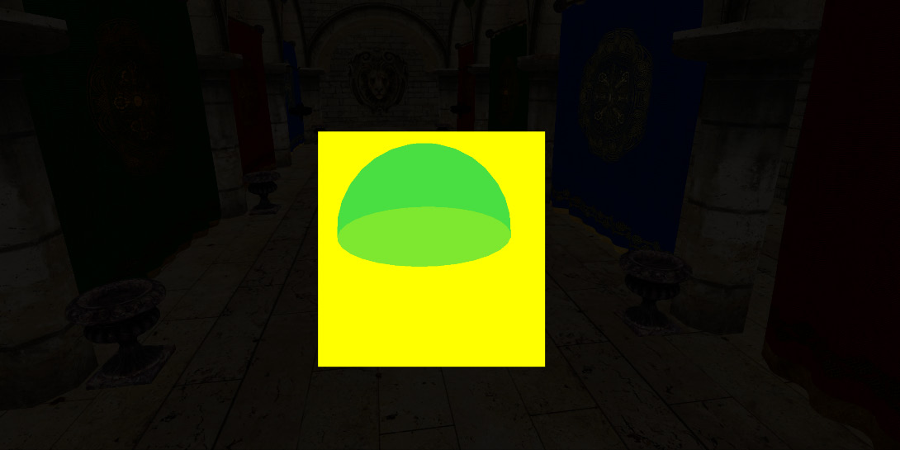
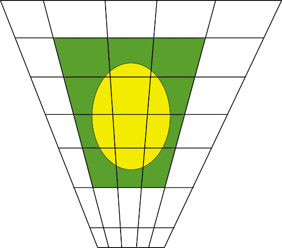
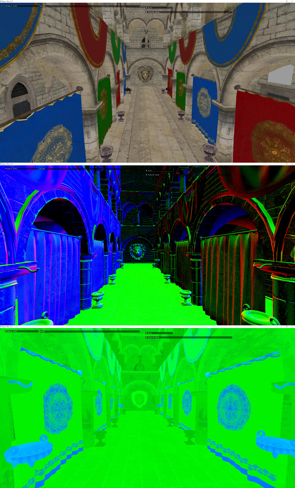

# 第 7 章：用聚类延迟渲染渲染大量光源（Clustered Deferred Rendering）

目前场景仍由单一点光源照亮；在打好渲染引擎基础的前提下这够用，但远不够真实。现代游戏单场景常有数百盏灯，光照阶段必须高效且不超帧预算。本章先介绍**延迟与前向着色**中最常用的技术及各自优劣；再概述我们的 **G-buffer** 配置（虽从项目开始就有，此前未详述，延迟渲染的选择会决定聚类光照策略）；最后详述**聚类算法**及关键代码。算法本身不复杂，但细节较多，需处理好才能稳定。

本章主要涉及：**聚类光照简史**；**G-buffer 的配置与实现**；**用屏幕瓦片（tile）与 Z 分箱（Z-binning）实现聚类光照**。

## 技术需求

本章结束后你将掌握我们的 G-buffer 实现，并学会实现可处理数百盏灯的光照聚类方案。代码见：https://github.com/PacktPublishing/Mastering-Graphics-Programming-with-Vulkan/tree/main/source/chapter7

## 聚类光照简史
2000 年代初以前，实时光照多以**前向渲染（forward rendering）**为主：每个物体带着光照等信息一次性绘出，但可处理的光源数很少（如 4～8 盏）。**延迟渲染**的思想——同一像素只着色一次——早在 1988 年 Deering 等人的论文中就有；**G-buffer**（几何缓冲）则由 Saito 与 Takahashi 在《Comprehensible Rendering of 3D Shapes》中提出，用于缓存每像素深度与法线并做后处理。首款商用延迟渲染游戏是 2001 年 Xbox 上的《Shrek》；随后《Stalker》及其论文 [Deferred Shading in Stalker](https://developer.nvidia.com/gpugems/gpugems2/part-ii-shading-lighting-and-shadows/chapter-9-deferred-shading-stalker)、2010 年 Siggraph 的 CryEngine 演讲 [Reaching the Speed of Light](http://advances.realtimerendering.com/s2010/Kaplanyan-CryEngine3%28SIGGRAPH%202010%20Advanced%20RealTime%20Rendering%20Course%29.pdf) 使延迟渲染普及。2012 年 AMD 的 **Leo** 演示借助 Compute Shader 为每个屏幕空间 **tile** 建立光源列表，诞生 **Forward+**（[Forward+ 论文](https://takahiroharada.files.wordpress.com/2015/04/forward_plus.pdf)）；随后《Dirt Showdown》PC 版率先商用。之后 tile 演变为 **cluster**，从 2D 屏幕 tile 发展到视锥形 3D cluster，以 Emil Persson 的 [Just Cause 3 聚类着色](https://www.humus.name/Articles/PracticalClusteredShading.pdf) 与 [Chalmers 聚类着色预印本](https://www.cse.chalmers.se/~uffe/clustered_shading_preprint.pdf) 为代表。3D 网格的内存占用随分辨率增长，**Activision** 的改进方案是本章采用的实现，详见“实现光照聚类”一节。下面比较前向与延迟技术。

## 前向与延迟技术的区别
两种技术的共同难点是**光源分配**。前向渲染优点：材质完全自由、不透明与透明同一路径、支持 MSAA、GPU 内存带宽较低。缺点：常需 **depth prepass** 减少无效 fragment；否则会为不可见物体着色浪费算力，故帧初执行只写深度的 pass，再设 depth test 为 equal 只着色可见 fragment；prepass 可能很贵，有时用简化几何；需注意不要禁用 Early-Z（如在 fragment 中写深度或 discard）。着色复杂度为 **N×L**（物体数×光源数），且必须为每个物体处理所有光源；shader 复杂、寄存器压力大。**延迟渲染**将几何绘制与光照计算解耦：建立多个 render target（albedo、法线、PBR 参数、深度等），再对每个 fragment 处理光源；复杂度降为 **N+L**，但仍不知“哪些光影响该像素”。优点：着色复杂度低、无需 depth prepass、G-buffer 写入与光照分离、shader 更简单。缺点：**高内存**（多 RT、高分辨率与 TAA 等会叠加，常需压缩）；**法线精度损失**（写入时压缩到 8 位；利用归一化可只存两分量重建第三分量，见延伸阅读）；透明物体需单独前向 pass；特殊材质需把所有参数塞进 G-buffer。解决“遍历所有光源”的两种常见做法：**tile** 与 **cluster**。

### 光源瓦片（Light tiles）
在屏幕空间建网格，为每个 **tile** 记录影响它的光源；着色时根据 fragment 所在 tile 只遍历该 tile 的光源。



Figure 7.1 – 点光源在屏幕上的覆盖区域。tile 可在 CPU 或 GPU compute 中构建，数据存为扁平数组；传统做法需 depth prepass 求 min/max Z，可能受深度不连续影响，但结构通常紧凑。

### 光源聚类（Light clusters）

**Cluster** 将视锥按 3D 网格划分，光源分配到每个格子，渲染时只遍历 fragment 所属格子的光源。



Figure 7.2 – 点光源覆盖的视锥 cluster。

光源可存于 3D 纹理或 BVH、八叉树等。构建 cluster 不需 depth prepass，多数实现为每盏灯建 AABB 并投影到 clip 空间，便于 3D 查找且可达到较高精度。下一节概述我们的 G-buffer 实现。

## 实现 G-buffer
项目一开始就采用延迟渲染；多 RT 会在后续章节用于 TAA 等。在 Vulkan 中需创建 framebuffer（存 G-buffer 的纹理）与 render pass，帧图（第 4 章）已自动化这一步；我们同时使用 **VK_KHR_dynamic_rendering** 扩展简化 render pass 与 framebuffer 的创建。**说明**：该扩展在 Vulkan 1.3 中已入核，可省略 KHR 后缀。使用该扩展后不必提前创建 render pass 与 framebuffer。创建管线时需填充 **VkPipelineRenderingCreateInfoKHR**（viewMask、colorAttachmentCount、pColorAttachmentFormats、depthAttachmentFormat、stencilAttachmentFormat），并链到 VkGraphicsPipelineCreateInfo 的 pNext；不再填充 renderPass 成员。示例：
```
VkPipelineRenderingCreateInfoKHR pipeline_rendering_create_info{
VK_STRUCTURE_TYPE_PIPELINE_RENDERING_CREATE_INFO_KHR };
pipeline_rendering_create_info.viewMask = 0;
pipeline_rendering_create_info.colorAttachmentCount =
creation.render_pass.num_color_formats;
pipeline_rendering_create_info.pColorAttachmentFormats
= creation.render_pass.num_color_formats > 0 ?
creation.render_pass.color_formats : nullptr;
pipeline_rendering_create_info.depthAttachmentFormat =
creation.render_pass.depth_stencil_format;
pipeline_rendering_create_info.stencilAttachmentFormat
= VK_FORMAT_UNDEFINED;
pipeline_info.pNext = &pipeline_rendering_create_info;
```
（结构体填好后链到 pipeline 的 pNext。）渲染时用 **vkCmdBeginRenderingKHR** 替代 vkCmdBeginRenderPass。先创建颜色附件数组：
```
Array<VkRenderingAttachmentInfoKHR> color_attachments_info;
color_attachments_info.init( device->allocator,
framebuffer->num_color_attachments,
framebuffer->num_color_attachments );
为每个颜色附件填充 VkRenderingAttachmentInfoKHR（imageView、imageLayout、loadOp、storeOp、clearValue 等）：
for ( u32 a = 0; a < framebuffer->
num_color_attachments; ++a ) {
Texture* texture = device->
access_texture( framebuffer->
color_attachments[a] );
VkAttachmentLoadOp color_op = ...;
VkRenderingAttachmentInfoKHR&
color_attachment_info = color_attachments_info[ a ];
color_attachment_info.sType =
 VK_STRUCTURE_TYPE_RENDERING_ATTACHMENT_INFO_KHR;
color_attachment_info.imageView = texture->
vk_image_view;
color_attachment_info.imageLayout =
VK_IMAGE_LAYOUT_COLOR_ATTACHMENT_OPTIMAL;
color_attachment_info.resolveMode =
VK_RESOLVE_MODE_NONE;
color_attachment_info.loadOp = color_op;
color_attachment_info.storeOp =
VK_ATTACHMENT_STORE_OP_STORE;
color_attachment_info.clearValue = render_pass->
output.color_operations[ a ] ==
RenderPassOperation::Enum::Clear ? clears[ 0 ]
: VkClearValue{ };
}
```
深度附件同样填充 VkRenderingAttachmentInfoKHR（若有）：
```
VkRenderingAttachmentInfoKHR depth_attachment_info{
VK_STRUCTURE_TYPE_RENDERING_ATTACHMENT_INFO_KHR };
bool has_depth_attachment = framebuffer->
depth_stencil_attachment.index != k_invalid_index;
if ( has_depth_attachment ) {
Texture* texture = device->access_texture(
framebuffer->depth_stencil_attachment );
VkAttachmentLoadOp depth_op = ...;
depth_attachment_info.imageView = texture->
vk_image_view;
depth_attachment_info.imageLayout =
VK_IMAGE_LAYOUT_DEPTH_STENCIL_ATTACHMENT_OPTIMAL;
depth_attachment_info.resolveMode =
 VK_RESOLVE_MODE_NONE;
depth_attachment_info.loadOp = depth_op;
depth_attachment_info.storeOp =
VK_ATTACHMENT_STORE_OP_STORE;
depth_attachment_info.clearValue = render_pass->
output.depth_operation ==
RenderPassOperation::Enum::Clear ? clears[ 1 ]
: VkClearValue{ };
}
```
最后填充 VkRenderingInfoKHR（flags、renderArea、colorAttachmentCount、pColorAttachments、pDepthAttachment 等）并调用 vkCmdBeginRenderingKHR；结束时调用 **vkCmdEndRenderingKHR**。G-buffer 有四个颜色 RT 加深度。Fragment 中声明多个 location 输出（与 vkCmdBeginRenderingKHR 中附件顺序一致）；法线为省内存只存两通道，采用**八面体编码**（octahedral encoding），光照 pass 中解码。编码与解码函数示例：
```
VkRenderingInfoKHR rendering_info{
VK_STRUCTURE_TYPE_RENDERING_INFO_KHR };
rendering_info.flags = use_secondary ?
VK_RENDERING_CONTENTS_SECONDARY_COMMAND
 _BUFFERS_BIT_KHR : 0;
rendering_info.renderArea = { 0, 0, framebuffer->
width, framebuffer->height };
rendering_info.layerCount = 1;
rendering_info.viewMask = 0;
rendering_info.colorAttachmentCount = framebuffer->
num_color_attachments;
rendering_info.pColorAttachments = framebuffer->
num_color_attachments > 0 ?
color_attachments_info.data : nullptr;
rendering_info.pDepthAttachment =
has_depth_attachment ? &depth_attachment_info :
nullptr;
rendering_info.pStencilAttachment = nullptr;
Once we are done rendering, we are going to call
vkCmdEndRenderingKHR instead of vkCmdEndRenderPass.
Now that we have set up our render targets, we are going to describe
how they are used in our G-buffer shader. Our G-buffer has four render
targets plus the depth buffer. As we mentioned in the previous section,
there is no need for a depth pre-pass, although you might notice this
was enabled in some of the earlier chapters for testing purposes.
The first step is to declare multiple outputs in the fragment shader:
layout (location = 0) out vec4 color_out;
layout (location = 1) out vec2 normal_out;
layout (location = 2) out vec4
occlusion_roughness_metalness_out;
layout (location = 3) out vec4 emissive_out;
```
（写入某 RT 即写入对应 out 变量。）编码：
（将球面投影到八面体再到 xy 平面；下半球沿对角线折叠。）解码：
```
vec3 octahedral_decode(vec2 f) {
vec3 n = vec3(f.x, f.y, 1.0 - abs(f.x) - abs(f.y));
float t = max(-n.z, 0.0);
n.x += n.x >= 0.0 ? -t : t;
n.y += n.y >= 0.0 ? -t : t;
return normalize(n);
}
```
Table 7.1 – G-buffer 内存布局。



Figure 7.3 – 自上而下：albedo、法线、occlusion(红)/roughness(绿)/metalness(蓝)。可进一步压缩：不透明物体不需 alpha；也可混合多 RT（如 RGBA8：rgb+normal_1；normal_2+roughness+metalness+occlusion；emissive）或使用 R11G11B10 等格式。下一节介绍我们实现的光照聚类。

## 实现光照聚类
实现基于 [Activision 2017 Sig 论文](https://www.activision.com/cdn/research/2017_Sig_Improved_Culling_final.pdf)：将 **XY 平面**与 **Z 范围**分开处理，结合 tile 与 cluster 的优点。步骤：(1) 按相机空间深度对光源排序；(2) 将深度范围划分为等长 bin（也可用对数划分）；(3) 将包围盒落在某 bin 内的光源归入该 bin，只存该 bin 的 min/max 光源索引，每 bin 16 位；(4) 将屏幕分为 tile（我们为 8×8），求覆盖每个 tile 的光源，每 tile 用**位域**表示活跃光源；(5) 着色时根据 fragment 深度读 bin 索引；(6) 在该 bin 的 min～max 范围内遍历，用 xy 取 tile 位域判断光源是否对该 fragment 可见。这样可高效遍历每个 fragment 的活跃光源。

### CPU 端光源分配
每帧步骤：(1) 按深度排序：计算每盏灯在相机空间中的中心与沿视线方向的最近/最远点（p_min、p_max），得到 projected_z、projected_z_min、projected_z_max（归一化到 [0,1]，z_far 可设小一些以提高精度）：
```
float z_far = 100.0f;
for ( u32 i = 0; i < k_num_lights; ++i ) {
Light& light = lights[ i ];
vec4s p{ light.world_position.x,
light.world_position.y,
 light.world_position.z, 1.0f };
vec3s p_min = glms_vec3_add( light.world_position,
glms_vec3_scale(
light_camera_dir,
-light.radius ) );
vec3s p_max = glms_vec3_add( light.world_position,
glms_vec3_scale(
light_camera_dir,
light.radius ) );
vec4s projected_p = glms_mat4_mulv(
world_to_camera, p );
vec4s projected_p_min = glms_mat4_mulv(
world_to_camera, p_min4 );
vec4s projected_p_max = glms_mat4_mulv(
 world_to_camera, p_max4 );
SortedLight& sorted_light = sorted_lights[ i ];
sorted_light.light_index = i;
sorted_light.projected_z = ( -projected_p.z –
scene_data.z_near ) / ( z_far –
scene_data.z_near );
sorted_light.projected_z_min = ( -
projected_p_min.z - scene_data.z_near ) / (
z_far - scene_data.z_near );
sorted_light.projected_z_max = ( -
projected_p_max.z - scene_data.z_near ) / (
z_far - scene_data.z_near );
}
```
（只对光源索引排序，避免每帧重传光源数组，只更新索引。）(2) 分配 tile：定义 light_tiles_bits 数组与 tile  stride；将光源变换到相机空间，若在相机后方可跳过：
```
qsort( sorted_lights.data, k_num_lights, sizeof(
SortedLight ), sorting_light_fn );
u32* gpu_light_indices = ( u32* )gpu.map_buffer(
cb_map );
if ( gpu_light_indices ) {
for ( u32 i = 0; i < k_num_lights; ++i ) {
gpu_light_indices[ i ] = sorted_lights[ i ]
.light_index;
}
gpu.unmap_buffer( cb_map );
}
```
This optimization allows us to upload the light array only once, while
we only need to update the light indices.
（定义 light_tiles_bits、tiles_entry_count、tile_stride 等。）
```
Array<u32> light_tiles_bits;
light_tiles_bits.init( context.scratch_allocator,
tiles_entry_count, tiles_entry_count );
float near_z = scene_data.z_near;
float tile_size_inv = 1.0f / k_tile_size;
u32 tile_stride = tile_x_count * k_num_words;
```
（将光源位置变换到相机空间，camera_visible 判断是否在相机前方。）
```
for ( u32 i = 0; i < k_num_lights; ++i ) {
const u32 light_index = sorted_lights[ i ]
.light_index;
Light& light = lights[ light_index ];
vec4s pos{ light.world_position.x,
light.world_position.y,
light.world_position.z, 1.0f };
 float radius = light.radius;
vec4s view_space_pos = glms_mat4_mulv(
game_camera.camera.view, pos );
bool camera_visible = view_space_pos.z - radius <
game_camera.camera.near_plane;
if ( !camera_visible &&
context.skip_invisible_lights ) {
continue;
}
```
(3) 将光源包围球的 8 个角点变换到视空间再投影到 clip 空间，得到 NDC 下的 AABB（aabb_min/max），注意 y 取反以匹配屏幕坐标系：
```
for ( u32 c = 0; c < 8; ++c ) {
vec3s corner{ ( c % 2 ) ? 1.f : -1.f, ( c & 2 ) ?
1.f : -1.f, ( c & 4 ) ? 1.f : -1.f };
corner = glms_vec3_scale( corner, radius );
 corner = glms_vec3_add( corner, glms_vec3( pos ) );
vec4s corner_vs = glms_mat4_mulv(
game_camera.camera.view,
glms_vec4( corner, 1.f ) );
corner_vs.z = -glm_max(
game_camera.camera.near_plane, -corner_vs.z );
vec4s corner_ndc = glms_mat4_mulv(
game_camera.camera.projection, corner_vs );
corner_ndc = glms_vec4_divs( corner_ndc,
corner_ndc.w );
aabb_min.x = glm_min( aabb_min.x, corner_ndc.x );
aabb_min.y = glm_min( aabb_min.y, corner_ndc.y );
aabb_max.x = glm_max( aabb_max.x, corner_ndc.x );
aabb_max.y = glm_max( aabb_max.y, corner_ndc.y );
}
aabb.x = aabb_min.x;
aabb.z = aabb_max.x;
aabb.w = -1 * aabb_min.y;
aabb.y = -1 * aabb_max.y;
```
(4) 将 AABB 从 NDC 转到屏幕空间（乘以 0.5 加 0.5 再乘分辨率），得到 min_x/min_y/max_x/max_y；若完全在屏幕外则 continue：
```
vec4s aabb_screen{ ( aabb.x * 0.5f + 0.5f ) * (
gpu.swapchain_width - 1 ),
( aabb.y * 0.5f + 0.5f ) * (
gpu.swapchain_height - 1 ),
( aabb.z * 0.5f + 0.5f ) * (
gpu.swapchain_width - 1 ),
( aabb.w * 0.5f + 0.5f ) *
( gpu.swapchain_height - 1 ) };
f32 width = aabb_screen.z - aabb_screen.x;
f32 height = aabb_screen.w - aabb_screen.y;
if ( width < 0.0001f || height < 0.0001f ) {
continue;
}
float min_x = aabb_screen.x;
float min_y = aabb_screen.y;
float max_x = min_x + width;
float max_y = min_y + height;
if ( min_x > gpu.swapchain_width || min_y >
gpu.swapchain_height ) {
continue;
}
if ( max_x < 0.0f || max_y < 0.0f ) {
 continue;
}
```
(5) 对该光源覆盖的所有 tile 设置对应位（first_tile_x/y、last_tile_x/y 由 min/max 除以 tile_size 得到；array_index = y*tile_stride + x，word_index = i/32，bit_index = i%32，light_tiles_bits[array_index+word_index] |= (1<<bit_index)）。最后将 light tiles 与 bin 数据上传 GPU。Table 7.2 – 深度 bin 示例；Table 7.3 – 每 tile 位域示例（每 tile 可占多个 32 位字）。下一节在 GPU 光照中如何使用这些数据。

### GPU 端光照处理
```
min_x = max( min_x, 0.0f );
min_y = max( min_y, 0.0f );
max_x = min( max_x, ( float )gpu.swapchain_width );
max_y = min( max_y, ( float )gpu.swapchain_height );
u32 first_tile_x = ( u32 )( min_x * tile_size_inv );
u32 last_tile_x = min( tile_x_count - 1, ( u32 )(
max_x * tile_size_inv ) );
u32 first_tile_y = ( u32 )( min_y * tile_size_inv );
u32 last_tile_y = min( tile_y_count - 1, ( u32 )(
max_y * tile_size_inv ) );
for ( u32 y = first_tile_y; y <= last_tile_y; ++y ) {
for ( u32 x = first_tile_x; x <= last_tile_x; ++x
) {
u32 array_index = y * tile_stride + x;
u32 word_index = i / 32;
u32 bit_index = i % 32;
light_tiles_bits[ array_index + word_index ] |= (
1 << bit_index );
}
}
```
We then upload all the light tiles and bin data to the GPU.
At the end of this computation, we will have a bin table containing the
minimum and maximum light ID for each depth slice. The following
table illustrates an example of the values for the first few slices:
Table 7.2 – Example of the data contained in the depth bins
The other data structure we computed is a 2D array, where each entry
contains a bitfield tracking the active lights for the corresponding
screen tile. The following table presents an example of the content of
this array:
Table 7.3 – Example of the bitfield values tracking the active lights per
tile
In the preceding example, we have divided the screen into a 4x4 grid,
and each tile entry has a bit set for every light that covers that tile. Note
that each tile entry can be composed of multiple 32-bit values
depending on the number of lights in the scene.
In this section, we provided an overview of the algorithm we have
implemented to assign lights to a given cluster. We then detailed the
steps to implement the algorithm. In the next section, we are going to
use the data we have just obtained to process lights on the GPU.
GPU light processing
(1) 根据 fragment 的相机空间深度计算 linear_d，得到 bin_index；从 bins[bin_index] 解码出 min_light_id 与 max_light_id（低 16 位与高 16 位）。(2) 根据 gl_GlobalInvocationID.xy 与 TILE_SIZE 得到 tile，计算 tile 在 bitfield 数组中的 address。(3) 若 max_light_id==0 表示该 bin 无光源。否则 (4) 从 min_light_id 到 max_light_id 循环，计算 word_id、bit_id，若 (tiles[address+word_id] & (1<<bit_id)) 非零则该光源覆盖该 tile，(5) 用 light_indices[light_id] 取全局光源索引，调用 calculate_point_light_contribution 累加。代码中还有使用 subgroup 指令的优化版本与注释。该技术既可用于延迟也可用于前向渲染。下一章将补上目前缺失的**阴影**。

## 本章小结
```
vec4 pos_camera_space = world_to_camera * vec4(
world_position, 1.0 );
float z_light_far = 100.0f;
float linear_d = ( -pos_camera_space.z - z_near ) / (
z_light_far - z_near );
int bin_index = int( linear_d / BIN_WIDTH );
uint bin_value = bins[ bin_index ];
uint min_light_id = bin_value & 0xFFFF;
uint max_light_id = ( bin_value >> 16 ) & 0xFFFF;
```
（position、tile、stride、address 计算；min/max_light_id 减 1 是因存储时从 1 开始；循环内 word_id、bit_id、tiles 位测试、light_indices、累加光照贡献。详见代码与 subgroup 优化版。）本章实现了光照聚类：先对比了前向与延迟渲染的优缺点及 tile/cluster 两种分组方式；再概述 G-buffer 的 RT 配置、**VK_KHR_dynamic_rendering** 的用法、多 RT 写入与法线八面体编解码，并提到进一步压缩建议；最后详述我们采用的聚类算法：按深度排序与 bin、按 tile 的位域、以及在光照 shader 中如何用 bin 与 tile 减少每 fragment 需计算的光源数。光照阶段优化对保持帧率至关重要，可多尝试不同方案。加入大量光源后场景仍缺**阴影**，下一章将专门讲解。

## 延伸阅读
- 延迟渲染早期历史（Shrek 2001）：[The Early History of Deferred Shading](https://sites.google.com/site/richgel99/the-early-history-of-deferred-shading-and-lighting)
- [Stalker 延迟着色](https://developer.nvidia.com/gpugems/gpugems2/part-ii-shading-lighting-and-shadows/chapter-9-deferred-shading-stalker)
- 聚类着色早期论文：[Clustered shading preprint](http://www.cse.chalmers.se/~uffe/clustered_shading_preprint.pdf)
- 常用参考： [Activision 2017 改进剔除](https://www.activision.com/cdn/research/2017_Sig_Improved_Culling_final.pdf)、[Practical Clustered Shading](http://www.humus.name/Articles/PracticalClusteredShading.pdf)
- 聚光灯（锥体）可见性：[Cull That Cone](https://bartwronski.com/2017/04/13/cull-that-cone/)
- 聚类/延迟的其它实现： [Intel deferred shading Siggraph 2010](https://www.intel.com/content/dam/develop/external/us/en/documents/lauritzen-deferred-shading-siggraph-2010-181241.pdf)、[idTech6 Siggraph 2016](https://advances.realtimerendering.com/s2016/Siggraph2016_idTech6.pdf)、[Frostbite 并行图形](https://www.ea.com/frostbite/news/parallel-graphics-in-frostbite-current-future)