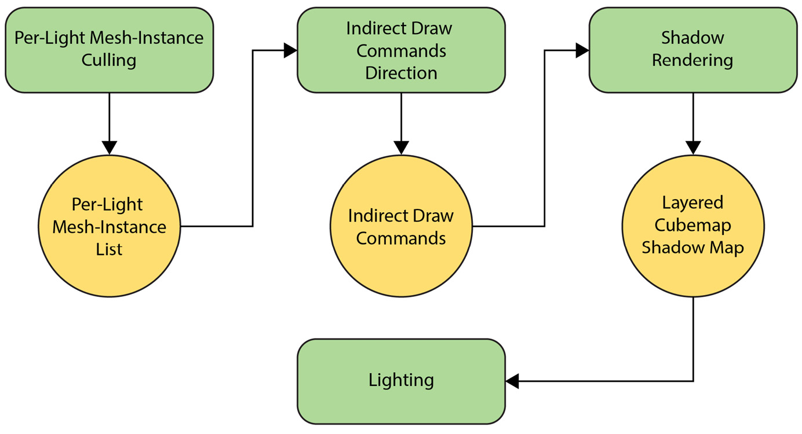
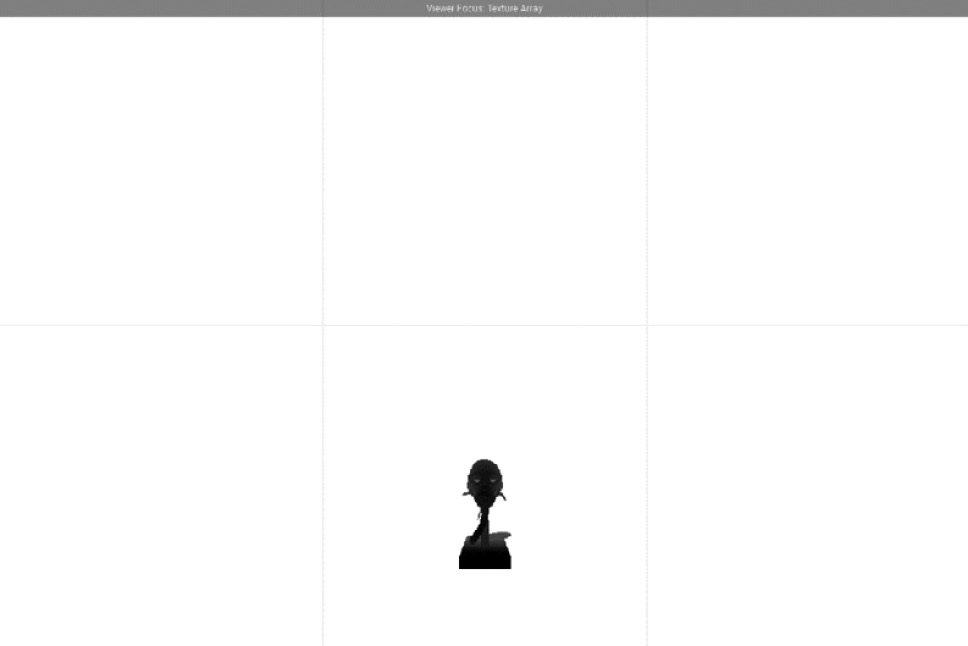

# 第 8 章：用 Mesh Shader 添加阴影（Adding Shadows Using Mesh Shaders）

上一章用聚类延迟技术为最多 256 盏动态、属性可独立设置的光源提供了支持。本章为这些光源增加**投射阴影**能力，并借助 **mesh shader** 在合理帧时间内让多盏灯同时产生阴影；同时介绍用 **Vulkan 稀疏资源（sparse resources）** 优化 shadow map 内存，使“大量阴影光源”从几乎不可行变为在当前硬件上可行且高效。

本章主要涉及：**阴影技术简史**；**用 mesh shader 实现 shadow mapping**；**用 Vulkan 稀疏资源优化阴影内存**。

## 技术需求

本章代码见：https://github.com/PacktPublishing/Mastering-Graphics-Programming-with-Vulkan/tree/main/source/chapter8

## 阴影技术简史
阴影能显著增强场景的深度与体积感，是渲染框架的重要一环；

与光强相关，在图形学中研究多年，仍远未“完全解决”。当前最常用的是 **shadow mapping**；

近年来硬件光追使**光追阴影**作为更真实的方案逐渐普及；

《Doom 3》等曾使用**阴影体（shadow volumes）**，现已少见。**阴影体**由 Frank Crow 于 1977 年提出：将三角形顶点沿光方向投影到无穷远形成体；阴影锐利，需对每个三角形、每盏灯分别处理；

现代实现用 stencil buffer 实现实时，但几何与 fill-rate 开销大，shadow map 更占优。

**Shadow mapping**（约 1978 年出现）是实时与离线渲染的事实标准：从光源视角渲染场景并保存每像素深度；

相机视角渲染时将像素转换到阴影坐标系，与 shadow map 比较判断是否在阴影中。分辨率与存储内容很重要；

随后出现各种滤波以柔化或硬化阴影。常见问题包括锯齿、shadow acne、Peter Panning 等，需多种技术缓解；

稳健的阴影方案通常需大量试错与针对场景的定制。

**光追阴影**利用硬件光追、用射线与专用场景表示（不同于 mesh/meshlet）对每像素向每盏灯发射射线计算阴影，效果最真实，但性能与支持硬件普及度仍不足以取代 shadow mapping。因此我们以 **shadow mapping** 作为 Raptor Engine 的主要阴影方案。下面用 mesh shader 实现多 shadow map 的算法与细节。

## 用 mesh shader 实现 shadow mapping
**算法概述**：用 meshlet 与 mesh shader 渲染阴影，但需先用 **compute** 生成绘制命令。

(1) **按光源剔除 mesh 实例**：在 compute 中做，得到每盏灯的可见 mesh 实例列表；

mesh 实例用于后续取 mesh，meshlet 级剔除在 task shader 中做。

(2) **写入间接绘制 meshlet 参数**：仍在 compute 中，用于把 meshlet 画进 shadow map；

多视图相关注意见后文。

(3) **用间接 mesh shader 绘制 meshlet** 到实际 shadow map；使用**分层 cubemap**，每层对应一盏灯。

(4) **光照时对 shadow 纹理采样**。

本章几乎不做滤波，重点在 mesh shader 驱动的阴影；滤波方案见章末链接。



Figure 8.1 – 算法概览。

下一节说明用于存储点光源阴影的 **cubemap**。

### Cubemap 阴影
**Cubemap** 用六个面存储图像，将 3D 方向 (x,y,z) 映射到对应面；

除阴影外也用于天空盒等，硬件普遍支持采样与滤波。

六个面通常为 +X/-X/+Y/-Y/+Z/-Z。渲染到某面需提供朝向该面的矩阵；

读取时用方向向量选面。我们为每个面提供 view-projection 矩阵供 meshlet 写入正确面；

**需为每个面单独生成绘制命令**，因为一个顶点只能写入一个 image view。

多视图扩展可让顶点写入多面，但撰写时 mesh shader 支持有限，故我们按面生成命令。

使用 **cubemap 数组**以便用分层渲染读写多盏灯的阴影。



Figure 8.2 – 从光源看去的六个面；

图中仅 +Z 有内容，我们会做剔除避免在空面绘制 meshlet。

**关于多视图**：Multiview 扩展可在 VR 立体或 cubemap 下让顶点写入多视图；

当前所用 Nvidia mesh shader 扩展对多视图支持不足，因此我们为每个面手动生成命令。

多厂商扩展推出后会更新代码，核心算法不变。下面进入算法步骤。

### 按光源的 mesh 实例剔除（Per-light mesh instance culling）

准备阴影渲染的第一步是在 compute shader 中做**粗粒度剔除**。Raptor 中同时有 mesh 与 meshlet 表示，因此可用 mesh 及其包围体作为高于 meshlet 的层级。我们做简单的**光源球与 mesh 球相交**测试，相交则加入对应 meshlet。派发时把 mesh 实例与光源组合（每灯 × 每 mesh 实例），从而对每灯、每 mesh 实例判断该灯是否影响该实例。输出为**每灯 meshlet 实例列表**（mesh 实例索引 + 全局 meshlet 索引），以及每灯 meshlet 实例数量，用于跳过空灯并正确读取索引。第一步是重置每灯计数：
```
layout (local_size_x = 32, local_size_y = 1, local_size_z =

1) in;
void main() {
if (gl_GlobalInvocationID.x == 0 ) {
for ( uint i = 0; i < NUM_LIGHTS; ++i ) {
per_light_meshlet_instances[i * 2] = 0;
per_light_meshlet_instances[i * 2 + 1] = 0;
}
}
global_shader_barrier();
```
随后跳过处理越界光源的线程；派发时按 32 向上取整，部分线程可能对应空灯。compute 的派发方式是把每个 mesh 实例与每盏灯一一组合，如图 8.3。Figure 8.3 – 用单次 draw call 为多盏灯渲染 cubemap 时的 command buffer 组织。early out 与 light index 计算如下：
```
uint light_index = gl_GlobalInvocationID.x %
active_lights;
if (light_index >= active_lights) {
return;
}
const Light = lights[light_index];
```
类似地计算 mesh 实例索引，若派发取整导致越界则再次 early out：
```
uint mesh_instance_index = gl_GlobalInvocationID.x /
active_lights;
if (mesh_instance_index >= num_mesh_instances) {
return;
}
uint mesh_draw_index = mesh_instance_draws
[mesh_instance_index].
mesh_draw_index;
// 跳过透明 mesh
MeshDraw mesh_draw = mesh_draws[mesh_draw_index];
if ( ((mesh_draw.flags & (DrawFlags_AlphaMask |
DrawFlags_Transparent)) != 0 ) ){
return;
}
```
最后取 mesh 实例与模型的包围球，计算世界空间包围球：
```
vec4 bounding_sphere = mesh_bounds[mesh_draw_index];
mat4 model = mesh_instance_draws
[mesh_instance_index].model;
// 计算 mesh 实例包围球
vec4 mesh_world_bounding_center = model * vec4
(bounding_sphere.xyz, 1);
float scale = length( model[0] );
float mesh_radius = bounding_sphere.w * scale * 1.1;
// 人为放大包围球
// 检查 mesh 是否在光源范围内
const bool mesh_intersects_sphere =
sphere_intersect(mesh_world_bounding_center.xyz,
mesh_radius, light.world_position, light.radius )
|| disable_shadow_meshes_sphere_cull();
if (!mesh_intersects_sphere) {
return;
}
```
此时可知该 mesh 实例受该灯影响，于是增加该灯的 meshlet 计数并写入绘制 meshlet 所需的索引：
```
uint per_light_offset =
atomicAdd(per_light_meshlet_instances[light_index],
mesh_draw.meshlet_count);
// mesh 在光源内，加入 meshlet
for ( uint m = 0; m < mesh_draw.meshlet_count; ++m ) {
uint meshlet_index = mesh_draw.meshlet_offset + m;
 meshlet_instances[light_index *
per_light_max_instances + per_light_offset
+ m] = uvec2( mesh_instance_index,
meshlet_index );
}
}
```
最终写入 mesh 实例索引（用于取世界矩阵）和全局 meshlet 索引（供后续 task shader 取 meshlet 数据）。在此之前需生成**间接绘制命令列表**，见下一节。根据场景我们为每灯预先分配了最大 meshlet 实例数。

### 间接绘制命令生成（Indirect draw commands generation）

本 compute shader 为每盏灯生成间接命令列表；用 per-light meshlet instances 的 SSBO 最后一个元素做原子计数。同前，先重置用于间接命令计数的原子整数：
```
layout (local_size_x = 32, local_size_y = 1, local_size_z =
1) in;
void main() {
if (gl_GlobalInvocationID.x == 0 ) {
// Use this as atomic int
per_light_meshlet_instances[NUM_LIGHTS] = 0;
}
global_shader_barrier();
We will early out execution for rounded-up light indices:
// Each thread writes the command of a light.
uint light_index = gl_GlobalInvocationID.x;
if ( light_index >= active_lights ) {
 return;
}
```
We can finally write the indirect data and the packed light index, only if
the light contains visible meshes.
Note that we write six commands, one for each cubemap face:
```
// Write per light shadow data
const uint visible_meshlets =
per_light_meshlet_instances[light_index];
if (visible_meshlets > 0) {
const uint command_offset =
atomicAdd(per_light_meshlet_instances[
NUM_LIGHTS], 6);
uint packed_light_index = (light_index & 0xffff)
<< 16;
meshlet_draw_commands[command_offset] =
uvec4( ((visible_meshlets + 31) / 32), 1, 1,
packed_light_index | 0 );
meshlet_draw_commands[command_offset + 1] =
uvec4( ((visible_meshlets + 31) / 32), 1, 1,
packed_light_index | 1 );
... same for faces 2 to 5.
}
}
```
至此得到间接绘制命令列表，每灯六条。进一步剔除在下一节的 task shader 中完成。

### Shadow cubemap 面剔除（Shadow cubemap face culling）

在间接绘制的 task shader 中，我们会增加按 cubemap 剔除 meshlet 的逻辑以优化渲染。为此提供一个工具函数：给定 cubemap 中心与一个 AABB，计算该 AABB 在 cubemap 的哪些面上可见；用 cubemap 各面法线判断 AABB 中心与半轴是否落在定义六个面之一的四个平面内：
```
uint get_cube_face_mask( vec3 cube_map_pos, vec3 aabb_min,
vec3 aabb_max ) {
vec3 plane_normals[] = {
vec3(-1, 1, 0), vec3(1, 1, 0), vec3(1, 0, 1),
vec3(1, 0, -1), vec3(0, 1, 1), vec3(0, -1, 1)
};
vec3 abs_plane_normals[] = {
vec3(1, 1, 0), vec3(1, 1, 0), vec3(1, 0, 1),
vec3(1, 0, 1), vec3(0, 1, 1), vec3(0, 1, 1) };
vec3 aabb_center = (aabb_min + aabb_max) * 0.5f;
vec3 center = aabb_center - cube_map_pos;
vec3 extents = (aabb_max - aabb_min) * 0.5f;
bool rp[ 6 ];
bool rn[ 6 ];
for ( uint i = 0; i < 6; ++i ) {
float dist = dot( center, plane_normals[ i ] );
float radius = dot( extents, abs_plane_normals[ i ]
);
rp[ i ] = dist > -radius;
rn[ i ] = dist < radius;
}
uint fpx = (rn[ 0 ] && rp[ 1 ] && rp[ 2 ] && rp[ 3 ] &&
aabb_max.x > cube_map_pos.x) ? 1 : 0;
uint fnx = (rp[ 0 ] && rn[ 1 ] && rn[ 2 ] && rn[ 3 ] &&
aabb_min.x < cube_map_pos.x) ? 1 : 0;
uint fpy = (rp[ 0 ] && rp[ 1 ] && rp[ 4 ] && rn[ 5 ] &&
aabb_max.y > cube_map_pos.y) ? 1 : 0;
uint fny = (rn[ 0 ] && rn[ 1 ] && rn[ 4 ] && rp[ 5 ] &&
aabb_min.y < cube_map_pos.y) ? 1 : 0;
uint fpz = (rp[ 2 ] && rn[ 3 ] && rp[ 4 ] && rp[ 5 ] &&
aabb_max.z > cube_map_pos.z) ? 1 : 0;
uint fnz = (rn[ 2 ] && rp[ 3 ] && rn[ 4 ] && rn[ 5 ] &&
aabb_min.z < cube_map_pos.z) ? 1 : 0;
return fpx | ( fnx << 1 ) | ( fpy << 2 ) | ( fny << 3 )
} | ( fpz << 4 ) | ( fnz << 5 );
```
该函数返回位掩码：六个比特中某位为 1 表示当前 AABB 在该面上可见。

### Meshlet 阴影渲染 – task shader

有了上述工具函数后，来看 task shader。我们相对其他 task shader 做了调整以支持间接绘制和分层渲染（写入不同 cubemap）。向 mesh shader 传递一个打包了 light index 与 face index 的 `uint`，用于取对应的 cubemap view-projection 矩阵并写入正确 layer：
```
out taskNV block {
uint meshlet_indices[32];
uint light_index_face_index;
};
void main() {
uint task_index = gl_LocalInvocationID.x;
uint meshlet_group_index = gl_WorkGroupID.x;
```
meshlet 索引需在全局计算。先算得相对于本次间接 draw 的 meshlet 索引：
```
// 计算 meshlet 与 light 索引
const uint meshlet_index = meshlet_group_index * 32 +
task_index;
```
再从剔除 compute 写入的 meshlet instances 中解析 light index 与读取偏移：
```
uint packed_light_index_face_index =
meshlet_draw_commands[gl_DrawIDARB].w;
const uint light_index =
packed_light_index_face_index >> 16;
 const uint meshlet_index_read_offset =
light_index * per_light_max_instances;
```
据此读取正确的 meshlet 与 mesh 实例索引：
```
uint global_meshlet_index =
meshlet_instances[meshlet_index_read_offset +
meshlet_index].y;
uint mesh_instance_index =
meshlet_instances[meshlet_index_read_offset +
meshlet_index].x;
```
计算 face index 后进入剔除阶段：
```
const uint face_index = (packed_light_index_face_index
& 0xf);
mat4 model = mesh_instance_draws[mesh_instance_index]
.model;
```
剔除逻辑与之前 task shader 类似，额外增加了按面剔除：
```
vec4 world_center = model * vec4(meshlets
[global_meshlet_index].center, 1);
float scale = length( model[0] );
float radius = meshlets[global_meshlet_index].radius *
scale * 1.1; // 人为放大包围球
vec3 cone_axis =
mat3( model ) * vec3(int(meshlets
[global_meshlet_index].cone_axis[0]) / 127.0,
int(meshlets[global_meshlet_index].
cone_axis[1]) / 127.0,
int(meshlets[global_meshlet_index].
cone_axis[2]) / 127.0);
float cone_cutoff = int(meshlets[global_meshlet_index].
cone_cutoff) / 127.0;
bool accept = false;
 const vec4 camera_sphere = camera_spheres[light_index];
// 锥剔除
accept = !coneCull(world_center.xyz, radius, cone_axis,
cone_cutoff, camera_sphere.xyz) ||
disable_shadow_meshlets_cone_cull();
// 球体剔除
if ( accept ) {
accept = sphere_intersect( world_center.xyz,
radius, camera_sphere.xyz,
camera_sphere.w) ||
disable_shadow_meshlets_sphere_cull();
}
// Cubemap 面剔除
if ( accept ) {
uint visible_faces =
get_cube_face_mask( camera_sphere.xyz,
world_center.xyz - vec3(radius),
world_center.xyz + vec3(radius));
switch (face_index) {
case 0:
accept = (visible_faces & 1) != 0;
break;
case 1:
accept = (visible_faces & 2) != 0;
break;
...same for faces 2 to 5.
}
accept = accept || disable_shadow_meshlets_cubemap
_face_cull();
}
```
此处将每个可见 meshlet 写入：
```
uvec4 ballot = subgroupBallot(accept);
uint index = subgroupBallotExclusiveBitCount(ballot);
if (accept)
meshlet_indices[index] = global_meshlet_index;
uint count = subgroupBallotBitCount(ballot);
if (task_index == 0)
 gl_TaskCountNV = count;
最后写入打包的 light 与 face index：
light_index_face_index =
packed_light_index_face_index;
}
```
接下来是 mesh shader。

### Meshlet 阴影渲染 – mesh shader

本 mesh shader 需要得到要写入的 cubemap 数组中的 **layer 索引**，以及 **light index** 以读取正确的 view-projection 变换。每个面有各自的变换，因为我们是按面分别渲染的。cubemap 的每个面对应一个 layer：第一个 cubemap 为 layer 0–5，第二个为 6–11，以此类推。代码如下：
```
void main() {
...
const uint light_index = light_index_face_index >> 16;
const uint face_index = (light_index_face_index & 0xf);
const int layer_index = int(CUBE_MAP_COUNT *
light_index + face_index);
for (uint i = task_index; i < vertex_count; i +=
32) {
uint vi = meshletData[vertexOffset + i];
vec3 position = vec3(vertex_positions[vi].v.x,
vertex_positions[vi].v.y,
vertex_positions[vi].v.z);
gl_MeshVerticesNV[ i ].gl_Position =
 view_projections[layer_index] *
(model * vec4(position, 1));
}
uint indexGroupCount = (indexCount + 3) / 4;
for (uint i = task_index; i < indexGroupCount; i += 32) {
writePackedPrimitiveIndices4x8NV(i * 4,
meshletData[indexOffset + i]);
}
```
此处为每个图元写入 layer 索引；使用这些偏移是为了避免写入时的 bank conflict，与之前 shader 一致：
```
gl_MeshPrimitivesNV[task_index].gl_Layer =
layer_index;
gl_MeshPrimitivesNV[task_index + 32].gl_Layer =
layer_index;
gl_MeshPrimitivesNV[task_index + 64].gl_Layer =
layer_index;
gl_MeshPrimitivesNV[task_index + 96].gl_Layer =
layer_index;
if (task_index == 0) {
gl_PrimitiveCountNV =
uint(meshlets[global_meshlet_index]
.triangle_count);
}
}
```
阴影的 mesh shader 渲染到此结束，未使用 fragment shader。接下来在光照 shader 中采样生成的 shadow 纹理，见下一节。

### Shadow map 采样（Shadow map sampling）

本章使用无滤波的硬阴影，采样代码是标准的 cubemap 用法：计算世界空间到光源的向量并用其采样。因为是分层 cubemap，需要 3D 方向向量和 layer 索引（后者存在光源数据中）：
```
vec3 shadow_position_to_light = world_position –
light.world_position;
const float closest_depth =
texture(global_textures_cubemaps_array
[nonuniformEXT(cubemap_shadows_index)],
vec4(shadow_position_to_light,
shadow_light_index)).r;
```
再用工具函数 `vector_to_depth_value` 将深度转为原始深度值：从光向量取主轴并转为原始深度，以便与 cubemap 读出的值比较：
```
const float current_depth = vector_to_depth_value
(shadow_position_to_light,
light.radius);
float shadow = current_depth - bias < closest_depth ?
1 : 0;
`vector_to_depth_value` 实现如下：
float vector_to_depth_value( inout vec3 Vec, float radius) {
vec3 AbsVec = abs(Vec);
float LocalZcomp = max(AbsVec.x, max(AbsVec.y,
AbsVec.z));
const float f = radius;
const float n = 0.01f;
float NormZComp = -(f / (n - f) - (n * f) / (n - f) /
LocalZcomp);
return NormZComp;
}
```
该函数从方向向量的主轴出发，用投影矩阵推导的公式得到原始深度，可与 shadow map 中任意深度值比较。下图是单盏点光源的阴影示例。Figure 8.4 – 场景中单盏点光源产生的阴影。阴影能显著提升渲染效果，为观察者提供物体与环境关系的重要视觉线索。至此我们完成了基于 mesh shader 的阴影实现，但在内存上仍有优化空间：当前方案为每盏灯预先分配一整张 cubemap（每灯六张纹理），内存会很快变大。下一节介绍用**稀疏资源**降低 shadow map 内存占用的方案。

## 用 Vulkan 稀疏资源优化阴影内存（Improving shadow memory with Vulkan's sparse resources）

上节末尾提到，目前为所有光源的每张 cubemap 分配了完整内存。根据光源在屏幕上的大小，远距离或小光源无法充分利用高分辨率，可能造成浪费。因此我们实现了一种根据相机位置**动态决定每张 cubemap 分辨率**的方法，并据此管理稀疏纹理，在运行时按帧需求重新绑定内存。稀疏纹理（有时也称虚拟纹理）可以手写实现，但 Vulkan 原生支持，下面说明如何用 Vulkan API 实现。

### 创建与分配稀疏纹理（Creating and allocating sparse textures）

Vulkan 中常规资源必须绑定到单块内存分配，且不能改绑到另一块分配；适合运行时已知、不需变更的资源。对**动态分辨率**的 cubemap，则需要能把同一资源绑定到不同的内存区域。Vulkan 提供两种方式：**Sparse resources**：可将资源绑定到非连续内存，但整份资源都需绑定。**Sparse residency**：可只将资源的一部分绑定到不同内存，适合我们——每层 cubemap 可能只用其中一块子区域。两种方式都允许在运行时重新绑定。使用稀疏资源的第一步是在创建资源时传入相应标志：
```
VkImageCreateInfo image_info = {
VK_STRUCTURE_TYPE_IMAGE_CREATE_INFO };
image_info.flags = VK_IMAGE_CREATE_SPARSE_RESIDENCY_BIT |
VK_IMAGE_CREATE_SPARSE_BINDING_BIT;
```
这里请求支持 **sparse residency** 的资源。创建 image 后不必立即分配内存，而是先分配一块内存池，再从中子分配各个 page。Vulkan 对单页大小有严格要求，规范中的要求见 Table 8.1 – Sparse block sizes for images。我们需要据此计算给定尺寸的 cubemap 要分配多少页。可用以下代码查询给定 image 的格式信息：
```
VkPhysicalDeviceSparseImageFormatInfo2 format_info{
VK_STRUCTURE_TYPE_PHYSICAL_DEVICE_SPARSE_IMAGE_FORMAT
 _INFO_2 };
format_info.format = texture->vk_format;
format_info.type = to_vk_image_type( texture->type );
format_info.samples = VK_SAMPLE_COUNT_1_BIT;
format_info.usage = texture->vk_usage;
format_info.tiling = VK_IMAGE_TILING_OPTIMAL;
```
该结构所需信息已在纹理数据结构中。接着查询该 image 的 block 大小：
```
Array<VkSparseImageFormatProperties2> properties;
vkGetPhysicalDeviceSparseImageFormatProperties2(
vulkan_physical_device, &format_info, &property_count,
properties.data );
u32 block_width = properties[ 0 ].properties.
imageGranularity.width;
u32 block_height = properties[ 0 ].properties.
imageGranularity.height;
```
据此可分配页池。先获取 image 的内存需求：
```
VkMemoryRequirements memory_requirements{ };
vkGetImageMemoryRequirements( vulkan_device, texture->
vk_image,
&memory_requirements );
```
与常规纹理相同，但 `memory_requirements.alignment` 会给出该 image 格式的 block 大小。再根据池大小计算需分配的 block 数：
```
u32 block_count = pool_size / ( block_width * block_height );
最后分配后续将用于写入 cubemap 的页：
VmaAllocationCreateInfo allocation_create_info{ };
allocation_create_info.usage = VMA_MEMORY_USAGE_GPU_ONLY;
VkMemoryRequirements page_memory_requirements;
page_memory_requirements.memoryTypeBits =
memory_requirements.memoryTypeBits;
page_memory_requirements.alignment =
memory_requirements.alignment;
page_memory_requirements.size =
memory_requirements.alignment;
vmaAllocateMemoryPages( vma_allocator,
&page_memory_requirements,
&allocation_create_info,
block_count, page_pool->
vma_allocations.data, nullptr );
```
VMA 库提供 `vmaAllocateMemoryPages`，可一次分配多页。分配好 shadow map 内存后，需要确定每张 cubemap 的分辨率。

### 按光源选择阴影内存用量（Choosing per-light shadow memory usage）

要确定某盏灯对应 cubemap 的分辨率，需衡量其对场景的影响。直观上，更远或半径更小的点光源影响更小，但需要量化。我们采用了与论文 *More Efficient Virtual Shadow Maps for Many Lights* 类似的思路。沿用上一章的 **cluster** 概念：将屏幕划分为 tile，并在 z 方向对视锥切片，得到更小的视锥（用 AABB 近似），用于判断某盏灯覆盖了哪些区域。实现步骤如下。1. 先在相机空间计算每盏灯的包围盒：
```
for ( u32 l = 0; l < light_count; ++l ) {
Light& light = scene->lights[ l ];
vec4s aabb_min_view = glms_mat4_mulv(
last_camera.view,
light.aabb_min );
vec4s aabb_max_view = glms_mat4_mulv(
last_camera.view,
light.aabb_max );
lights_aabb_view[ l * 2 ] = vec3s{
aabb_min_view.x, aabb_min_view.y,
aabb_min_view.z };
lights_aabb_view[ l * 2 + 1 ] = vec3s{
aabb_max_view.x, aabb_max_view.y,
 aabb_max_view.z };
}
```
2. Next, we iterate over the tiles and each depth slice to compute
each cluster position and size. We start by computing the camera
space position of each tile:
```
vec4s max_point_screen = vec4s{ f32( ( x + 1 ) *
tile_size ), f32( ( y + 1 ) *
tile_size ), 0.0f, 1.0f };
// 右上
vec4s min_point_screen = vec4s{ f32( x * tile_size ),
f32( y * tile_size ),
0.0f, 1.0f }; // 左下
vec3s max_point_view = screen_to_view(
max_point_screen );
vec3s min_point_view = screen_to_view(
min_point_screen );
3. 再确定每个切片的近、远深度：
f32 tile_near = z_near * pow( z_ratio, f32( z ) *
z_bin_range );
f32 tile_far = z_near * pow( z_ratio, f32( z + 1 ) *
z_bin_range );
4. 最后结合以上得到 cluster 的位置与大小：
vec3s min_point_near = line_intersection_to_z_plane(
eye_pos, min_point_view,
tile_near );
vec3s min_point_far = line_intersection_to_z_plane(
eye_pos, min_point_view,
tile_far );
vec3s max_point_near = line_intersection_to_z_plane(
eye_pos, max_point_view,
 tile_near );
vec3s max_point_far = line_intersection_to_z_plane(
eye_pos, max_point_view,
tile_far );
vec3s min_point_aabb_view = glms_vec3_minv( glms_vec3_minv( min_point_near, min_point_far ), glms_vec3_minv( max_point_near, max_point_far ) );
vec3s max_point_aabb_view = glms_vec3_maxv( glms_vec3_maxv( min_point_near, min_point_far ), glms_vec3_maxv( max_point_near, max_point_far ) );
```
得到 cluster 后，对每盏灯判断是否覆盖该 cluster 以及 cluster 在光源上的投影（稍后说明）。1. 下一步是光源与 cluster 的包围盒相交测试：
```
f32 minx = min( min( light_aabb_min.x,
light_aabb_max.x ), min(
min_point_aabb_view.x,
max_point_aabb_view.x ) );
f32 miny = min( min( light_aabb_min.y,
light_aabb_max.y ), min(
 min_point_aabb_view.y,
max_point_aabb_view.y ) );
f32 minz = min( min( light_aabb_min.z,
light_aabb_max.z ), min(
min_point_aabb_view.z,
max_point_aabb_view.z ) );
f32 maxx = max( max( light_aabb_min.x,
light_aabb_max.x ), max(
min_point_aabb_view.x,
max_point_aabb_view.x ) );
f32 maxy = max( max( light_aabb_min.y,
light_aabb_max.y ), max(
min_point_aabb_view.y,
max_point_aabb_view.y ) );
f32 maxz = max( max( light_aabb_min.z,
light_aabb_max.z ), max(
min_point_aabb_view.z,
max_point_aabb_view.z ) );
f32 dx = abs( maxx - minx );
f32 dy = abs( maxy - miny );
f32 dz = abs( maxz - minz );
f32 allx = abs( light_aabb_max.x - light_aabb_min.x )
+ abs( max_point_aabb_view.x –
min_point_aabb_view.x );
f32 ally = abs( light_aabb_max.y - light_aabb_min.y )
+ abs( max_point_aabb_view.y –
min_point_aabb_view.y );
f32 allz = abs( light_aabb_max.z - light_aabb_min.z )
 + abs( max_point_aabb_view.z –
min_point_aabb_view.z );
bool intersects = ( dx <= allx ) && ( dy < ally ) &&
( dz <= allz );
```
若相交，则计算光源在 cluster 上投影面积的近似值：
```
f32 d = glms_vec2_distance( sphere_screen, tile_center );
f32 diff = d * d - tile_radius_sq;
if ( diff < 1.0e-4 ) {
} continue;
f32 solid_angle = ( 2.0f * rpi ) * ( 1.0f - ( sqrtf(
diff ) / d ) );
f32 resolution = sqrtf( ( 4.0f * rpi * tile_pixels ) /
( 6 * solid_angle ) );
```
思路是：在屏幕空间取光源与 cluster 中心的距离，计算 cluster 在光源处张成的立体角，再结合 cluster 的像素大小得到 cubemap 分辨率；详见论文。我们保留最大分辨率，并用该值绑定每张 cubemap 的内存。

### 渲染到稀疏 shadow map（Rendering into a sparse shadow map）

确定本帧各 cubemap 分辨率后，将预分配的页绑定到纹理：1. 先记录每张 image 绑定了哪些页：
```
VkImageAspectFlags aspect = TextureFormat::has_depth(
texture->vk_format ) ? VK_IMAGE_ASPECT_DEPTH_BIT : VK_IMAGE_ASPECT_COLOR_BIT;
for ( u32 block_y = 0; block_y < num_blocks_y;
++block_y ) {
for ( u32 block_x = 0; block_x < num_blocks_x;
++block_x ) {
VkSparseImageMemoryBind sparse_bind{ };
VmaAllocation allocation =
page_pool-> vma_allocations
[ page_pool->used_pages++ ];
VmaAllocationInfo allocation_info{ };
vmaGetAllocationInfo( vma_allocator,
allocation,
&allocation_info );
```
先取得将用于该 block 的分配的详情（需用到 `VkDeviceMemory` 句柄及其在池中的偏移）。2. 再计算每个 block 在纹理中的偏移：
```
i32 dest_x = ( i32 )( block_x * block_width +
x );
i32 dest_y = ( i32 )( block_y * block_height +
y );
```
3. 将该信息填入 `VkSparseImageMemoryBind`，后续用于更新 cubemap 纹理绑定的内存：
```
sparse_bind.subresource.aspectMask = aspect;
sparse_bind.subresource.arrayLayer = layer;
sparse_bind.offset = { dest_x, dest_y, 0 };
sparse_bind.extent = { block_width,
block_height, 1 };
sparse_bind.memory =
allocation_info.deviceMemory;
 sparse_bind.memoryOffset =
allocation_info.offset;
pending_sparse_queue_binds.push( sparse_bind
);
}
}
```
如前所述，我们只使用一张多 layer 的 image，`layer` 变量决定每块分配属于哪一层；详见完整代码。4. 最后记录这些页将绑定到哪张 image：
```
SparseMemoryBindInfo bind_info{ };
bind_info.image = texture->vk_image;
bind_info.binding_array_offset = array_offset;
bind_info.count = num_blocks;
pending_sparse_memory_info.push( bind_info );
```
`array_offset` 是 `pending_sparse_queue_binds` 数组中的偏移，从而把所有待绑定分配放在同一数组。记录完分配更新列表后，需提交到队列由 GPU 执行。5. 先为每层填充 `VkSparseImageMemoryBindInfo`：
```
for ( u32 b = 0; b < pending_sparse_memory_info.size;
++b ) {
SparseMemoryBindInfo& internal_info =
pending_sparse_memory_info[ b ];
VkSparseImageMemoryBindInfo& info =
sparse_binding_infos[ b ];
info.image = internal_info.image;
info.bindCount = internal_info.count;
info.pBinds = pending_sparse_queue_binds.data +
internal_info.binding_array_offset;
}
```
6. 再将所有待执行的绑定提交到主队列：
```
VkBindSparseInfo sparse_info{
VK_STRUCTURE_TYPE_BIND_SPARSE_INFO };
sparse_info.imageBindCount =
sparse_binding_infos.size;
sparse_info.pImageBinds = sparse_binding_infos.data;
sparse_info.signalSemaphoreCount = 1;
sparse_info.pSignalSemaphores =
&vulkan_bind_semaphore;
vkQueueBindSparse( vulkan_main_queue, 1, &sparse_info,
VK_NULL_HANDLE );
```
需要由用户保证在访问刚更新过绑定的资源之前，该操作已完成；我们通过 signal 一个 semaphore（`vulkan_bind_semaphore`），在主渲染提交中 wait 它来实现。调用 `vkQueueBindSparse` 的队列必须具有 `VK_QUEUE_SPARSE_BINDING_BIT` 能力。本节涵盖了分配与使用稀疏纹理的步骤：先说明稀疏纹理的原理及对 cubemap 的适用性，再介绍根据每盏灯对场景的贡献动态确定每张 cubemap 分辨率的算法，最后演示用 Vulkan API 将内存绑定到稀疏资源。

## 小结（Summary）

本章在光照系统中加入了高效的多点光源阴影实现。我们简述了阴影算法的发展、优缺点，直至利用光追硬件的新技术；接着介绍了为多点光源实现阴影的细节：每盏灯生成 cubemap 的方式，以及为支持多灯所做的优化——尤其是从主几何 pass 复用的剔除，以及每灯一次间接绘制。最后一节介绍了**稀疏纹理**：可动态将内存绑定到给定资源；我们说明了用于衡量每盏点光源对场景贡献的算法，以及如何据此决定每张 cubemap 的分辨率，并演示了用 Vulkan API 使用稀疏资源。本章仅涉及点光源，部分技术可复用到其他光源类型；例如可进一步按几何可见区域降低 cubemap 分辨率。cluster 计算目前在 CPU 上完成以便理解并避免从 GPU 回读（可能较慢），将实现迁到 GPU 也值得考虑。欢迎在代码上实验并扩展功能。

## 延伸阅读（Further reading）

- *Real-Time Shadows* 一书对多种阴影实现技术做了很好的综述，其中不少至今仍在使用。
- *GPU Pro 360 Guide to Shadows* 汇集了 GPU Pro 系列中与阴影相关的文章。
- 书中提到的**四面体 shadow mapping**：将 shadow map 投影到四面体再展开为单张纹理；概念出自 *Shadow Mapping for Omnidirectional Light Using Tetrahedron Mapping*（原载 GPU Pro），后在 *Tile-based Omnidirectional Shadows*（原载 GPU Pro 6）中扩展。作者代码：[link](http://www.hd-prg.com/tileBasedShadows.html)
- 我们的稀疏纹理实现参考了 SIGGRAPH 报告：[link](https://efficientshading.com/wp-content/uploads/s2015_shadows.pdf)；与其对应论文：[link](http://newq.net/dl/pub/MoreEfficientClusteredShadowsPreprint.pdf)
- 本章未实现的 **shadow map caching** 可降低 shadow map 计算成本并在多帧间分摊更新；入门可看：[link](https://www.activision.com/cdn/research/2017_DD_Rendering_of_COD_IW.pdf)
- cluster 计算主要参考：[link](http://www.aortiz.me/2018/12/21/CG.html#part-2)
- Vulkan 规范中关于稀疏资源的 API 说明：[link](https://registry.khronos.org/vulkan/specs/1.2-extensions/html/vkspec.html#sparsememory)