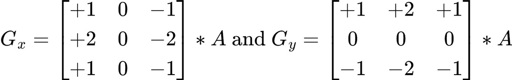
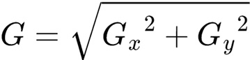
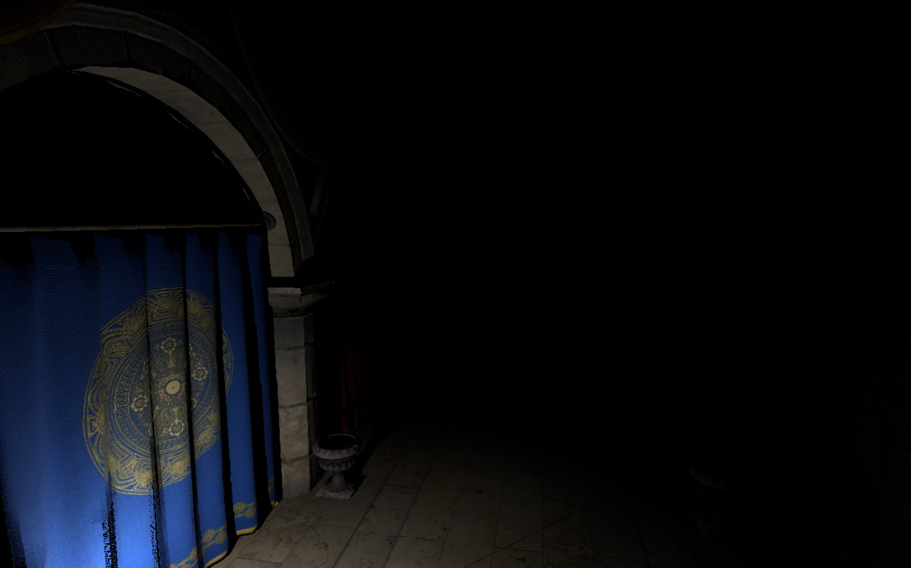

# 第 9 章：实现可变着色率（Implementing Variable Rate Shading）

本章将实现近年来常用的**可变着色率（Variable Rate Shading，VRS）**：在保持观感质量的前提下，由开发者指定每个像素的着色频率，从而缩短部分渲染 pass 的时间，把省下的时间用于更多效果或更高分辨率。Vulkan 提供多种接入方式，我们会概览并实现其一。该功能通过扩展提供，仅较新硬件支持；也可用 compute shader 手动实现，此处不展开，延伸阅读中会给出参考。

本章主要内容：
- 可变着色率概念介绍
- 用 Vulkan API 实现可变着色率
- 用 specialization constants 配置 compute shader

## 技术需求

本章代码见：https://github.com/PacktPublishing/Mastering-Graphics-Programming-with-Vulkan/tree/main/source/chapter9

## 可变着色率介绍（Introducing variable rate shading）

**可变着色率（VRS）** 让开发者控制 fragment 的着色频率。关闭时，所有 fragment 按 1×1 着色，即 fragment shader 对图像中每个 fragment 都执行一次。随着 VR 头显出现，开发者开始研究如何缩短单帧渲染时间：VR 需要同时渲染两眼，且对帧延迟敏感，需要更高帧率以避免晕动。其中一种做法是**注视点渲染（foveated rendering）**：中心全分辨率、外围降低质量；用户主要关注画面中心，对周围质量下降不敏感。该思路可推广到非 VR，因此 DirectX® 与 Vulkan 等 API 都加入了原生支持。在通用方案下，可为不同 fragment 指定多种着色率，常用推荐为 1×1、1×2、2×1、2×2；更高比率虽可行，但容易在最终画面上产生可见瑕疵。1×1 表示对图像中所有 fragment 都执行 fragment shader，无节省，即未开启 VRS 时的默认行为。1×2 或 2×1 表示一次 fragment shader 调用着色两个 fragment，结果复用到两者；2×2 则一次调用将同一结果应用到四个 fragment。

### 确定着色率（Determining the shading rate）
为每个 fragment 选择着色率有多种方式；我们采用的是在光照 pass 之后，基于**亮度**做**边缘检测**。思路是：亮度均匀区域降低着色率，过渡区域用全分辨率；人眼对变化区域更敏感，对均匀区域不敏感，因此这样能在观感上更合理。使用的滤波器是 3×3 的经典 **Sobel 滤波器**，对每个 fragment 计算两个分量。



Figure 9.1 – 用于近似某 fragment 的 x、y 方向导数的滤波器（来源：Wikipedia – https://en.wikipedia.org/wiki/Sobel_operator）。再用下列公式得到最终导数值。



Figure 9.2 – 近似导数值的公式（来源：Wikipedia – https://en.wikipedia.org/wiki/Sobel_operator）。对下图应用 Sobel 滤波。



Figure 9.3 – 光照 pass 后的渲染帧。得到如下着色率掩码。


Figure 9.4 – 计算得到的着色率掩码。实现中：若 fragment 的 G 值（按 Figure 9.2 公式计算）大于 0.1，使用全 1×1 着色率，对应 Figure 9.4 中的黑色像素；G 值低于 0.1 的用 2×2 率，对应图中红色像素。掩码数值的计算方式在下一节说明。本节介绍了可变着色率的概念与我们的实现思路；下一节演示如何用 Vulkan API 实现该功能。

## 在 Vulkan 中集成可变着色率（Integrating variable rate shading using Vulkan）

上节提到，fragment 着色率功能由 **VK_KHR_fragment_shading_rate** 扩展提供；与其他可选扩展一样，调用相关 API 前请确认设备支持。Vulkan 提供三种控制着色率的方式：**按 draw**、**按图元（primitive）**、**在 render pass 中使用 image attachment**。按 draw 设置时有两种做法：在创建 pipeline 时传入 `VkPipelineFragmentShadingRateStateCreateInfoKHR`，或在运行时调用 `vkCmdSetFragmentShadingRateKHR`。适用于事先知道某些 draw 可以降率且不影响质量的场景，例如天空或远离相机的物体。也可以**按图元**指定着色率：在 vertex 或 mesh shader 中写入内置变量 `PrimitiveShadingRateKHR`。例如在 mesh shader 中已判定某图元可用较低 LOD 时，可同时为其指定较低着色率。我们采用第三种方式（render pass 的 image attachment），更灵活。按上节所述，先要计算可变着色率掩码，由 compute shader 写入**着色率图像（shading rate image）**。首先在 shader 调用内填充共享表：
```
shared float local_image_data[ LOCAL_DATA_SIZE ][
LOCAL_DATA_SIZE ];
local_image_data[ local_index.y ][ local_index.x ] =
luminance( texelFetch( global_textures[
color_image_index ], global_index, 0 ).rgb );
barrier();
```
表中每一项对应本 shader 调用所处理 fragment 的亮度值。这样做的目的是减少纹理读取：若每个线程各自读所需像素，需要 8 次读取；用共享表后每线程只需 1 次读取。注意：我们每次处理 16×16 的 fragment，但 Sobel 需要 3×3 邻域，因此实际要填 18×18 的表；处于处理区域边界的线程需要额外逻辑才能把表填满，此处省略。必须使用 `barrier()` 保证本 workgroup 内所有线程完成写入后再继续，否则表未填全会导致错误结果。接着对当前 fragment 计算导数值：
```
float dx = local_image_data[ local_index.y - 1 ][
local_index.x - 1 ] - local_image_data[
local_index.y - 1 ][ local_index.x + 1 ] +
2 * local_image_data[ local_index.y ][
local_index.x - 1 ] -
2 * local_image_data[ local_index.y ][
local_index.x + 1 ] +
local_image_data[ local_index.y + 1][
local_index.x - 1 ] -
local_image_data[ local_index.y + 1 ][
local_index.x + 1 ];
float dy = local_image_data[ local_index.y - 1 ][
local_index.x - 1 ] +
2 * local_image_data[ local_index.y - 1 ][
local_index.x ] +
local_image_data[ local_index.y - 1 ][
local_index.x + 1 ] -
local_image_data[ local_index.y + 1 ][
local_index.x - 1 ] -
2 * local_image_data[ local_index.y + 1 ][
local_index.x ] -
local_image_data[ local_index.y + 1 ][
local_index.x + 1 ];
float d = pow( dx, 2 ) + pow( dy, 2 );
即应用上一节的公式。得到导数后，把该 fragment 的着色率写入图像：
uint rate = 1 << 2 | 1;
if ( d > 0.1 ) {
} rate = 0;
imageStore( global_uimages_2d[ fsr_image_index ], ivec2(
gl_GlobalInvocationID.xy ), uvec4( rate, 0, 0, 0 ) );
```
着色率按 Vulkan 规范中的公式编码：`size_w = 2^((texel/4) & 3)`，`size_h = 2^(texel & 3)`。我们计算的是上述公式中的 texel 值：为 x、y 着色率各设指数（0 或 1），并写入着色率图像。着色率图像填好后，可在下一帧的 render pass 中用作着色率来源。使用前需把该 image 转换到正确 layout：`VK_IMAGE_LAYOUT_FRAGMENT_SHADING_RATE_ATTACHMENT_OPTIMAL_KHR`，并使用新的 pipeline stage：`VK_PIPELINE_STAGE_FRAGMENT_SHADING_RATE_ATTACHMENT_BIT_KHR`。将新创建的着色率图像纳入 render pass 有几种方式：可用 `VkFragmentShadingRateAttachmentInfoKHR` 扩展 `VkSubpassDescription2` 来指定用作 fragment 着色率的 attachment。我们尚未使用 RenderPass2 扩展，因此选择扩展现有的 **dynamic rendering** 实现，通过以下代码扩展 `VkRenderingInfoKHR`：
```
VkRenderingFragmentShadingRateAttachmentInfoKHR
shading_rate_info {
VK_STRUCTURE_TYPE_RENDERING_FRAGMENT_SHADING
_RATE_ATTACHMENT_INFO_KHR };
shading_rate_info.imageView = texture->vk_image_view;
shading_rate_info.imageLayout =
 VK_IMAGE_LAYOUT_FRAGMENT_SHADING_RATE
_ATTACHMENT_OPTIMAL_KHR;
shading_rate_info.shadingRateAttachmentTexelSize = { 1, 1 };
rendering_info.pNext = ( void* )&shading_rate_info;
```
至此渲染用的 shader 无需修改。本节说明了为使用着色率图像所需做的渲染代码改动，以及基于 Sobel 滤波的边缘检测 compute shader 实现；该算法的结果用于决定每个 fragment 的着色率。下一节介绍 **specialization constants**：用其在创建 pipeline 时指定常量，从而控制 compute shader 的 workgroup 大小以优化性能。

## 利用 specialization constants（Taking advantage of specialization constants）

**Specialization constants** 是 Vulkan 的一项功能：在创建 pipeline 时指定常量。同一 shader 仅因少量常量不同而用于多种场景（例如不同材质）时特别有用；相比预处理器宏，可在运行时动态设置而无需重新编译 shader。我们要根据运行硬件控制 compute shader 的 workgroup 大小以获得最佳性能，实现步骤如下。1. 首先在解析 shader 的 SPIR-V 时，判断是否使用了 specialization constants，并识别带有下列 decoration 的变量：
```
case ( SpvDecorationSpecId ):
{
id.binding = data[ word_index + 3 ];
break;
}
```
2. 解析所有变量时，保存 specialization constant 的详细信息，供编译使用该 shader 的 pipeline 时使用：
```
switch ( id.op ) {
case ( SpvOpSpecConstantTrue ):
case ( SpvOpSpecConstantFalse ):
case ( SpvOpSpecConstant ):
case ( SpvOpSpecConstantOp ):
case ( SpvOpSpecConstantComposite ):
{
 Id& id_spec_binding = ids[ id.type_index ];
SpecializationConstant&
specialization_constant = parse_result->
specialization_constants[
parse_result->
specialization_constants_count
];
specialization_constant.binding =
id_spec_binding.binding;
specialization_constant.byte_stride =
id.width / 8;
specialization_constant.default_value =
id.value;
SpecializationName& specialization_name =
 parse_result->specialization_names[
parse_result->
specialization_constants_count ];
raptor::StringView::copy_to(
id_spec_binding.name,
specialization_name.name, 32 );
++parse_result->
specialization_constants_count;
break;
}
}
```
3. 有了 specialization constant 信息后，在创建 pipeline 时覆盖其值。先填充 `VkSpecializationInfo`：
```
VkSpecializationInfo specialization_info;
VkSpecializationMapEntry specialization_entries[
 spirv::k_max_specialization_constants ];
u32 specialization_data[
spirv::k_max_specialization_constants ];
specialization_info.mapEntryCount = shader_state->
parse_result->specialization_constants_count;
specialization_info.dataSize = shader_state->
parse_result->specialization_constants_count *
sizeof( u32 );
specialization_info.pMapEntries =
specialization_entries;
specialization_info.pData = specialization_data;
```
4. 再为每个 specialization constant 条目设值：
```
for ( u32 i = 0; i < shader_state->parse_result->
specialization_constants_count; ++i ) {
 const spirv::SpecializationConstant&
specialization_constant = shader_state->
parse_result->
specialization_constants[ i ];
cstring specialization_name = shader_state->
parse_result->specialization_names[ i ].name;
VkSpecializationMapEntry& specialization_entry =
specialization_entries[ i ];
if ( strcmp(specialization_name, "SUBGROUP_SIZE")
== 0 ) {
specialization_entry.constantID =
specialization_constant.binding;
specialization_entry.size = sizeof( u32 );
specialization_entry.offset = i * sizeof( u32 );
 specialization_data[ i ] = subgroup_size;
}
}
```
我们这里查找名为 `SUBGROUP_SIZE` 的变量。最后将 specialization constant 信息存入创建 pipeline 时使用的 shader stage 结构：`shader_stage_info.pSpecializationInfo = &specialization_info`。编译时驱动与编译器会用我们指定的值覆盖 shader 中的原值。本节说明了如何用 specialization constants 在运行时改变 shader 行为：解析 SPIR-V 时识别 specialization constant 的改动，以及创建 pipeline 时覆盖其值所需的代码。

## 小结（Summary）

本章介绍了**可变着色率（VRS）**：在不明显损失观感的前提下提升部分渲染 pass 的性能，并说明了用边缘检测决定每个 fragment 着色率的思路。接着说明了用 Vulkan API 启用和使用该功能所需的改动，以及按 draw、按图元、按 render pass 三种控制着色率的方式；并给出了基于 Sobel 的 compute shader 边缘检测实现，以及如何用其结果生成着色率图像。最后介绍了 **specialization constants**：在创建 pipeline 时指定常量，从而根据运行设备控制 compute shader 的 workgroup 大小以优化性能。下一章将为场景加入体积效果，用于营造氛围并引导玩家视线。

## 延伸阅读（Further reading）

- Vulkan 可变着色率 API 仅作概览，细节请阅规范：https://registry.khronos.org/vulkan/specs/1.3-extensions/html/vkspec.html#primsrast-fragment-shading-rate
- 网上资料多针对 DirectX，思路可迁移到 Vulkan。VRS 收益可参考：https://devblogs.microsoft.com/directx/variable-rate-shading-a-scalpel-in-a-world-of-sledgehammers/
- 以下两个视频深入讲解在现有引擎中集成 VRS，其中用 compute shader 实现 VRS 的部分尤其值得看：
  * https://www.youtube.com/watch?v=pPyN9r5QNbs
  * https://www.youtube.com/watch?v=Sswuj7BFjGo
- VRS 也可用于其他场景（例如加速光追）：https://interplayoflight.wordpress.com/2022/05/29/accelerating-raytracing-using-software-vrs/