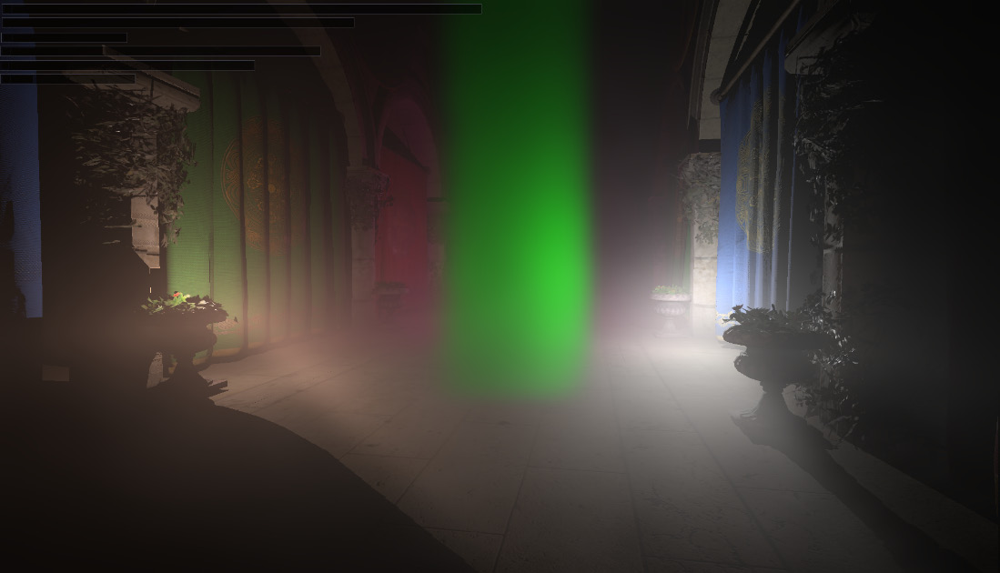
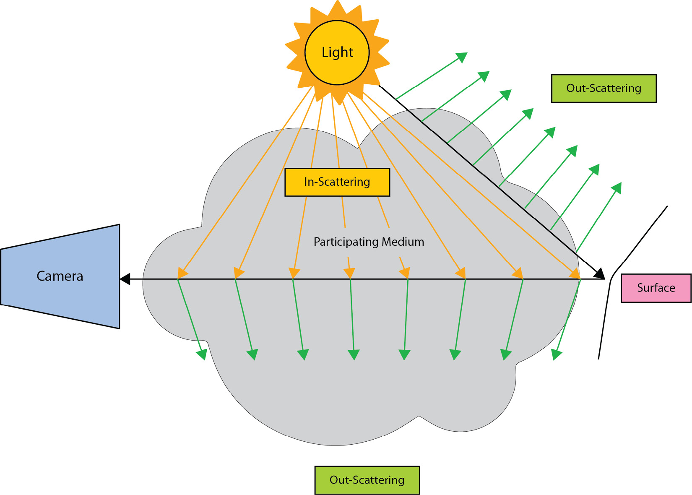
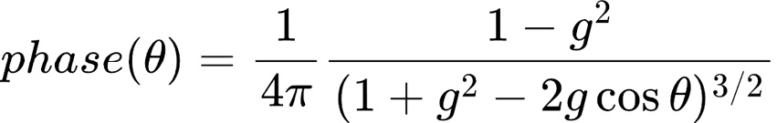
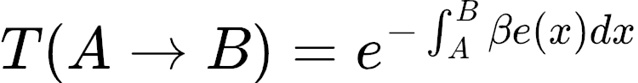
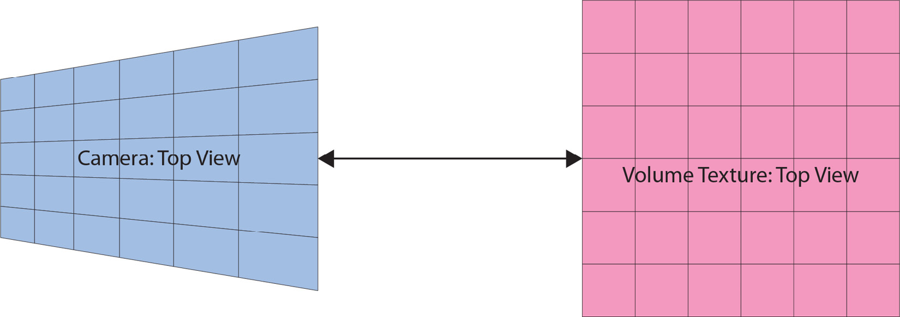
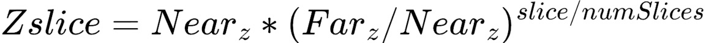
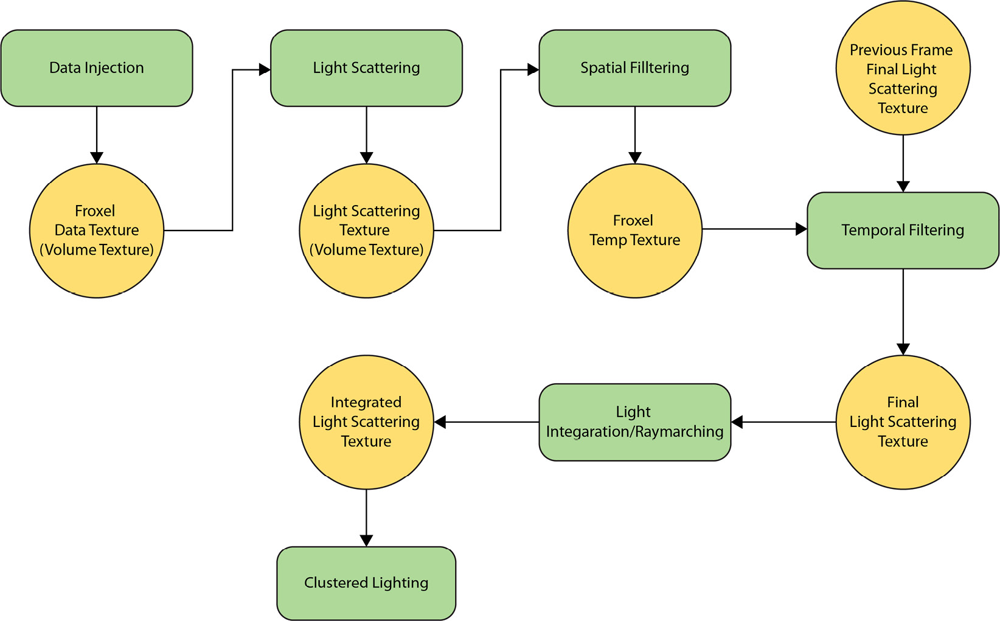

# 第 10 章：体积雾（Adding Volumetric Fog）

上一章加入可变着色率后，本章实现另一种提升 Raptor Engine 视觉的现代技术：**体积雾（Volumetric Fog）**。体积渲染与雾在图形学中由来已久，但直到近几年才被认为可以实时实现。能实时可行的关键观察是：雾是**低频**效果，因此可以用比屏幕低得多的分辨率渲染，从而提升实时性能。同时，compute shader 与通用 GPU 编程的普及，加上对体积部分近似与优化的巧妙做法，为实时体积雾铺平了道路。核心思路来自 Bart Wronski 在 Siggraph 2014 的经典论文（https://bartwronski.files.wordpress.com/2014/08/bwronski_volumetric_fog_siggraph2014.pdf），其中描述的思想在近十年后仍是该技术的基础。实现该技术也有助于理解一帧内不同渲染环节的协同：单点技术本身有难度，与其它技术的衔接同样重要且会增加实现难度。

本章主要内容：
- 体积雾渲染概念介绍
- 实现体积雾基础算法
- 加入空间与时间滤波以改善视觉效果

章末将把体积雾集成进 Raptor Engine，与场景及所有动态光源交互，如图 10.1。



Figure 10.1 – 带密度体积与三盏投射阴影光源的体积雾。

## 技术需求

本章代码见：https://github.com/PacktPublishing/Mastering-Graphics-Programming-with-Vulkan/tree/main/source/chapter10

## 体积雾渲染介绍（Introducing Volumetric Fog Rendering）

**体积雾渲染**是什么？顾名思义，即**体积渲染（Volumetric Rendering）**与**雾现象**的结合。下面先简述这两部分背景，再看它们如何组合成最终技术。从体积渲染说起。

### 体积渲染（Volumetric Rendering）

该技术描述光在**参与介质participating medium**中传播时的视觉效果。参与介质是含有密度或反照率局部变化的体积。下图概括了光子在参与介质中的行为。



Figure 10.2 – 光在参与介质中的行为。我们要描述的是光穿过参与介质（雾体积、云或大气散射）时的变化。主要有三种现象：**吸收（Absorption）**：光被介质吸收、不再射出，净能量损失。**外散射（Out-scattering）**：Figure 10.2 中绿色箭头所示，同样是能量离开介质（从而可见）的损失。**内散射（In-scattering）**：来自光源、与介质相互作用后进入的光能。除这三者外，要完整理解体积渲染还需掌握另外三个概念。

**相位函数（Phase function）**：描述光向不同方向的散射，依赖于光向量与出射方向的夹角。可很复杂以追求真实感，最常用的是 **Henyey-Greenstein** 函数，考虑各向异性。公式见 



Figure 10.3 – The Henyey-Greenstein function。式中 theta 为视线向量与光向量的夹角；shader 中会给出可用的实现。

**消光（Extinction）**：描述光被散射程度的量，在算法中间步骤使用；最终应用到场景时则需要**透射率**。

**透射率（Transmittance）**：光穿过一段介质的消光结果，由 **Beer-Lambert 定律**计算，



Figure 10.4 – The Beer-Lambert law。在最终积分步骤中会计算透射率并据此将雾应用到场景；此处先建立概念，章末会提供链接以深入数学背景。有了这些概念即可进入体积雾的实现细节。

### 体积雾（Volumetric Fog）
了解体积渲染的各个组成部分后，可以从整体看算法。Bart Wronski 开发该技术时最早、最巧妙的思路之一是使用**视锥对齐体积纹理（Frustum Aligned Volume Texture）**，如图 10.5。



Figure 10.5 – Frustum Aligned Volume Texture。结合标准光栅化相关的数学，可以在相机视锥与纹理之间建立映射；这种映射在渲染各阶段本就存在（例如顶点乘 view-projection 矩阵）。新的是在体积纹理中存储信息以计算体积渲染；纹理的每个元素常称为 **froxel**（frustum voxel，视锥体素）。我们选择 128×128×128 的纹理，也有方案让宽高依赖屏幕分辨率（类似聚类着色）。会以该分辨率使用多张纹理作为中间结果，滤波稍后讨论。另一项选择是用**非线性深度分布**将线性范围映射到指数范围，以提高相机方向上的有效分辨率，采用类似 id Tech 的分布函数，



Figure 10.6 – Volume texture depth slice on the Z coordinate function。确定体积纹理与世界单位的映射后，可以描述完整体积雾方案的步骤。算法概览如下，矩形表示 shader 执行、椭圆表示纹理。



Figure 10.7 – Algorithm overview。下面按步骤建立概念模型，shader 细节稍后在章内展开。

**数据注入（Data injection）**：第一步是数据注入。该 shader 将带颜色与密度的雾写入第一张仅含数据的视锥对齐纹理。我们加入了恒定雾、基于高度的雾以及雾体积，以模拟更真实的游戏开发设置。

**光散射（Light scattering）**：在光散射阶段计算场景光源的**内散射**。借助已有的聚类光照（Clustered Lighting），复用同一数据结构计算每个 froxel 的光照贡献；注意与标准聚类光照不同——此处没有漫反射或高光，只有由衰减、阴影与相位给出的整体项。还会对光源对应的 shadow map 采样以增强真实感。

**空间滤波（Spatial filtering）**：为减弱噪声，仅在视锥对齐纹理的 X、Y 轴上做高斯滤波，然后进入更重要的**时间滤波**。

**时间滤波（Temporal filtering）**：该滤波通过允许在算法不同步骤加入噪声以减轻条带（banding），显著改善观感。会读取上一帧的最终纹理（积分前），并按固定因子将当前光散射结果与上一帧混合。时间滤波与重投影会带来一些问题，下一章讨论 TAA 时会深入展开。散射与消光确定后，进行光的积分，得到将被场景采样的纹理。

**光积分（Light integration）**：该步准备另一张视锥对齐体积纹理，存放雾的积分。本质上该 shader 模拟低分辨率 **ray marching**，供场景采样。Ray marching 通常从相机向远平面进行；视锥对齐纹理与此积分结合后，每个 froxel 相当于缓存了光散射的 ray marching 结果，便于场景采样。此步从之前纹理中的消光出发，用 Beer-Lambert 定律最终算得透射率，并用来把雾合成进场景。此步与时间滤波是让该算法得以实时的关键创新。在《荒野大镖客 2》等更高级方案中，可额外做 ray marching 模拟更远距离的雾，也可将雾与纯 ray marching 的体积云混合，实现几乎无缝过渡，详见该作 Siggraph 渲染报告。

**在聚类光照中应用到场景（Scene application in Clustered Lighting）**：最后一步是在光照 shader 中用世界坐标读取体积纹理：读深度缓冲、算世界位置、算 froxel 坐标并采样。可进一步在半分辨率纹理上做场景应用，再用几何感知上采样应用到场景以平滑体积效果，这部分留作练习。

## 实现体积雾渲染（Implementing Volumetric Fog Rendering）
至此已具备理解完整实现所需的概念。从 CPU 侧看只是一系列 compute shader 派发，较为直接。技术核心分布在多个 shader 中、在 GPU 上执行，几乎每步都作用在上节所述的视锥对齐体积纹理上。Figure 10.7 给出了算法各步，下面逐节说明。

### 数据注入（Data injection）

在第一个 shader 中，从不同雾现象的颜色与密度出发，写入散射与消光。我们加入三种雾：**恒定雾**、**高度雾**、**体积内雾**。对每种雾计算散射与消光并累加。下列代码将颜色与密度转为散射与消光：
vec4 scattering_extinction_from_color_density( vec3 color,
float density ) {
const float extinction = scattering_factor * density;
return vec4( color * extinction, extinction );
}
下面看主 shader。与本章多数 shader 一样，按「一线程对应一个 froxel」派发。先看派发与计算世界位置的代码：
```
layout (local_size_x = 8, local_size_y = 8, local_size_z =
1) in;
void main() {
ivec3 froxel_coord = ivec3(gl_GlobalInvocationID.xyz);
 vec3 world_position = world_from_froxel(froxel_coord);
vec4 scattering_extinction = vec4(0);
```
加入可选噪声以驱动雾动画并打破恒定密度：
```
vec3 sampling_coord = world_position *
volumetric_noise_position_multiplier +
vec3(1,0.1,2) * current_frame *
volumetric_noise_speed_multiplier;
vec4 sampled_noise = texture(
global_textures_3d[volumetric_noise_texture_index],
sampling_coord);
float fog_noise = sampled_noise.x;
```
此处加入并累加恒定雾：

```
// Add constant fog
float fog_density = density_modifier * fog_noise;
scattering_extinction +=
scattering_extinction_from_color_density(
vec3(0.5), fog_density );
```

接着加入并累加高度雾：
```
// Add height fog
float height_fog = height_fog_density *
exp(-height_fog_falloff * max(world_position.y, 0)) *
fog_noise;
scattering_extinction +=
scattering_extinction_from_color_density(
vec3(0.5), height_fog );
```
最后从包围盒加入密度：
```
// Add density from box
vec3 box = abs(world_position - box_position);
 if (all(lessThanEqual(box, box_size))) {
vec4 box_fog_color = unpack_color_rgba( box_color
);
scattering_extinction +=
scattering_extinction_from_color_density(
box_fog_color.rgb, box_fog_density *
fog_noise);
}
```
最后存储散射与消光，供下一 shader 光照使用：
```
imageStore(global_images_3d[froxel_data_texture_index],
froxel_coord.xyz, scattering_extinction );
}
```
### 计算光照贡献（Calculating the lighting contribution）

光照复用通用光照中已有的 **Clustered Lighting** 数据结构。本 shader 中计算光的**内散射**。派发方式同前，一线程一 froxel：
```
layout (local_size_x = 8, local_size_y = 8, local_size_z =
1) in;
void main() {
ivec3 froxel_coord = ivec3(gl_GlobalInvocationID.xyz);
vec3 world_position = world_from_froxel(froxel_coord);
vec3 rcp_froxel_dim = 1.0f / froxel_dimensions.xyz;
```
从注入 shader 的结果读取散射与消光：
```
vec4 scattering_extinction = texture(global_textures_3d
[nonuniformEXT(froxel_data_texture_index)],
 froxel_coord * rcp_froxel_dim);
float extinction = scattering_extinction.a;
```
接着开始累加光照并使用聚类 bin。注意不同渲染算法之间的协同：已有聚类 bin 后，可从世界空间位置查询给定体积内的光源：
```
vec3 lighting = vec3(0);
vec3 V = normalize(camera_position.xyz - world_position);
// Read clustered lighting data
// Calculate linear depth
float linear_d = froxel_coord.z * 1.0f /
froxel_dimension_z;
linear_d = raw_depth_to_linear_depth(linear_d,
froxel_near, froxel_far) / froxel_far;
// Select bin
int bin_index = int( linear_d / BIN_WIDTH );
uint bin_value = bins[ bin_index ];
// As in calculate_lighting method, cycle through
// lights to calculate contribution
for ( uint light_id = min_light_id;
light_id <= max_light_id;
++light_id ) {
// Same as calculate_lighting method
// Calculate point light contribution
// Read shadow map for current light
float shadow = current_depth –
bias < closest_depth ? 1 : 0;
const vec3 L = normalize(light_position –
world_position);
float attenuation = attenuation_square_falloff(
L, 1.0f / light_radius) * shadow;
```
至此代码与光照几乎一致，此处用 phase_function 得到最终光照因子：
```
 lighting += point_light.color *
point_light.intensity *
phase_function(V, -L,
phase_anisotropy_01) *
attenuation;
}
```
最终散射计算并存储如下：
```
vec3 scattering = scattering_extinction.rgb * lighting;
imageStore( global_images_3d
[light_scattering_texture_index],
ivec3(froxel_coord.xyz), vec4(scattering,
extinction) );
}
```
下面看积分/ray marching shader，以完成体积部分所需的主要 shader。

### 积分散射与消光（Integrating scattering and extinction）

该 shader 在 froxel 纹理上执行 ray marching 并在每个单元做中间计算；仍写入视锥对齐纹理，但每个单元存储从该单元起的**累积散射与透射率**。注意这里用**透射率**而非消光——透射率是消光在空间上的积分。派发仅在视锥纹理的 X、Y 轴上进行，读取光散射纹理，在主循环中沿 Z 做积分并写入每个 froxel。最终存储结果为散射与透射率，便于应用到场景：
```
// Dispatch with Z = 1 as we perform the integration.
layout (local_size_x = 8, local_size_y = 8, local_size_z =
 1) in;
void main() {
ivec3 froxel_coord = ivec3(gl_GlobalInvocationID.xyz);
vec3 integrated_scattering = vec3(0,0,0);
float integrated_transmittance = 1.0f;
float current_z = 0;
vec3 rcp_froxel_dim = 1.0f / froxel_dimensions.xyz;
```
纹理为视锥对齐，故沿 Z 轴积分。先计算深度差以得到消光积分所需的厚度：
```
for ( int z = 0; z < froxel_dimension_z; ++z ) {
froxel_coord.z = z;
float next_z = slice_to_exponential_depth(
froxel_near, froxel_far, z + 1,
int(froxel_dimension_z) );
const float z_step = abs(next_z - current_z);
current_z = next_z;
```
对 Z 轴上下一单元计算散射与透射率并累加：
```
// Following equations from Physically Based Sky,
Atmosphere and Cloud Rendering by Hillaire
const vec4 sampled_scattering_extinction =
texture(global_textures_3d[
nonuniformEXT(light_scattering_texture_index)],
froxel_coord * rcp_froxel_dim);
const vec3 sampled_scattering =
sampled_scattering_extinction.xyz;
const float sampled_extinction =
sampled_scattering_extinction.w;
const float clamped_extinction =
max(sampled_extinction, 0.00001f);
const float transmittance = exp(-sampled_extinction
* z_step);
 const vec3 scattering = (sampled_scattering –
 (sampled_scattering *
 transmittance)) /
 clamped_extinction;
 integrated_scattering += scattering *
 integrated_transmittance;
 integrated_transmittance *= transmittance;
 imageStore( global_images_3d[
 integrated_light_scattering_texture_index],
 froxel_coord.xyz,
 vec4(integrated_scattering,
 integrated_transmittance) );
 }
 }
```
 至此得到一张包含 ray marching 散射与透射率的体积纹理，可在帧内任意处查询该点的雾量与颜色。算法的主要体积渲染部分到此结束。下面看如何将雾应用到场景。

### 将体积雾应用到场景（Applying Volumetric Fog to the scene）

最终应用体积雾时，用屏幕空间坐标计算纹理采样坐标。该函数在延迟与前向光照计算的末尾都会调用。先计算采样坐标：
```
vec3 apply_volumetric_fog( vec2 screen_uv, float raw_depth,
vec3 color ) {
const float near = volumetric_fog_near;
const float far = volumetric_fog_far;
// Fog linear depth distribution
float linear_depth = raw_depth_to_linear_depth(
raw_depth, near, far );
// Exponential
 float depth_uv = linear_depth_to_uv( near, far,
linear_depth, volumetric_fog_num_slices );
vec4 scattering_transmittance =
texture(global_textures_3d
[nonuniformEXT(volumetric_fog_texture_index)],
froxel_uvw);
```
读取该位置的散射与透射率后，用透射率调制当前场景颜色并加上雾的散射颜色：
```
color.rgb = color.rgb * scattering_transmittance.a +
scattering_transmittance.rgb;
return color;
}
```
至此完成了体积雾渲染所需的全部步骤，但仍有一个大问题：**条带（banding）**。多篇论文专门讨论，简言之低分辨率体积纹理会带来条带，却是实时性能所必需的。

### 加入滤波（Adding filters）

为改善视觉效果，我们加入两种滤波：**时间滤波**与**空间滤波**。时间滤波通过允许在算法不同阶段加噪声以减轻条带，真正改善观感；空间滤波则进一步平滑雾。

### 空间滤波（Spatial filtering）

该 shader 在体积纹理的 X、Y 轴上施加高斯滤波以平滑结果；读取光散射结果并写入当前帧尚未使用的 froxel 数据纹理，无需额外临时纹理。先定义高斯函数及其代码：
```
#define SIGMA_FILTER 4.0
#define RADIUS 2
float gaussian(float radius, float sigma) {
const float v = radius / sigma;
return exp(-(v*v));
}
```
然后读取光散射纹理，仅在坐标有效时累加值与权重：
```
vec4 scattering_extinction =
texture( global_textures_3d[
nonuniformEXT(light_scattering_texture_index)],
froxel_coord * rcp_froxel_dim );
if ( use_spatial_filtering == 1 ) {
float accumulated_weight = 0;
vec4 accumulated_scattering_extinction = vec4(0);
for (int i = -RADIUS; i <= RADIUS; ++i ) {
for (int j = -RADIUS; j <= RADIUS; ++j ) {
ivec3 coord = froxel_coord + ivec3(i, j,
0);
// if inside
if (all(greaterThanEqual(coord, ivec3(0)))
&& all(lessThanEqual(coord,
ivec3(froxel_dimension_x,
froxel_dimension_y,
froxel_dimension_z)))) {
const float weight =
gaussian(length(ivec2(i, j)),
SIGMA_FILTER);
const vec4 sampled_value =
texture(global_textures_3d[
nonuniformEXT(
light_scattering_texture_index)],
 coord * rcp_froxel_dim);
accumulated_scattering_extinction.rgba +=
sampled_value.rgba * weight;
accumulated_weight += weight;
}
}
}
scattering_extinction =
accumulated_scattering_extinction /
accumulated_weight;
}
将结果存入 froxel 数据纹理：
imageStore(global_images_3d[froxel_data_texture_index],
froxel_coord.xyz, scattering_extinction );
}
```
下一步是时间滤波。

### 时间滤波（Temporal filtering）

该 shader 对当前计算得到的 3D 光散射纹理做时间滤波，需要当前帧与上一帧两张纹理；借助 bindless 只需切换索引即可。派发与本章多数 shader 相同，每个体积纹理的 froxel 一线程。先读取当前光散射纹理，此时来自空间滤波、存放在 froxel_data_texture：
```
vec4 scattering_extinction =
texture( global_textures_3d[
nonuniformEXT(froxel_data_texture_index)],
froxel_coord * rcp_froxel_dim );
```
需计算上一帧的屏幕空间位置以读取上一帧纹理。先算世界位置，再用上一帧的 view-projection 得到读取纹理的 UVW 坐标：
```
// Temporal reprojection
if (use_temporal_reprojection == 1) {
vec3 world_position_no_jitter =
world_from_froxel_no_jitter(froxel_coord);
vec4 sceen_space_center_last =
previous_view_projection *
vec4(world_position_no_jitter, 1.0);
vec3 ndc = sceen_space_center_last.xyz /
sceen_space_center_last.w;
float linear_depth = raw_depth_to_linear_depth(
ndc.z, froxel_near, froxel_far
);
float depth_uv = linear_depth_to_uv( froxel_near,
froxel_far, linear_depth,
int(froxel_dimension_z) );
vec3 history_uv = vec3( ndc.x * .5 + .5, ndc.y * -
.5 + .5, depth_uv );
```
再判断 UVW 是否有效，若有效则读取上一帧纹理：
```
// If history UV is outside the frustum, skip
if (all(greaterThanEqual(history_uv, vec3(0.0f)))
&& all(lessThanEqual(history_uv, vec3(1.0f)))) {
// Fetch history sample
vec4 history = textureLod(global_textures_3d[
previous_light_scattering_texture_index],
history_uv, 0.0f);
```
读取样本后，按用户指定比例将当前结果与历史混合：
```
 scattering_extinction.rgb = mix(history.rgb,
scattering_extinction.rgb,
temporal_reprojection_percentage);
scattering_extinction.a = mix(history.a,
scattering_extinction.a,
temporal_reprojection_percentage);
}
}
```
将结果写回光散射纹理，供积分的最后一步使用。
```
imageStore(global_images_3d[light_scattering_texture_index],
froxel_coord.xyz, scattering_extinction );
}
```
至此已覆盖体积雾完整算法的全部步骤。最后看用于驱动雾动画的**体积噪声生成**，并简要说明用于减轻条带的噪声与抖动。

### 体积噪声生成（Volumetric noise generation）

为使雾密度更有层次，可对体积噪声纹理采样以微调密度。可增加一次执行的 compute shader，在 3D 纹理中生成并存储 **Perlin 噪声**，在采样雾密度时读取；还可让噪声随时间变化以模拟风。shader 较直接，使用 Perlin 噪声函数如下：
```
layout (local_size_x = 8, local_size_y = 8, local_size_z =
1) in;
void main() {
 ivec3 pos = ivec3(gl_GlobalInvocationID.xyz);
vec3 xyz = pos / volumetric_noise_texture_size;
float perlin_data = get_perlin_7_octaves(xyz, 4.0);
imageStore( global_images_3d[output_texture_index],
pos, vec4(perlin_data, 0, 0, 0) );
}
```
得到单通道、含 Perlin 噪声的体积纹理供采样；并使用在 U、V、W 轴上为 repeat 的 Sampler。

### 蓝噪声（Blue noise）

作为在算法不同区域偏移采样用的额外噪声，我们使用**蓝噪声（blue noise）**，从纹理读取并加入时间分量。蓝噪声有许多特性，文献中多讨论其为何适合视觉；章末会给出链接，此处仅从双通道纹理读取并映射到 -1～1。映射函数如下：
```
float triangular_mapping( float noise0, float noise1 ) {
return noise0 + noise1 - 1.0f;
}
```
读取蓝噪声的代码如下：
```
float generate_noise(vec2 pixel, int frame, float scale) {
vec2 uv = vec2(pixel.xy / blue_noise_dimensions.xy);
// Read blue noise from texture
vec2 blue_noise = texture(global_textures[
nonuniformEXT(blue_noise_128_rg_texture_index)],
uv ).rg;
const float k_golden_ratio_conjugate = 0.61803398875;
float blue_noise0 = fract(ToLinear1(blue_noise.r) +
 float(frame % 256) * k_golden_ratio_conjugate);
float blue_noise1 = fract(ToLinear1(blue_noise.g) +
float(frame % 256) * k_golden_ratio_conjugate);
return triangular_noise(blue_noise0, blue_noise1) *
scale;
}
```
结果在 -1～1 之间，可按需缩放并在各处使用。有关于动画蓝噪声的论文可进一步提升质量，因授权问题我们采用此免费方案。

## 小结（Summary）

本章介绍了**体积雾渲染**技术：先给出简要数学背景与算法概览，再展示代码；并说明了改善条带的各种手段——需在噪声与时间重投影之间谨慎权衡。所给算法是可在许多商业游戏中见到的近乎完整实现。还讨论了滤波，尤其是与下一章相关的时间滤波——下一章将介绍基于时间重投影的抗锯齿（TAA）。下一章将看到 TAA 与体积雾中用于采样抖动的噪声如何协同减轻视觉条带，并展示用一次性 compute shader 生成体积噪声、进而生成自定义纹理的可行做法。该技术也用于体积云等其它体积算法，以存储更多用于云形状的自定义噪声。

## 延伸阅读（Further reading）

- 本章引用多篇论文，其中通用 GPU 体积渲染以 *Real-Time Volumetric Rendering* 最为重要：https://patapom.com/topics/Revision2013/Revision%202013%20-%20Real-time%20Volumetric%20Rendering%20Course%20Notes.pdf
- 算法仍源自 Bart Wronski 的奠基论文：https://bartwronski.files.wordpress.com/2014/08/bwronski_volumetric_fog_siggraph2014.pdf；后续演进与数学改进见：https://www.ea.com/frostbite/news/physically-based-unified-volumetric-rendering-in-frostbite
- 深度分布参考 id Tech 6 公式：https://advances.realtimerendering.com/s2016/Siggraph2016_idTech6.pdf
- 条带与噪声方面，Playdead 的文档较全面：https://loopit.dk/rendering_inside.pdf、https://loopit.dk/banding_in_games.pdf
- 动画蓝噪声：https://blog.demofox.org/2017/10/31/animating-noise-for-integration-over-time/
- 抖动、蓝噪声与黄金比序列：https://bartwronski.com/2016/10/30/dithering-part-two-golden-ratio-sequence-blue-noise-and-highpass-and-remap/
- 免费蓝噪声纹理：http://momentsingraphics.de/BlueNoise.html