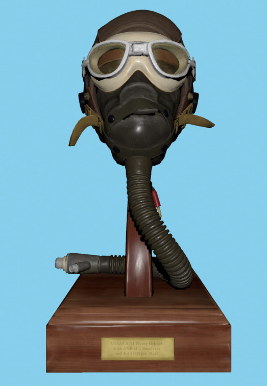
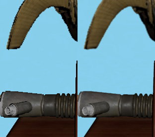
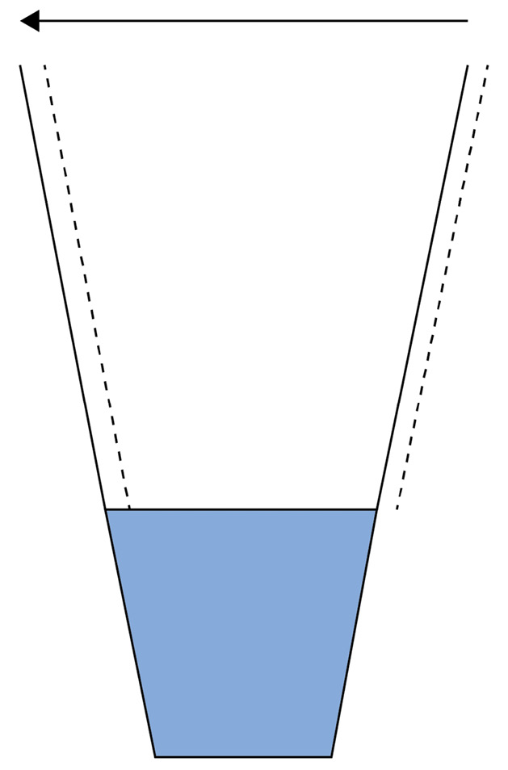
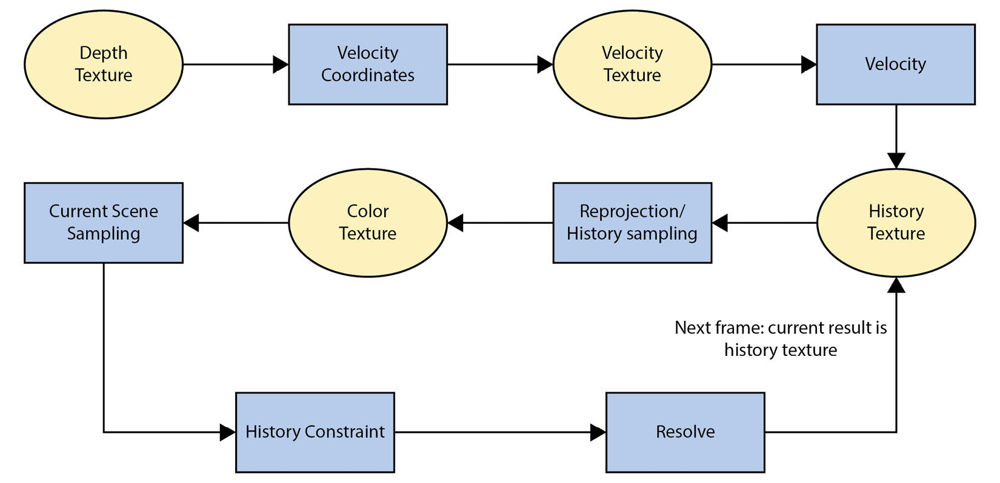
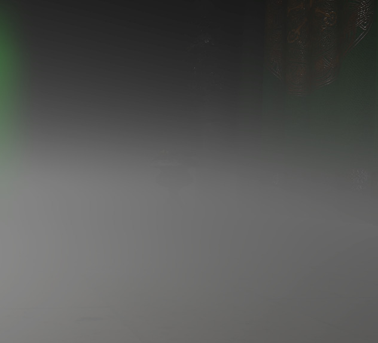

# 第 11 章：时间性抗锯齿（Temporal Anti-Aliasing）

本章在上章**时间重投影（temporal reprojection）**的基础上展开。提升画质的常见做法之一是**超采样（super-sampling）**——采集更多样本再滤波到目标采样率。渲染中最常用的是 **MSAA（Multi-Sample Anti-Aliasing）**；另一种超采样是**时间超采样**，用两帧或更多帧的样本重建更高质量图像。体积雾中已用类似思路有效消除体积纹理低分辨率带来的条带；下面介绍如何用**时间性抗锯齿（TAA）**提升画质。近年来 TAA 普及，是因为越来越多游戏以延迟渲染为核心，而 MSAA 难以直接用于延迟管线；曾有多种 MSAA 与延迟渲染结合尝试，但当时在时间与内存上都被证明不可行，于是转向后处理抗锯齿等方案。**后处理抗锯齿（Post-Process Anti-Aliasing）** 及其各种缩写随之出现。最早广泛使用的是 **MLAA（Morphological Anti-Aliasing）**，由当时在 Intel 的 Alexander Reshetov 提出，2009 年在 High-Performance Graphics 发表；算法在 CPU 上用 Intel SSE 实现，给出了若干几何边缘检测与增强的思路，催生了后续实现。之后索尼圣莫尼卡在《战神 III》中用 Cell SPU 实现了实时 MLAA。2011 年 Jorge Jimenez 等人给出了后处理抗锯齿的 GPU 实现，开辟了新的渲染研究方向；多家工作室开始开发并分享各自的后处理抗锯齿方案，多基于几何边缘识别与图像增强。随后出现利用**上一帧信息**提升画质的做法，例如 **SMAA** 开始加入时间分量。目前采用最广的是 **TAA**：虽有一系列挑战，但能较好融入管线，并让体积雾等技术通过**动画抖动（animated dithering）**减轻条带、提升观感。TAA 已是多数商业与自研引擎的标准；透明物体与画面模糊等问题我们会一并讨论。本章先给出算法概览，再进入实现；并会写一个极简 TAA 以展示基本构件，便于你从零实现自定义 TAA，最后介绍算法内可改进的各个方向。下图为例景与 TAA 效果。

Figure 11.1 – Temporally anti-aliased scene。

Figure 11.2 – 图 11.1 细节：未开 TAA（左）与开启 TAA（右）。

本章涉及：
- 实现最简 TAA
- 逐步改进 TAA
- TAA 之外的图像锐化概览
- 用噪声与 TAA 改善不同区域的条带

## 技术需求

本章代码见：https://github.com/PacktPublishing/Mastering-Graphics-Programming-with-Vulkan/tree/main/source/chapter11

## 概览（Overview）
本节给出 TAA 渲染技术的算法概览。TAA 通过对相机投影矩阵施加小偏移在时间上积累样本，再经滤波得到最终图像，如图 11.3。

Figure 11.3 – Frustum jitter。实现一节会介绍多种用于偏移相机的数值序列。对相机的这种微小移动称为**抖动（jittering）**，借以采集更多数据以增强图像。TAA shader 概览见

 Figure 11.4 – TAA algorithm overview。按图 11.4，算法分为步骤（蓝框）与纹理读取（黄椭圆）：(1) **Velocity Coordinates**：计算读取速度的坐标，通常在当前像素周围 3×3 邻域内、结合当前帧深度纹理找到最近像素；已证明 3×3 邻域可减少重影并改善边缘。(2) **Velocity Texture**：用得到的坐标从速度纹理读取速度，注意使用线性采样，因为速度可为亚像素。(3) **History Texture**：读取上一帧 TAA 输出；可对读取施加滤波以提升质量。(4) 读取当前场景颜色；同时再读当前像素邻域并缓存，用于约束之前读到的 history 颜色并指导最终 **resolve** 阶段。(5) **History constraint**：将上一帧颜色限制在当前颜色构成的合理范围内，拒绝遮挡/去遮挡带来的无效样本，否则会出现明显重影。(6) **Resolve**：将当前颜色与约束后的 history 结合，并施加额外滤波得到最终像素颜色。本帧 TAA 结果即下一帧的 history 纹理，因此每帧只需交换 history 与 TAA 结果纹理，无需拷贝，与部分实现一致。有了算法概览后，从最简 TAA shader 开始实现。

## 最简 TAA 实现（The simplest TAA implementation）
理解该技术的最好方式是先做一个缺若干关键步骤的基础实现，得到模糊或抖动的画面——这很容易做到。若做对，所需要素并不复杂，但每一步都要精确。先为相机加入**抖动**，以便从略不同视角渲染并采集额外数据；再加入**运动向量（motion vectors）**，从而在正确位置读取上一帧颜色；最后做**重投影**——读取 history 帧颜色并与当前帧结合。下面分步说明。

### 相机抖动（Jittering the camera）

本步目标是在 x、y 两轴上对投影相机做微小平移。在 GameCamera 类中加入了工具函数：
void GameCamera::apply_jittering( f32 x, f32 y ) {
// Reset camera projection
camera.calculate_projection_matrix();
// Calculate jittering translation matrix and modify
projection matrix
mat4s jittering_matrix = glms_translate_make( { x, y,
0.0f } );
camera.projection = glms_mat4_mul( jittering_matrix,
camera.projection );
camera.calculate_view_projection();
}
每一步都关键且易错，需格外小心。先重置投影矩阵（因为要手动修改），再用 x、y 的抖动值构造平移矩阵（数值计算稍后说明），最后用抖动矩阵乘投影矩阵并重新计算 view-projection。**乘法顺序**不能错，否则即使相机不动也会出现抖动模糊。实现正确后，可去掉矩阵构造与乘法，只改投影矩阵中的两个元素，得到更简洁、少错的代码：
void GameCamera::apply_jittering( f32 x, f32 y ) {
camera.calculate_projection_matrix();
// Perform the same calculations as before, with the
observation that
// we modify only 2 elements in the projection matrix:
camera.projection.m20 += x;
camera.projection.m21 += y;
camera.calculate_view_projection();
}
### 选择抖动序列（Choosing jittering sequences）

下面构造用于相机抖动的 x、y 数值序列。常用序列有：**Halton**、**Hammersley**、**Martin Robert 的 R2**、**Interleaved gradients**。代码中提供了上述序列的实现，每种会略微改变随时间采样的方式从而影响画面。章末会给出相关链接；此处只需知道我们有一组成对数值，在若干帧后循环使用以抖动相机。假设选用 Halton 序列，先计算 x、y：
f32 jitter_x = halton( jitter_index, 2 );
f32 jitter_y = halton( jitter_index, 3 );
这些值在 [0,1]，为双向抖动需映射到 [-1,1]：
 f32 jitter_offset_x = jitter_x * 2 - 1.0f;
f32 jitter_offset_y = jitter_y * 2 - 1.0f;
再传给 apply jitter；注意要实现**亚像素抖动**，需将偏移除以屏幕分辨率：
game_camera.apply_jittering( jitter_offset_x / gpu.swapchain_width, jitter_offset_y / gpu.swapchain_height );
最后选择**抖动周期（jitter period）**——多少帧后重复同一组抖动数，更新方式：`jitter_index = ( jitter_index + 1 ) % jitter_period`。通常 4 帧是不错的周期；示例代码中可改该数以观察对画面的影响。另一项必要工作是将当前与上一帧的抖动值缓存并传给 GPU，使运动向量考虑完整位移。我们在 scene uniforms 中加入 `jitter_xy` 与 `previous_jitter_xy`，供所有 shader 使用。

### 添加运动向量（Adding motion vectors）

相机抖动与偏移保存正确后，需加入**运动向量**以从上一帧正确读取颜色。运动有两类来源：**相机运动**与**动态物体运动**。我们增加 R16G16 格式的**速度纹理**存储每像素速度；每帧先清为 (0,0)，再分别计算两种运动。对相机运动，在 compute shader 中根据抖动与运动向量计算当前与上一帧的屏幕空间位置：
layout (local_size_x = 8, local_size_y = 8, local_size_z =
1) in;
void main() {
ivec3 pos = ivec3(gl_GlobalInvocationID.xyz);
// Read the raw depth and reconstruct NDC coordinates.
const float raw_depth = texelFetch(global_textures[
nonuniformEXT(depth_texture_index)], pos.xy, 0).r;
const vec2 screen_uv = uv_nearest(pos.xy, resolution);
vec4 current_position_ndc = vec4(
ndc_from_uv_raw_depth( screen_uv, raw_depth ), 1.0f
);
// Reconstruct world position and previous NDC position
const vec3 pixel_world_position =
world_position_from_depth
(screen_uv, raw_depth, inverse_view_projection);
vec4 previous_position_ndc = previous_view_projection *
vec4(pixel_world_position, 1.0f);
previous_position_ndc.xyz /= previous_position_ndc.w;
// Calculate the jittering difference.
vec2 jitter_difference = (jitter_xy –
previous_jitter_xy)* 0.5f;
// Pixel velocity is given by the NDC [-1,1] difference
in X and Y axis
vec2 velocity = current_position_ndc.xy –
previous_position_ndc.xy;
// Take in account jittering
velocity -= jitter_difference;
imageStore( motion_vectors, pos.xy, vec4(velocity, 0,
0) );
动态 mesh 需在 vertex 或 mesh shader 中额外写出速度，计算与相机运动 shader 类似：
// Mesh shader version
gl_MeshVerticesNV[ i ].gl_Position = view_projection *
(model * vec4(position, 1));
vec4 world_position = model * vec4(position, 1.0);
vec4 previous_position_ndc = previous_view_projection *
vec4(world_position, 1.0f);
previous_position_ndc.xyz /= previous_position_ndc.w;
vec2 jitter_difference = (jitter_xy - previous_jitter_xy) *
0.5f;
vec2 velocity = gl_MeshVerticesNV[ i ].gl_Position.xy –
previous_position_ndc.xy - jitter_difference;
vTexcoord_Velocity[i] = velocity;
之后只需将速度写入单独 render target。有了运动向量，即可实现一个极简 TAA shader。

### 首次实现代码（First implementation code）

同样用 compute shader 做 TAA。最简实现如下：
vec3 taa_simplest( ivec2 pos ) {
const vec2 velocity = sample_motion_vector( pos );
const vec2 screen_uv = uv_nearest(pos, resolution);
const vec2 reprojected_uv = screen_uv - velocity;
vec3 current_color = sample_color(screen_uv.xy).rgb;
vec3 history_color =
sample_history_color(reprojected_uv).rgb;
// source_weight is normally around 0.9.
return mix(current_color, previous_color,
source_weight);
}
步骤很简单：(1) 在当前像素采样速度；(2) 在当前像素采样当前颜色；(3) 用运动向量算上一帧像素位置并采样 history 颜色；(4) 混合颜色，例如当前帧约占 10%。在继续改进前，必须先让这一版**完全正确**。你会看到更模糊的画面以及明显问题：相机或物体移动时的**重影（ghosting）**。若相机与场景静止，像素不应移动——这是判断抖动与重投影是否正确的关键。此版跑通后，即可进入各改进方向。

## 改进 TAA（Improving TAA）

可从五方面改进：**重投影**、**history 采样**、**场景采样**、**history 约束**、**resolve**。每项都有可调参数以适配项目需求——TAA 并非精确或完美，需从观感上多加斟酌。下面逐项说明以便对照代码。

### 重投影（Reprojection）
首先改进重投影，即计算用于读取速度、驱动 History 采样的坐标。计算 history 纹理像素坐标的常见做法是取当前像素周围 3×3 内**最近像素**（Brian Karis 的思路）：读深度纹理，用深度确定最近像素并缓存其 x、y：
void find_closest_fragment_3x3(ivec2 pixel, out ivec2
closest_position, out
 float closest_depth) {
closest_depth = 1.0f;
closest_position = ivec2(0,0);
for (int x = -1; x <= 1; ++x ) {
for (int y = -1; y <= 1; ++y ) {
ivec2 pixel_position = pixel + ivec2(x, y);
pixel_position = clamp(pixel_position,
ivec2(0), ivec2(resolution.x - 1,
resolution.y - 1));
float current_depth =
texelFetch(global_textures[
nonuniformEXT(depth_texture_index)],
pixel_position, 0).r;
if ( current_depth < closest_depth ) {
closest_depth = current_depth;
closest_position = pixel_position;
}
}
}
}
仅用找到的像素位置作为读取运动向量的坐标，重影就会明显减轻、边缘更平滑：
float closest_depth = 1.0f;
ivec2 closest_position = ivec2(0,0);
find_closest_fragment_3x3( pos.xy,
closest_position,
closest_depth );
const vec2 velocity = sample_motion_vector
(closest_position.xy);
// rest of the TAA shader
There can be other ways of reading the velocity, but this has proven to
be the best trade-off between quality and performance. Another way to
experiment would be to use the maximum velocity in a similar 3x3
neighborhood of pixels.
There is no perfect solution, and thus experimentation and
parametrization of the rendering technique are highly encouraged. After
we have calculated the pixel position of the history texture to read, we
can finally sample it.
### History 采样（History sampling）

最简做法是仅在计算出的位置读 history 纹理；实际可加滤波以提升读取质量。代码中提供了多种滤波选项，标准选择是用 **Catmull-Rom** 滤波增强采样：
// Sample motion vectors.
const vec2 velocity = sample_motion_vector_point(
closest_position );
const vec2 screen_uv = uv_nearest(pos.xy, resolution);
const vec2 reprojected_uv = screen_uv - velocity;
// History sampling: read previous frame samples and
optionally apply a filter to it.
vec3 history_color = vec3(0);
history_color = sample_history_color(
reprojected_uv ).rgb;
switch (history_sampling_filter) {
case HistorySamplingFilterSingle:
history_color = sample_history_color(
reprojected_uv ).rgb;
break;
case HistorySamplingFilterCatmullRom:
history_color = sample_texture_catmull_rom(
reprojected_uv,
history_color_texture_index );
break;
}
得到 history 颜色后，采样当前场景颜色并缓存供 history 约束与最终 resolve 使用的信息。若不对 history 做进一步处理会产生重影。

### 场景采样（Scene sampling）

此时重影已减轻但仍存在；沿用“找最近像素”的思路，可在当前像素周围采样颜色并滤波。本质上把像素当作**信号**而非单一颜色；该话题可延伸很长，章末会给出深入资料。本步还会缓存用于约束上一帧颜色的 history 边界信息。需要做的是：在当前像素周围再采 3×3 区域，计算约束所需信息；最有价值的是该区域内颜色的**最小/最大值**；**Variance Clipping**（稍后说明）还需**均值**与**平方均值（moments）**以辅助 history 约束；最后对颜色采样施加一定滤波。代码如下：
// Current sampling: read a 3x3 neighborhood and cache
color and other data to process history and final
resolve.
// Accumulate current sample and weights.
vec3 current_sample_total = vec3(0);
float current_sample_weight = 0.0f;
// Min and Max used for history clipping
vec3 neighborhood_min = vec3(10000);
vec3 neighborhood_max = vec3(-10000);
// Cache of moments used in the constraint phase
vec3 m1 = vec3(0);
 vec3 m2 = vec3(0);
for (int x = -1; x <= 1; ++x ) {
for (int y = -1; y <= 1; ++y ) {
ivec2 pixel_position = pos + ivec2(x, y);
pixel_position = clamp(pixel_position,
ivec2(0), ivec2(resolution.x - 1,
resolution.y - 1));
vec3 current_sample =
sample_current_color_point(pixel_position).rgb;
vec2 subsample_position = vec2(x * 1.f, y *
1.f);
float subsample_distance = length(
subsample_position
);
float subsample_weight = subsample_filter(
subsample_distance );
current_sample_total += current_sample *
subsample_weight;
current_sample_weight += subsample_weight;
neighborhood_min = min( neighborhood_min,
current_sample );
neighborhood_max = max( neighborhood_max,
current_sample );
m1 += current_sample;
m2 += current_sample * current_sample;
}
}
vec3 current_sample = current_sample_total /
current_sample_weight;
上述代码完成颜色采样、滤波以及为 history 约束缓存信息，可进入下一阶段。

### History 约束（The history constraint）

最后是对采样到的 history 颜色做**约束**。根据前面步骤已得到我们认为**有效**的颜色范围；若把各通道当作数值，相当于在颜色空间划出一个有效区域并对 history 进行约束。约束用于接受或丢弃来自 history 纹理的颜色，从而几乎消除重影。历史上发展出多种约束方式以更好剔除无效颜色；也有实现依赖深度或速度差，但当前做法更稳健。我们加入了四种可选的约束：**RGB clamp**、**RGB clip**、**Variance clip**、**Variance clip + RGB clamp**。质量最好的是「Variance clip + RGB clamp」，其余几种在早期实现中常用，也值得对比。代码如下：
switch (history_clipping_mode) {
// This is the most complete and robust history
clipping mode:
case HistoryClippingModeVarianceClipClamp:
default: {
// Calculate color AABB using color moments m1
and m2
float rcp_sample_count = 1.0f / 9.0f;
float gamma = 1.0f;
vec3 mu = m1 * rcp_sample_count;
vec3 sigma = sqrt(abs((m2 * rcp_sample_count) –
(mu * mu)));
vec3 minc = mu - gamma * sigma;
vec3 maxc = mu + gamma * sigma;
// Clamp to new AABB
vec3 clamped_history_color = clamp(
history_color.rgb,
 neighborhood_min,
neighborhood_max
);
history_color.rgb = clip_aabb(minc, maxc,
vec4(clamped_history_color,
1), 1.0f).rgb;
break;
}
}
`clip_aabb` 将采样的 history 颜色限制在最小/最大颜色值构成的范围内。简言之，在颜色空间构造 **AABB**，把 history 限制在该范围内，使最终颜色相对当前帧更合理。TAA shader 的最后一步是 **resolve**：将当前与 history 颜色结合并施加滤波得到最终像素颜色。

### Resolve

再次施加若干滤波，决定上一帧像素是否可用以及混合比例。默认仅使用约 10% 的当前帧像素、其余依赖 history，因此若不加这些滤波画面会较模糊：
// Resolve: combine history and current colors for final
pixel color
vec3 current_weight = vec3(0.1f);
vec3 history_weight = vec3(1.0 - current_weight);
第一个是**时间滤波**，用缓存的邻域最小/最大颜色计算当前与上一帧的混合量：
 // Temporal filtering
if (use_temporal_filtering() ) {
vec3 temporal_weight = clamp(abs(neighborhood_max –
neighborhood_min) /
current_sample,
vec3(0), vec3(1));
history_weight = clamp(mix(vec3(0.25), vec3(0.85),
temporal_weight), vec3(0),
vec3(1));
current_weight = 1.0f - history_weight;
}
接下来两个滤波相关，一并说明。都基于**亮度**：一个用于抑制**萤火虫（fireflies）**——强光源下可能出现的极亮单像素；另一个用亮度差进一步调节当前/上一帧的权重：
// Inverse luminance filtering
if (use_inverse_luminance_filtering() ||
use_luminance_difference_filtering() ) {
// Calculate compressed colors and luminances
vec3 compressed_source = current_sample /
(max(max(current_sample.r, current_sample.g),
current_sample.b) + 1.0f);
vec3 compressed_history = history_color /
(max(max(history_color.r, history_color.g),
history_color.b) + 1.0f);
float luminance_source = use_ycocg() ?
compressed_source.r :
luminance(compressed_source);
float luminance_history = use_ycocg() ?
compressed_history.r :
luminance(compressed_history);
if ( use_luminance_difference_filtering() ) {
float unbiased_diff = abs(luminance_source –
luminance_history) / max(luminance_source,
 max(luminance_history, 0.2));
float unbiased_weight = 1.0 - unbiased_diff;
float unbiased_weight_sqr = unbiased_weight *
unbiased_weight;
float k_feedback = mix(0.0f, 1.0f,
unbiased_weight_sqr);
history_weight = vec3(1.0 - k_feedback);
current_weight = vec3(k_feedback);
}
current_weight *= 1.0 / (1.0 + luminance_source);
history_weight *= 1.0 / (1.0 + luminance_history);
}
用新算出的权重合并结果并输出颜色：
vec3 result = ( current_sample * current_weight +
history_color * history_weight ) /
max( current_weight + history_weight,
0.00001 );
return result;
至此 shader 已完整可用。示例中有大量可调参数便于体会各滤波与步骤的差异。对 TAA 的常见抱怨是画面模糊，下面介绍几种改善方式。

## 图像锐化（Sharpening the image）

最简实现中会注意到画面锐度下降，这也是常与 TAA 关联的问题。我们已在场景采样时用滤波做了改善，还可在 TAA 之外对最终图像做锐化。下面简要讨论三种方式。

### 锐度后处理（Sharpness post-processing）

一种做法是在后处理链中加入简单锐化 shader。代码简单且基于亮度：
vec4 color = texture(global_textures[
nonuniformEXT(texture_id)], vTexCoord.xy);
float input_luminance = luminance(color.rgb);
float average_luminance = 0.f;
// Sharpen
for (int x = -1; x <= 1; ++x ) {
for (int y = -1; y <= 1; ++y ) {
vec3 sampled_color = texture(global_textures[
nonuniformEXT(texture_id)], vTexCoord.xy +
vec2( x / resolution.x, y /
resolution.y )).rgb;
average_luminance += luminance( sampled_color
);
}
}
average_luminance /= 9.0f;
float sharpened_luminance = input_luminance –
average_luminance;
float final_luminance = input_luminance +
sharpened_luminance *
sharpening_amount;
color.rgb = color.rgb * (final_luminance /
input_luminance);
该代码中锐化量为 0 时不锐化，常用值为 1。

### 负 Mip 偏移（Negative mip bias）

一种全局减轻模糊的方式是把 `VkSamplerCreateInfo` 的 `mipLodBias` 设为负数（如 -0.25），使纹理 mip 金字塔向更高分辨率偏移。需权衡性能——在更高 MIP 级采样，若过高可能重新引入锯齿；做成引擎全局选项便于调节。

### 去抖动纹理 UV（Unjitter texture UVs）

另一种可能让纹理采样更锐利的做法是按**无抖动**的相机计算 UV，例如：
vec2 unjitter_uv(float uv, vec2 jitter) {
return uv - dFdxFine(uv) * jitter.x + dFdyFine(uv) *
jitter.y;
}
作者未亲自尝试该方法，但认为值得实验；Emilio Lopez 在其 TAA 文章（见参考文献）中写过，并提到同事 Martin Sobek 提出该想法。TAA 与锐化结合能显著改善边缘同时保留物体内部细节。最后再看一个问题：条带。

## 改善条带（Improving banding）

**条带（banding）** 影响帧渲染的多个环节，例如体积雾与光照。Figure 11.5 – Banding problem detail in Volumetric Fog。

图 11.5 展示了体积雾中未做处理时的条带。消除视觉条带的一种做法是在帧的多个 pass 中加**抖动（dithering）**，但这会引入可见噪声。抖动即**刻意加入噪声以消除条带**；可用多种噪声，示例代码中有体现。时间重投影能平滑所加噪声，因而是提升观感的重要手段。第 10 章体积雾中用了简单的时间重投影并在多处加噪声；本章则用更复杂的时间重投影增强图像。**动画抖动**的理由更清晰：动画抖动相当于在时间上获得更多样本，借时间重投影有效利用；抖动与自身的时间重投影相关，因此体积雾步骤中的抖动尺度可能过大而无法被 TAA 完全消除。在将体积雾应用到场景时，可加入较小的动画抖动以增强雾效，同时由 TAA 平滑；光照 shader 中也可在每像素加抖动，同样可由 TAA 平滑。**说明**：时间重投影使用多帧，要得到完全无噪声的图像很难，因此无法用静态图展示示例中无条带的效果。

## 小结（Summary）

本章介绍了 **TAA** 渲染技术：先概览算法并突出各 shader 步骤，再实现最简 TAA shader 以加深理解，随后用滤波与当前场景信息逐步增强各环节。建议加入自定义滤波、调整参数与场景以继续理解和改进。也可尝试将 history 约束应用到体积雾的时间重投影阶段（感谢 Marco Vallario 的建议）。下一章将为 Raptor Engine 加入光追支持，开启后续章节中的高质量光照技术。

## 延伸阅读（Further reading）

本章涉及后处理抗锯齿简史、TAA 实现、条带与噪声等；图形社区分享了大量资料，可据此深入。以下为部分链接：
- 后处理抗锯齿技术演进索引：http://www.iryoku.com/research-impact-retrospective-mlaa-from-2009-to-2017
- MLAA 首篇论文：https://www.intel.com/content/dam/develop/external/us/en/documents/z-shape-arm-785403.pdf
- MLAA GPU 实现：http://www.iryoku.com/mlaa/
- SMAA（MLAA 演进）：http://www.iryoku.com/smaa/
- Matt Pettineo 关于信号处理与抗锯齿的文章：https://therealmjp.github.io/posts/msaa-resolve-filters/
- *Inside* 中的时间重投影抗锯齿，首份完整 TAA 文档，含 history 约束与 AABB clipping：http://s3.amazonaws.com/arena-attachments/655504/c5c71c5507f0f8bf344252958254fb7d.pdf?1468341463
- 高质量时间超采样（Unreal TAA 实现）：https://de45xmedrsdbp.cloudfront.net/Resources/files/TemporalAA_small-59732822.pdf
- 时间超采样与 variance clipping 介绍：https://developer.download.nvidia.com/gameworks/events/GDC2016/msalvi_temporal_supersampling.pdf
- TAA 文章（含 UV unjitter、Mip bias 等）：https://www.elopezr.com/temporal-aa-and-the-quest-for-the-holy-trail/
- 另一篇完整 TAA 实现：https://alextardif.com/TAA.html
- 游戏中的条带：https://loopit.dk/banding_in_games.pdf