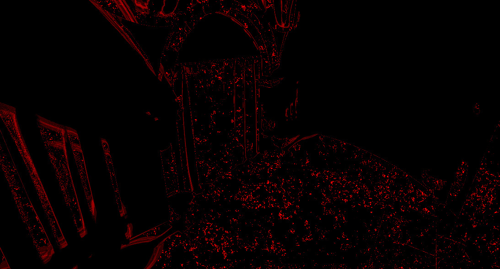
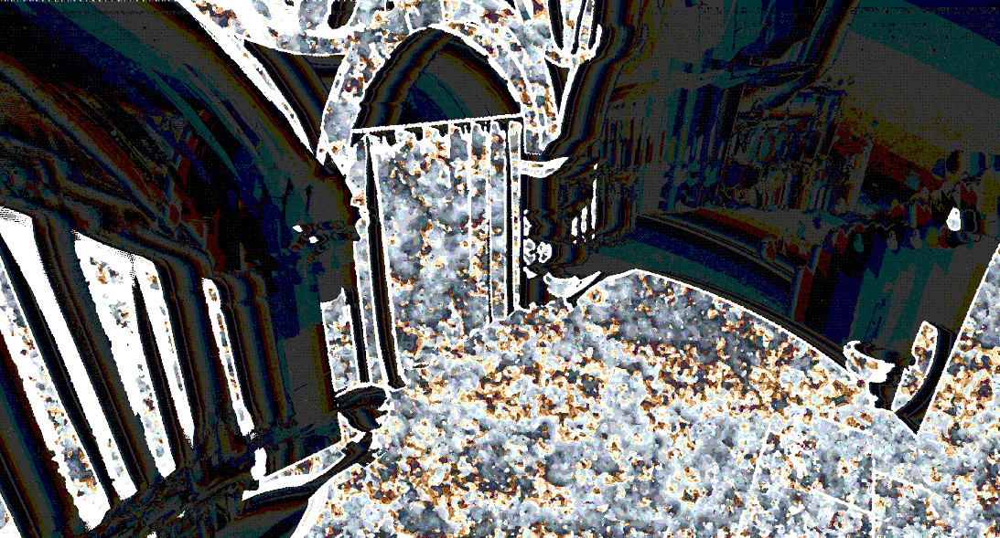
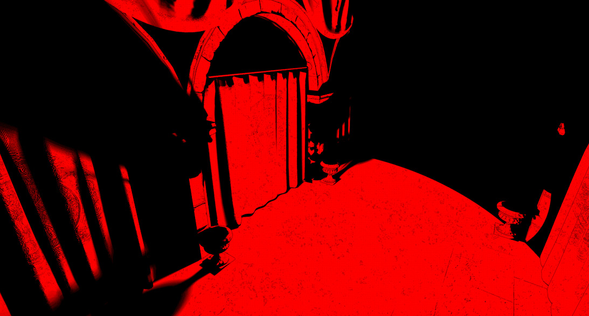

# 第13章 用光线追踪重新实现阴影（Revisiting Shadows with Ray Tracing）

本章我们将使用光线追踪实现阴影。

在第 8 章《使用 Mesh Shader 添加阴影》中，我们使用传统的阴影贴图（shadow mapping）技术获取每个光源的可见性，并用该信息计算最终图像的阴影项。使用光线追踪做阴影能获得更精细的结果，并能根据每个光源的距离与强度对质量做更细粒度的控制。

我们将实现两种技术：第一种类似离线渲染中的做法，向每个光源发射光线以判定可见性。这种方式效果最好，但随场景中光源数量增加，开销可能很大。第二种技术基于《Ray Tracing Gems》中的一篇近期文章，用一些启发式方法决定每个光源需要发射多少光线，并将结果与空间、时间滤波结合，使结果稳定。

本章将涵盖以下主题：

- 实现简单的光线追踪阴影
- 实现进阶的光线追踪阴影技术

## 技术需求（Technical requirements）

学完本章后，你将掌握如何实现基础的光线追踪阴影，并熟悉一种能渲染多光源与软阴影的进阶技术。

本章代码可在以下地址找到：https://github.com/PacktPublishing/Mastering-Graphics-Programming-with-Vulkan/tree/main/source/chapter13。

## 实现简单的光线追踪阴影（Implementing simple ray-traced shadows）

如引言所述，阴影贴图技术多年来一直是实时渲染的主力。在 GPU 具备光线追踪能力之前，其他方案往往过于昂贵。

图形社区并未因此停止想出各种办法，在保持低成本的同时提升质量。传统技术的主要问题在于：它们基于从每个光源视角捕获的深度缓冲。这对靠近光源和相机的物体效果不错，但距离变远时，深度不连续会在最终结果中产生伪影。

解决思路包括对结果做滤波，例如使用百分比近距滤波（Percentage Closer Filtering, PCF）或级联阴影贴图（Cascade Shadow Maps, CSM）。CSM 需要捕获多个深度切片（级联），以在远离光源时保持足够分辨率，通常只用于太阳光，因为多次重绘场景会占用大量内存和时间，且级联边界处很难做好。

阴影贴图的另一大问题是：由于深度缓冲分辨率和其带来的不连续，很难得到硬阴影。我们可以用光线追踪缓解这些问题。离线渲染多年来一直用光线追踪与路径追踪实现包括阴影在内的照片级效果；他们可以等一帧算几小时甚至几天，而我们可以在实时下得到类似效果。上一章中我们使用 `vkCmdTraceRaysKHR` 向场景发射光线。

本节实现中我们引入**光线查询（ray queries）**，允许在片段着色器和计算着色器中遍历已构建的加速结构（Acceleration Structures）。

我们将修改光照 pass 中的 `calculate_point_light_contribution` 方法，判断每个片段能看到哪些光源，并得到最终阴影项。

首先需要启用设备扩展 `VK_KHR_ray_query`，以及对应的着色器扩展：

```
#extension GL_EXT_ray_query : enable
```

然后不再从每个光源视角计算立方体贴图，而是从片段的世界空间位置向每个光源发射一条光线。先初始化一个 `rayQueryEXT` 对象：

```
rayQueryEXT rayQuery;
rayQueryInitializeEXT(rayQuery, as, gl_RayFlagsOpaqueEXT |
gl_RayFlagsTerminateOnFirstHitEXT, 0xff,
world_position, 0.001, l, d);
```

注意 `gl_RayFlagsTerminateOnFirstHitEXT` 参数：我们只关心该光线的首次命中。`l` 是从 `world_position` 指向光源的方向，对射线起点做小偏移以避免自相交。最后一个参数 `d` 是 `world_position` 到光源位置的距离；必须正确设置该值，否则光线查询可能报告超过光源位置的交点，从而错误地把片段判为在阴影中。

初始化光线查询对象后，调用以下方法开始场景遍历：

```
rayQueryProceedEXT( rayQuery );
```

该方法会在找到命中或光线终止时返回。使用光线查询时无需指定着色器绑定表（shader binding table）。要查询遍历结果，可用多种方法；这里我们只关心光线是否击中几何体：

```
if ( rayQueryGetIntersectionTypeEXT( rayQuery, true ) ==
gl_RayQueryCommittedIntersectionNoneEXT ) {
shadow = 1.0;
}
```

若未命中，表示从该片段能看到当前处理的光源，可在最终计算中计入该光源的贡献。对每个光源重复上述过程即可得到整体阴影项。

该实现非常简单，主要适用于点光源。对于面光源等其他类型，需要发射多条光线才能判定可见性；光源增多时，这种简单做法会变得过于昂贵。

本节演示了入门级的实时光线追踪阴影实现。下一节将介绍一种扩展性更好、能支持多种光源类型的新技术。

## 改进光线追踪阴影（Improving ray-traced shadows）

上一节描述了一种用于计算场景可见性项的简单算法。如前所述，它在大量光源下扩展性不好，且对不同类型的光源可能需要大量采样。

本节将实现一种受《Ray Tracing Gems》中《Ray Traced Shadows》一文启发的算法。与本章及后续章节的常见思路一样，核心思想是**把计算成本分摊到时间上**。

由于采样数仍然较少，结果可能带噪点。为达到目标质量，我们将使用空间与时间滤波，类似第 11 章《时间性抗锯齿（Temporal Anti-Aliasing）》中的做法。

该技术由三个 pass 实现，并会利用运动向量（motion vectors）。下面逐 pass 说明。

### 运动向量（Motion vectors）

如第 11 章所述，运动向量用于确定给定片段处的物体在帧间移动了多少，以便决定保留或丢弃哪些历史信息，从而减少最终图像中的拖影（ghosting）。

本章技术所需的运动向量与时间性抗锯齿（TAA）中的计算方式不同。先计算两帧深度的比例差：

```
float depth_diff = abs( 1.0 - ( previous_position_ndc.z /
current_position_ndc.z ) );
```

再计算用于判断深度变化是否可接受的 epsilon：

```
float c1 = 0.003;
float c2 = 0.017;
float eps = c1 + c2 * abs( view_normal.z );
```

最后用这两个值决定重投影是否成功：

```
vec2 visibility_motion = depth_diff < eps ? vec2(
current_position_ndc.xy - previous_position_ndc.xy ) :
vec2( -1, -1 );
```

下图展示了该计算的结果：


Figure 13.1 – The motion vector's texture

该值将存入纹理供后续使用。下一步是计算过去四帧的可见性变化。

### 计算可见性方差（Computing visibility variance）

该技术用过去四帧的数据决定每个片段、每个光源需要多少采样。我们将可见性值存于 3D RGBA16 纹理中，每个通道对应一帧的可见性，每一层存储单个光源的可见性历史。

这是首批使用 3D 派发（dispatch）大小的计算着色器之一，派发调用如下：

```
gpu_commands->dispatch( x, y, render_scene->active_lights );
```

在此 pass 中，我们仅计算过去四帧的最小值与最大值之差：

```
vec4 last_visibility_values = texelFetch(
global_textures_3d[ visibility_cache_texture_index ],
tex_coord, 0 );
float max_v = max( max( max( last_visibility_values.x,
last_visibility_values.y ), last_visibility_values.z ),
last_visibility_values.w );
float min_v = min( min( min( last_visibility_values.x,
last_visibility_values.y ), last_visibility_values.z ),
last_visibility_values.w );
float delta = max_v - min_v;
```

首帧时历史值设为 0。将 delta 存入另一个 3D 纹理供下一 pass 使用。下图为本 pass 的结果：



Figure 13.2 – The visibility variation for the past four frames

### 计算可见性（Computing visibility）

本 pass 根据过去四帧的方差，计算每个光源应发射多少光线。

需要从多个纹理读取大量数据，因此使用本地数据存储（LDS, local data storage）在着色器调用内的所有线程间缓存这些值：

```
local_image_data[ local_index.y ][ local_index.x ] =
texelFetch( global_textures_3d[ variation_texture_index
], global_index, 0 ).r;
```

如第 9 章《实现可变速率着色（Variable Rate Shading）》所述，在访问 `local_image_data` 中的数据前，必须通过 `barrier()` 同步这些写入；同时需要填充矩阵边缘的值，代码与之前相同，此处不重复。

接着对该数据做滤波以提高时间稳定性。第一步是计算 5×5 区域的最大值并存入另一个 LDS 矩阵：

```
local_max_image_data[ local_index.y ][ local_index.x ] =
max_filter( local_index );
```

`max_filter` 实现如下：

```
for ( int y = -2; y <= 2; ++y ) {
for ( int x = -2; x <= 2; ++x ) {
ivec2 xy = index.xy + ivec2( x, y );
float v = local_image_data[ xy.y ][ xy.x ];
max_v = max( max_v, v );
}
}
```

得到最大值后，再通过 13×13 的 tent 滤波（tent filter）：

```
float spatial_filtered_value = 0.0;
for ( int y = -6; y <= 6; ++y ) {
for ( int x = -6; x <= 6; ++x ) {
ivec2 index = local_index.xy + ivec2( x, y );
float v = local_max_image_data[ index.y ][ index.x
 ];
float f = tent_kernel[ y + 6 ][ x + 6 ];
spatial_filtered_value += v * f;
}
}
```

这样可以在平滑相邻片段差异的同时，给当前片段更大权重。然后将该值与时间数据结合：

```
vec4 last_variation_values = texelFetch(
global_textures_3d[ variation_cache_texture_index ],
global_index, 0 );
float filtered_value = 0.5 * ( spatial_filtered_value +
0.25 * ( last_variation_values.x +
last_variation_values.y +
last_variation_values.z +
last_variation_values.w ) );
```

继续前先更新下一帧的方差缓存：

```
last_variation_values.w = last_variation_values.z;
last_variation_values.z = last_variation_values.y;
last_variation_values.y = last_variation_values.x;
last_variation_values.x = texelFetch( global_textures_3d[
variation_texture_index ], global_index, 0 ).r;
```

利用上述结果计算可见性项。先确定采样数。若上一 pass 的重投影失败，则直接使用最大采样数：

```
uint sample_count = MAX_SHADOW_VISIBILITY_SAMPLE_COUNT;
if ( motion_vectors_value.r != -1.0 ) {
```

若重投影成功，则取上一帧的采样数，并判断过去四帧采样数是否稳定：

```
 sample_count = sample_count_history.x;
bool stable_sample_count =
( sample_count_history.x == sample_count_history.y ) &&
( sample_count_history.x == sample_count_history.z ) &&
( sample_count_history.x == sample_count_history.w );
```

再结合前面得到的滤波值决定本帧采样数：

```
float delta = 0.2;
if ( filtered_value > delta && sample_count <
MAX_SHADOW_VISIBILITY_SAMPLE_COUNT ) {
sample_count += 1;
} else if ( stable_sample_count &&
sample_count >= 1 ) {
sample_count -= 1;
}
```

若滤波值超过给定阈值，则增加采样数，表示过去四帧方差较大，需要更多采样才能收敛到更好结果。反之，若过去四帧采样数稳定，则减少采样数。

实践中若场景稳定（例如相机不动），采样数可能减到 0，导致场景无光照。因此若过去四帧采样数均为 0，我们强制将采样数设为 1：

```
bvec4 hasSampleHistory = lessThan(
sample_count_history, uvec4( 1 ) );
bool zeroSampleHistory = all( hasSampleHistory );
if ( sample_count == 0 && zeroSampleHistory ) {
sample_count = 1;
} }
```

下图是采样数缓存纹理的示例：



Figure 13.3 – The sample count cache texture

可以看到，能看到光源的片段往往需要更多采样，符合预期。

确定采样数后，开始计算可见性值：

```
float visibility = 0.0;
if ( sample_count > 0 ) {
// world position and normal are computed the same as
before
visibility = get_light_visibility(
gl_GlobalInvocationID.z, sample_count,
pixel_world_position, normal, frame_index );
}
```

`get_light_visibility` 负责在场景中追踪光线，实现如下：

```
const vec3 position_to_light = light.world_position –
 world_position;
const vec3 l = normalize( position_to_light );
const float NoL = clamp(dot(normal, l), 0.0, 1.0);
float d = sqrt( dot( position_to_light, position_to_light ) );
```

先按光照实现中的方式计算若干参数，并计算 `d`（该片段世界位置与当前光源的距离）。

仅当该光源足够近且在该片段处不被几何体遮挡时，才在场景中追踪光线：

```
float visiblity = 0.0;
float attenuation =
attenuation_square_falloff(position_to_light,
1.0f / light.radius);
const float scaled_distance = r / d;
if ( ( NoL > 0.001f ) && ( d <= r ) && ( attenuation >
0.001f ) ) {
```

然后每个采样发射一条光线。为使结果随时间收敛，使用预计算的泊松盘（Poisson disk）得到光线方向：

```
for ( uint s = 0; s < sample_count; ++s ) {
vec2 poisson_sample = POISSON_SAMPLES[ s *
FRAME_HISTORY_COUNT + frame_index ];
vec3 random_dir = normalize( vec3( l.x +
poisson_sample.x, l.y + poisson_sample.y, l.z )
);
vec3 random_x = x_axis * poisson_sample.x *
(scaled_distance) * 0.01;
vec3 random_y = y_axis * poisson_sample.y *
(scaled_distance) * 0.01;
vec3 random_dir = normalize(l + random_x +
random_y);
```

得到光线方向后开始光线遍历：

```
rayQueryEXT rayQuery;
rayQueryInitializeEXT(rayQuery, as,
gl_RayFlagsOpaqueEXT |
gl_RayFlagsTerminateOnFirstHitEXT,
0xff, world_position, 0.001,
random_dir, d);
rayQueryProceedEXT( rayQuery );
```

与第一节的代码类似，这里对每个方向累加光源可见时的可见性值：

```
if (rayQueryGetIntersectionTypeEXT(rayQuery, true)
!= gl_RayQueryCommittedIntersectionNoneEXT) {
visibility +=
rayQueryGetIntersectionTEXT(rayQuery,
true) < d ? 0.0f : 1.0f;
}
else {
visiblity += 1.0f;
}
}
}
```

最后返回可见性值的平均：

```
return visiblity / float( sample_count );
```

得到本帧可见性后，需要更新可见性历史缓存。若重投影成功，只需加入新值：

```
vec4 last_visibility_values = vec4(0);
if ( motion_vectors_value.r != -1.0 ) {
 last_visibility_values = texelFetch(
global_textures_3d[ visibility_cache_texture_index
], global_index, 0 );
last_visibility_values.w = last_visibility_values.z;
last_visibility_values.z = last_visibility_values.y;
last_visibility_values.y = last_visibility_values.x;
```

若重投影失败，则用新可见性值覆盖所有历史项：

```
} else {
last_visibility_values.w = visibility;
last_visibility_values.z = visibility;
} last_visibility_values.y = visibility;
last_visibility_values.x = visibility;
```

最后一步是更新采样数缓存：

```
sample_count_history.w = sample_count_history.z;
sample_count_history.z = sample_count_history.y;
sample_count_history.y = sample_count_history.x;
sample_count_history.x = sample_count;
```

在更新本帧可见性项与所有缓存后，进入最后一个 pass，计算将用于光照的滤波后可见性。

### 计算滤波后可见性（Computing filtered visibility）

若直接使用上一节得到的可见性值，输出会非常噪。每帧的采样数和采样位置可能不同，尤其在相机或物体运动时。

因此在使用前需要对结果做清理。常见做法是使用降噪器（denoiser）。降噪器通常由一系列计算 pass 实现，会尽可能降低噪点，但可能耗时较长，尤其在高分辨率下。

这里我们使用简单的时间与空间滤波来缩短耗时。与上一 pass 一样，先把数据读入 LDS：

```
local_image_data[ local_index.y ][ local_index.x ] =
visibility_temporal_filter( global_index );
local_normal_data[ local_index.y ][ local_index.x ] =
get_normal( global_index );
```

`visibility_temporal_filter` 实现如下：

```
vec4 last_visibility_values = texelFetch(
global_textures_3d[ visibility_cache_texture_index ],
ivec3( xy, index.z ), 0 );
float filtered_visibility = 0.25 * (
last_visibility_values.x + last_visibility_values.y +
last_visibility_values.z + last_visibility_values.w );
```

先读取该片段、该光源的历史可见性数据并求平均，作为时间滤波。根据需求也可采用不同权重，更偏重近期帧。

空间滤波使用高斯核。原文根据可见性方差使用可变大小核；本实现采用固定的 5×5 高斯核，效果已足够好。

计算滤波值的循环如下：

```
vec3 p_normal = local_normal_data[ local_index.y ][
local_index.x ];
```

先保存当前片段法线，再在核范围内迭代计算最终项：

```
for ( int y = -2; y <= 2; ++y ) {
for ( int x = -2; x <= 2; ++x ) {
ivec2 index = local_index.xy + ivec2( x, y );
vec3 q_normal = local_normal_data[ local_index.y +
y ][ local_index.x + x ];
if ( dot( p_normal, q_normal ) <= 0.9 ) {
continue;
}
```

如文章所述，若相邻片段法线差异较大，则忽略该采样点，以避免阴影泄漏。最后将已做过时间滤波的值与核权重结合：

```
float v = local_image_data[ index.y ][ index.x ];
float k = gaussian_kernel[ y + 2 ][ x + 2 ];
spatial_filtered_value += v * k;
}
}
```

下图是滤波后可见性纹理的内容：



Figure 13.4 – The filtered visibility texture

至此完成了每个光源的可见性计算。下一节说明如何在光照 pass 中使用该信息。

### 使用滤波后可见性（Using the filtered visibility）

使用可见性项很简单。在 `calculate_point_light_contribution` 中，只需读取前面 pass 计算好的可见性：

```
float shadow = texelFetch( global_textures_3d[
shadow_visibility_texture_index ], ivec3( screen_uv,
shadow_light_index ), 0 ).r;
float attenuation =
attenuation_square_falloff(position_to_light, 1.0f /
light.radius) * shadow;
if ( attenuation > 0.0001f && NoL > 0.0001f ) {
// same code as before
```

也可以将传统阴影贴图与类似本节的光线追踪实现结合，具体取决于该技术的帧预算、场景光源类型和期望质量。

本节介绍了一种不同的光线追踪阴影实现：先计算并存储过去四帧的可见性方差；再用最大值滤波和 tent 滤波得到每个片段、每个光源的采样数；用该采样数在场景中发射光线得到原始可见性；最后在最后一个 pass 中对可见性做时间与空间滤波以降低噪点，并在光照计算中使用该滤波值。

## 小结（Summary）

本章介绍了两种光线追踪阴影实现。第一节给出类似离线渲染器的简单实现：每个片段向每个光源发射一条光线，判断是否可见。这对点光源效果不错，但要支持其他光源类型和软阴影需要大量光线。

因此第二节提供了另一种方案，利用空间与时间信息决定每个光源的采样数：先计算过去四帧的可见性方差，滤波后决定每个片段、每个光源发射多少光线，用该数量遍历场景得到可见性，再对可见性做滤波降噪，最后在光照计算中使用滤波后的可见性得到最终阴影项。

下一章将继续光线追踪之旅，实现全局光照（global illumination）。

## 延伸阅读（Further reading）

本章实现的技术详见《Ray Tracing Gems》第 13 章《Revisiting Shadows with Ray Tracing》。该书可在此免费阅读：http://www.realtimerendering.com/raytracinggems/rtg/index.html。

我们仅使用了 GLSL 光线追踪 API 的一小部分，建议阅读 GLSL 扩展规范了解全部选项：

- https://github.com/KhronosGroup/GLSL/blob/master/extensions/ext/GLSL_EXT_ray_tracing.txt
- https://github.com/KhronosGroup/GLSL/blob/master/extensions/ext/GLSL_EXT_ray_query.txt

本章用到了几种滤波；信号处理在图形编程中的应用比许多人想象的更广。入门可参考 Bart Wronski 的这篇文章：https://bartwronski.com/2021/02/15/bilinear-down-upsampling-pixel-grids-and-that-half-pixel-offset/.
