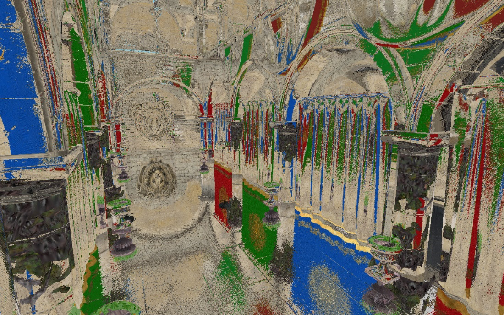
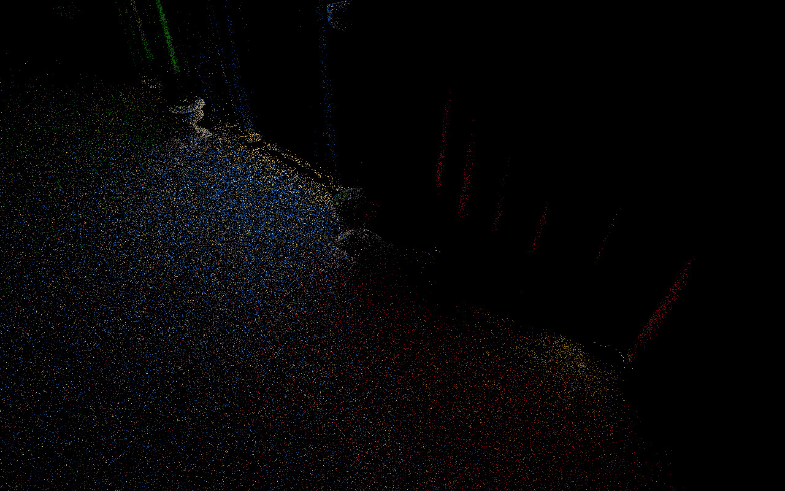
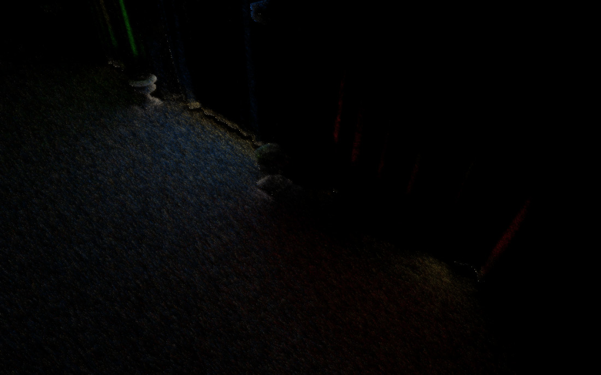
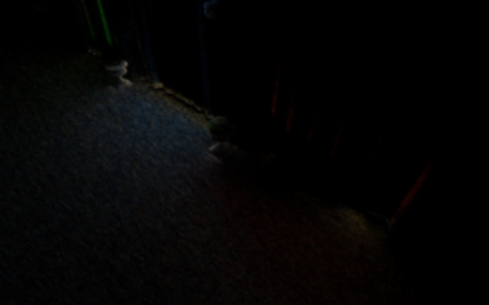

# 第15章 用光线追踪实现反射（Adding Reflections with Ray Tracing）

本章将使用光线追踪实现反射。

在引入光线追踪硬件之前，应用通常用屏幕空间技术做反射。但该技术有局限：只能使用屏幕上可见的信息；若某条反射光线超出屏幕上的可见几何体，通常会回退到环境贴图。因此反射效果会随相机位置不一致。

引入光线追踪硬件后，我们可以访问屏幕外的几何体，从而克服这一限制。代价是可能要做昂贵的光照计算：若反射到的几何体在屏幕外，就没有 G-buffer 数据，需要从零计算颜色、光照与阴影。

为降低成本，开发者通常在半分辨率下追踪反射，或仅在屏幕空间反射失败时使用光线追踪。另一种做法是在光线追踪路径中使用较低分辨率几何体以降低光线遍历成本。本章将实现纯光线追踪方案，以获得最佳质量，之后在其上加入上述优化会比较容易。

本章将涵盖以下主题：

- 屏幕空间反射如何工作
- 实现光线追踪反射
- 实现降噪器使光线追踪输出可用

## 技术需求（Technical requirements）

学完本章后，你将了解反射的多种实现方式，并学会如何实现光线追踪反射以及如何借助降噪器改善最终结果。

本章代码可在以下地址找到：https://github.com/PacktPublishing/Mastering-Graphics-Programming-with-Vulkan/tree/main/source/chapter15。

## 屏幕空间反射如何工作（How screen-space reflections work）

反射是重要的渲染要素，能增强场景沉浸感。因此即便在光线追踪硬件出现之前，开发者就已发展出多种技术来实现该效果。

最常见的一种是在 G-buffer 就绪后对场景进行光线步进（ray-march）。表面是否产生反射由材质粗糙度决定，只有低粗糙度材质才会产生反射，这也有助于控制成本，因为通常只有少量表面满足条件。

光线步进与光线追踪类似，在第 10 章《添加体积雾》中已有介绍。简而言之：光线步进不通过遍历场景判断光线是否击中几何体，而是沿光线方向以固定步长、在固定迭代次数内前进。

这既有优点也有缺点。优点是成本固定，与场景复杂度无关，因为每条光线的最大迭代次数是事先给定的。缺点在于结果质量取决于步长与迭代次数。要获得最佳质量需要大量迭代和较小步长，但这会使技术过于昂贵；折中做法是使用足够好的步长，再将结果通过降噪滤波以减轻低频采样带来的伪影。

顾名思义，该技术在屏幕空间中工作，与屏幕空间环境光遮蔽（SSAO）等类似。对给定片段，先判断是否产生反射；若产生，则根据表面法线与视线方向得到反射光线方向。接着沿反射方向按给定迭代次数与步长步进，每一步与深度缓冲比较以判断是否击中几何体。由于深度缓冲分辨率有限，通常定义一个 delta，若某次迭代中射线深度与深度缓冲的差小于该 delta 则视为命中并退出循环，否则继续。该 delta 的大小可随场景复杂度调整，一般需手动调节。若光线步进击中可见几何体，则取该片段处的颜色作为反射颜色；否则返回黑色或用环境贴图得到反射颜色。此处略过一些与本章无关的实现细节，延伸阅读中有更详细的资料。

如前所述，该技术受限于屏幕上可见的信息。主要缺点是：当反射到的几何体不再出现在屏幕上时，反射会随相机移动而消失。另一缺点来自光线步进本身——步数与步长分辨率有限，可能在反射中产生空洞，通常通过强滤波弥补，导致反射模糊，难以在部分场景与视角下得到清晰反射。

本节介绍了屏幕空间反射的主要思路与不足。下一节将实现光线追踪反射，以减轻这些限制。

## 实现光线追踪反射（Implementing ray-traced reflections）

本节将利用硬件光线追踪能力实现反射。在进入代码前，先概括算法：

1. 从 G-buffer 出发，判断给定片段的粗糙度是否低于某阈值；若是则继续，否则不再处理该片段。
2. 为使技术能实时运行，每个片段只发射一条反射光线。我们将展示两种选取反射方向的方式：一种模拟镜面，另一种对给定片段按 GGX 分布采样。
3. 若反射光线击中几何体，需计算其表面颜色。向通过重要性采样（importance sampling）选出的光源再发射一条光线；若该光源可见，则用标准光照模型计算反射表面颜色。
4. 由于每片段仅一个采样，最终输出会带噪，尤其每帧随机选取反射方向时。因此光线追踪步骤的输出将经过降噪器处理。我们实现了一种称为时空方差引导滤波（Spatiotemporal Variance-Guided Filtering, SVGF）的算法，专为此类用途设计，会利用空间与时间数据得到仅含少量噪点的结果。
5. 最后在光照计算中使用降噪后的数据得到高光颜色。

下面进入实现。第一步是判断给定片段的粗糙度是否低于某阈值：

```
if ( roughness <= 0.3 ) {
```

我们选择 0.3 以得到期望效果，也可尝试其他值。若该片段参与反射计算，则初始化随机数生成器并计算采样 GGX 分布所需的两个值：

```
rng_state = seed( gl_LaunchIDEXT.xy ) + current_frame;
float U1 = rand_pcg() * rnd_normalizer;
float U2 = rand_pcg() * rnd_normalizer;
```

两个随机函数可实现如下：

```
uint seed(uvec2 p) {
} return 19u * p.x + 47u * p.y + 101u;
uint rand_pcg() {
uint state = rng_state;
rng_state = rng_state * 747796405u + 2891336453u;
uint word = ((state >> ((state >> 28u) + 4u)) ^ state)
277803737u;
return (word >> 22u) ^ word;
}
```

这两个函数来自《Hash Functions for GPU Rendering》一文，强烈推荐阅读，文中还有多种可尝试的函数。我们选用该 seed 以便基于片段位置。

接着选取反射向量。如前所述，我们实现了两种方式。第一种简单地将视线向量绕表面法线反射，得到镜面效果：

```
vec3 reflected_ray = normalize( reflect( incoming, normal ) );
```

使用该方法得到的效果如下：



Figure 15.1 – Mirror-like reflections

第二种通过随机采样 GGX 分布计算法线：

```
vec3 normal = sampleGGXVNDF( incoming, roughness, roughness,
U1, U2 );
vec3 reflected_ray = normalize( reflect( incoming, normal ) );
```

`sampleGGXVNDF` 来自《Sampling the GGX Distribution of Visible Normals》一文，该文对其实现有清晰描述，建议阅读。简而言之，该方法根据材质 BRDF 与视线方向按概率得到随机法线，以使反射更符合物理。

接着在场景中追踪光线：

```
traceRayEXT( as, // topLevel
gl_RayFlagsOpaqueEXT, // rayFlags
0xff, // cullMask
sbt_offset, // sbtRecordOffset
sbt_stride, // sbtRecordStride
miss_index, // missIndex
world_pos, // origin
0.05, // Tmin
reflected_ray, // direction
100.0, // Tmax
0 // payload index
);
```

若光线有命中，则用重要性采样选取一个光源用于最终颜色计算。重要性采样的核心是根据给定概率分布决定哪个元素（此处为光源）更可能被选中。我们采用《Ray Tracing Gems》中《Importance Sampling of Many Lights on the GPU》一章描述的重要性值。先遍历场景中所有光源：

```
for ( uint l = 0; l < active_lights; ++l ) {
Light light = lights[ l ];
```

计算光源与命中三角形法线之间的夹角：

```
vec3 p_to_light = light.world_position - p_world.xyz;
float point_light_angle = dot( normalize( p_to_light ),
triangle_normal );
 float theta_i = acos( point_light_angle );
```

再计算光源与片段世界空间位置的距离：

```
float distance_sq = dot( p_to_light, p_to_light );
float r_sq = light.radius * light.radius;
```

用这两个值判断该光源是否应参与该片段的计算：

```
bool light_active = ( point_light_angle > 1e-4 ) && (
distance_sq <= r_sq );
```

接着计算朝向参数，表示光源是正对片段还是成角度照射：

```
float theta_u = asin( light.radius / sqrt( distance_sq
) );
float theta_prime = max( 0, theta_i - theta_u );
float orientation = abs( cos( theta_prime ) );
```

最后结合光源强度计算重要性值：

```
float importance = ( light.intensity * orientation ) /
distance_sq;
float final_value = light_active ? importance : 0.0;
lights_importance[ l ] = final_value;
```

若该光源对该片段不参与，其重要性为 0。最后累加该光源的重要性：

```
} total_importance += final_value;
```

得到各光源重要性后需做归一化。与任意概率分布一样，这些值之和应为 1：

```
for ( uint l = 0; l < active_lights; ++l ) {
lights_importance[ l ] /= total_importance;
}
```

接着选取本帧使用的光源。先生成新的随机值：

```
float rnd_value = rand_pcg() * rnd_normalizer;
```

再遍历光源并累加各自的重要性，当累加值超过随机值即选中该光源：

```
for ( ; light_index < active_lights; ++light_index ) {
accum_probability += lights_importance[ light_index ];
if ( accum_probability > rnd_value ) {
break;
}
}
```

选中光源后，向该光源发射光线判断是否可见；若可见，则用光照模型计算反射表面的最终颜色。阴影因子按第 13 章《用光线追踪重新实现阴影》的方式计算，颜色计算与第 14 章《用光线追踪实现动态漫反射全局光照》相同。结果如下：



Figure 15.2 – The noisy output of the ray tracing step

本节说明了光线追踪反射的实现：先介绍两种选取光线方向的方式，再演示如何用重要性采样选取光源，最后说明如何用选中的光源得到反射表面的最终颜色。该步骤的结果带噪，不能直接用于光照计算。下一节将实现降噪器以去除大部分噪点。

## 实现降噪器（Implementing a denoiser）

为使反射 pass 的输出能用于光照计算，需要经过降噪器。我们实现的算法称为 SVGF，专为路径追踪的颜色重建而设计。

SVGF 包含三个主要 pass：

1. 先计算颜色与亮度（luminance）矩的积分，这是算法的时间步，将上一帧数据与本帧结果结合。
2. 再根据第一步得到的一阶、二阶矩估计方差。
3. 最后执行五遍小波滤波（wavelet filter），这是算法的空间步，每遍应用 5×5 滤波以尽可能减少剩余噪点。

下面进入代码细节。先计算本帧的矩：

```
float u_1 = luminance( reflections_color );
float u_2 = u_1 * u_1;
vec2 moments = vec2( u_1, u_2 );
```

使用运动向量（与第 11 章《时间性抗锯齿》中计算的相同）判断能否将本帧数据与上一帧结合。先计算上一帧在屏幕上的位置：

```
bool check_temporal_consistency( uvec2 frag_coord ) {
vec2 frag_coord_center = vec2( frag_coord ) + 0.5;
vec2 motion_vector = texelFetch( global_textures[
motion_vectors_texture_index ],
ivec2( frag_coord ), 0 ).rg;
vec2 prev_frag_coord = frag_coord_center +
motion_vector;
```

检查上一帧片段坐标是否有效：

```
if ( any( lessThan( prev_frag_coord, vec2( 0 ) ) ) ||
any( greaterThanEqual( prev_frag_coord,
resolution ) ) ) {
return false;
 }
```

再检查 mesh ID 与上一帧是否一致：

```
uint mesh_id = texelFetch( global_utextures[
mesh_id_texture_index ],
ivec2( frag_coord ), 0 ).r;
uint prev_mesh_id = texelFetch( global_utextures[
history_mesh_id_texture_index ],
ivec2( prev_frag_coord ), 0 ).r;
if ( mesh_id != prev_mesh_id ) {
return false;
}
```

接着检查大的深度不连续（可能由上一帧的遮挡解除引起），利用本帧与上一帧的深度差以及本帧深度的屏幕空间导数：

```
float z = texelFetch( global_textures[
depth_texture_index ],
ivec2( frag_coord ), 0 ).r;
float prev_z = texelFetch( global_textures[
history_depth_texture ],
ivec2( prev_frag_coord ), 0
).r;
vec2 depth_normal_dd = texelFetch( global_textures[
depth_normal_dd_texture_index ],
ivec2( frag_coord ), 0 ).rg;
float depth_diff = abs( z - prev_z ) / (
depth_normal_dd.x + 1e-2 );
if ( depth_diff > 10 ) {
return false;
}
```

最后用法线做一致性检查：

```
float normal_diff = distance( normal, prev_normal ) / (
depth_normal_dd.y + 1e-2
);
if ( normal_diff > 16.0 ) {
return false;
}
```

若以上检查均通过，则上一帧数据可用于时间累积：

```
if ( is_consistent ) {
vec3 history_reflections_color = texelFetch(
global_textures[ history_reflections_texture_index ],
ivec2( frag_coord ), 0 ).rgb;
vec2 history_moments = texelFetch( global_textures[
history_moments_texture_index ],
ivec2( frag_coord ), 0 ).rg;
float alpha = 0.2;
integrated_color_out = reflections_color * alpha +
( 1 - alpha ) * history_reflections_color;
integrated_moments_out = moments * alpha + ( 1 - alpha
) * moments;
```

若一致性检查失败，则仅使用本帧数据：

```
} else {
integrated_color_out = reflections_color;
integrated_moments_out = moments;
}
```

累积 pass 到此结束。得到的效果如下：



Figure 15.3 – The color output after the accumulation step

下一步是计算方差：

```
float variance = moments.y - pow( moments.x, 2 );
```

得到累积值后开始实现小波滤波。如前所述，这是 5×5 交叉双边滤波（cross-bilateral filter）。先写熟悉的双重循环，注意不要越界访问：

```
for ( int y = -2; y <= 2; ++y) {
for( int x = -2; x <= 2; ++x ) {
ivec2 offset = ivec2( x, y );
ivec2 q = frag_coord + offset;
if ( any( lessThan( q, ivec2( 0 ) ) ) || any(
greaterThanEqual( q, ivec2( resolution ) ) ) )
{
continue;
 }
```

计算滤波核值与权重 w：

```
float h_q = h[ x + 2 ] * h[ y + 2 ];
float w_pq = compute_w( frag_coord, q );
float sample_weight = h_q * w_pq;
```

权重函数的实现稍后说明。接着加载该片段的积分颜色与方差：

```
vec3 c_q = texelFetch( global_textures[
integrated_color_texture_index ], q, 0 ).rgb;
float prev_variance = texelFetch( global_textures[
variance_texture_index ], q, 0 ).r;
```

最后累加新的颜色与方差：

```
new_filtered_color += h_q * w_pq * c_q;
color_weight += sample_weight;
new_variance += pow( h_q, 2 ) * pow( w_pq, 2 ) *
prev_variance;
variance_weight += pow( sample_weight, 2 );
}
}
```

存储前需除以累加权重：

```
new_filtered_color /= color_weight;
new_variance /= variance_weight;
```

上述过程重复五次。得到的颜色将用于光照计算中的高光颜色。下面说明权重计算。权重由法线、深度与亮度三部分组成，代码中尽量沿用论文命名以便与公式对应。先写法线部分：

```
vec2 encoded_normal_p = texelFetch( global_textures[
normals_texture_index ], p, 0 ).rg;
vec3 n_p = octahedral_decode( encoded_normal_p );
vec2 encoded_normal_q = texelFetch( global_textures[
normals_texture_index ], q, 0 ).rg;
vec3 n_q = octahedral_decode( encoded_normal_q );
float w_n = pow( max( 0, dot( n_p, n_q ) ), sigma_n );
```

用当前片段与滤波邻域片段的法线夹角（余弦）作为法线权重。再看深度：

```
float z_dd = texelFetch( global_textures[ depth_normal_dd_
texture_index ], p, 0 ).r;
float z_p = texelFetch( global_textures[ depth_texture_index ],
p, 0 ).r;
float z_q = texelFetch( global_textures[ depth_texture_index ],
q, 0 ).r;
float w_z = exp( -( abs( z_p – z_q ) / ( sigma_z * abs(
z_dd ) + 1e-8 ) ) );
```

与累积步类似，利用两片段深度差及屏幕空间导数，对大的深度不连续施加惩罚。最后是亮度权重。先计算所处理片段的亮度：

```
vec3 c_p = texelFetch( global_textures[ integrated_color_
texture_index ], p, 0 ).rgb;
vec3 c_q = texelFetch( global_textures[ integrated_color_
texture_index ], q, 0 ).rgb;
float l_p = luminance( c_p );
float l_q = luminance( c_q );
```

将方差经高斯滤波以减少不稳定：

```
float g = 0.0;
const int radius = 1;
for ( int yy = -radius; yy <= radius; yy++ ) {
for ( int xx = -radius; xx <= radius; xx++ ) {
ivec2 s = p + ivec2( xx, yy );
float k = kernel[ abs( xx ) ][ abs( yy ) ];
float v = texelFetch( global_textures[
variance_texture_index ], s, 0 ).r;
g += v * k;
}
}
```

最后计算亮度权重并与其他两项结合：

```
float w_l = exp( -( abs( l_p - l_q ) / ( sigma_l * sqrt
( g ) + 1e-8 ) ) );
return w_z * w_n * w_l;
```

至此完成了 SVGF 的实现。五遍滤波后得到：



Figure 15.4 – The output at the end of the denoising step

本节介绍了常见降噪算法的实现。算法包含三个 pass：颜色与亮度矩的累积、亮度方差估计、以及重复五遍的小波滤波。

## 小结（Summary）

本章介绍了如何实现光线追踪反射。先从屏幕空间反射的概览入手，这是光线追踪硬件出现前长期使用的技术，并说明了其原理与局限。接着描述了用于得到反射值的光线追踪实现，给出了两种确定反射光线方向的方法，以及有命中时如何计算反射颜色。由于每片段仅一个采样，该步骤结果带噪；为尽量降噪，我们实现了基于 SVGF 的降噪器。该技术包含三个 pass：先是颜色与亮度矩的时间累积，再计算亮度方差，最后对颜色输出做五遍小波滤波。

本章也标志着本书的结束。希望你在阅读中收获与我们写作时同等的乐趣。现代图形技术无法在一本书中穷尽，我们选取了在 Vulkan 中实现时最具代表性的功能与技术，旨在提供一套可在此基础上扩展的入门工具。祝你在掌握图形编程的路上一切顺利。我们非常欢迎反馈与勘误，欢迎随时联系。

## 延伸阅读（Further reading）

我们仅对屏幕空间反射做了简要介绍，以下文章对其实现、局限与改进有更详细说明：

- https://lettier.github.io/3d-game-shaders-for-beginners/screen-space-reflection.html
- https://bartwronski.com/2014/01/25/the-future-of-screenspace-reflections/
- https://bartwronski.com/2014/03/23/gdc-follow-up-screenspace-reflections-filtering-and-up-sampling/

我们只使用了《Hash Functions for GPU Rendering》中多种哈希技术之一：https://jcgt.org/published/0009/03/02/。

通过采样 BRDF 确定反射向量的采样技术详见《Sampling the GGX Distribution of Visible Normals》：https://jcgt.org/published/0007/04/01/。

本节介绍的 SVGF 算法详见原文与补充材料：https://research.nvidia.com/publication/2017-07_spatiotemporal-variance-guided-filtering-real-time-reconstruction-path-traced。

我们使用重要性采样决定每帧使用的光源。近年来另一种流行技术是 Reservoir 时空重要性重采样（ReSTIR），建议阅读原文并了解受其启发的其他工作：https://research.nvidia.com/publication/2020-07_spatiotemporal-reservoir-resampling-real-time-Ray-Tracing-dynamic-direct。

本章为教学目的从零实现了 SVGF，可作为进一步改进的起点；也建议参考 AMD 与 Nvidia 的商用降噪器以对比效果：

- https://gpuopen.com/fidelityfx-denoiser/
- https://developer.nvidia.com/rtx/Ray-Tracing/rt-denoisers
